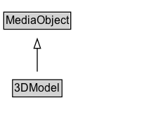

# 3DModel

A 3D model represents some kind of 3D content, which may have [[encoding]]s in one or more [[MediaObject]]s. Many 3D formats are available (e.g. see [Wikipedia](https://en.wikipedia.org/wiki/Category:3D_graphics_file_formats)); specific encoding formats can be represented using the [[encodingFormat]] property applied to the relevant [[MediaObject]]. For the
case of a single file published after Zip compression, the convention of appending '+zip' to the [[encodingFormat]] can be used. Geospatial, AR/VR, artistic/animation, gaming, engineering and scientific content can all be represented using [[3DModel]].

## Diagram

=== "SVG (interactive)"

    <!-- Generated by graphviz version 14.1.3 (20260303.0454)
     -->
    <!-- Pages: 1 -->
    <svg width="159pt" height="132pt"
     viewBox="0.00 0.00 159.00 132.00" xmlns="http://www.w3.org/2000/svg" xmlns:xlink="http://www.w3.org/1999/xlink">
    <g id="graph0" class="graph" transform="scale(1 1) rotate(0) translate(4 128)">
    <polygon fill="white" stroke="none" points="-4,4 -4,-128 154.75,-128 154.75,4 -4,4"/>
    <g id="clust3" class="cluster">
    <title>cluster_associated</title>
    </g>
    <!-- MediaObject -->
    <g id="node1" class="node">
    <title>MediaObject</title>
    <g id="a_node1"><a xlink:href="../MediaObject" xlink:title="&lt;TABLE&gt;">
    <polygon fill="lightgray" stroke="none" points="1,-97.88 1,-114.12 70.5,-114.12 70.5,-97.88 1,-97.88"/>
    <text xml:space="preserve" text-anchor="start" x="2" y="-101.88" font-family="Arial" font-size="12.00">MediaObject</text>
    <polygon fill="none" stroke="black" points="0,-96.88 0,-115.12 71.5,-115.12 71.5,-96.88 0,-96.88"/>
    </a>
    </g>
    </g>
    <!-- 3DModel -->
    <g id="node2" class="node">
    <title>3DModel</title>
    <g id="a_node2"><a xlink:href="../3DModel" xlink:title="&lt;TABLE&gt;">
    <polygon fill="lightgray" stroke="none" points="10.38,-25.88 10.38,-42.12 61.12,-42.12 61.12,-25.88 10.38,-25.88"/>
    <text xml:space="preserve" text-anchor="start" x="11.38" y="-29.88" font-family="Arial" font-size="12.00">3DModel</text>
    <polygon fill="none" stroke="black" points="9.38,-24.88 9.38,-43.12 62.12,-43.12 62.12,-24.88 9.38,-24.88"/>
    </a>
    </g>
    </g>
    <!-- 3DModel&#45;&gt;MediaObject -->
    <g id="edge1" class="edge">
    <title>3DModel&#45;&gt;MediaObject</title>
    <path fill="none" stroke="black" d="M35.75,-51.79C35.75,-59.25 35.75,-68.24 35.75,-76.69"/>
    <polygon fill="none" stroke="black" points="32.25,-76.54 35.75,-86.54 39.25,-76.54 32.25,-76.54"/>
    </g>
    <!-- Invis -->
    </g>
    </svg>

=== "PNG"

    

## Formalization for 3DModel

| Property | Constraint |
|----------|------------|
| subClassOf | [MediaObject](MediaObject.md) |

