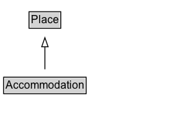

# Accommodation

An accommodation is a place that can accommodate human beings, e.g. a hotel room, a camping pitch, or a meeting room. Many accommodations are for overnight stays, but this is not a mandatory requirement.
For more specific types of accommodations not defined in schema.org, one can use [[additionalType]] with external vocabularies.
  
See also the <a href="/docs/hotels.html">dedicated document on the use of schema.org for marking up hotels and other forms of accommodations</a>.

## Diagram

=== "SVG (interactive)"

    <!-- Generated by graphviz version 14.1.3 (20260303.0454)
     -->
    <!-- Pages: 1 -->
    <svg width="186pt" height="132pt"
     viewBox="0.00 0.00 186.00 132.00" xmlns="http://www.w3.org/2000/svg" xmlns:xlink="http://www.w3.org/1999/xlink">
    <g id="graph0" class="graph" transform="scale(1 1) rotate(0) translate(4 128)">
    <polygon fill="white" stroke="none" points="-4,4 -4,-128 182.12,-128 182.12,4 -4,4"/>
    <g id="clust3" class="cluster">
    <title>cluster_associated</title>
    </g>
    <!-- Place -->
    <g id="node1" class="node">
    <title>Place</title>
    <g id="a_node1"><a xlink:href="../Place" xlink:title="&lt;TABLE&gt;">
    <polygon fill="lightgray" stroke="none" points="28.75,-97.88 28.75,-114.12 61.5,-114.12 61.5,-97.88 28.75,-97.88"/>
    <text xml:space="preserve" text-anchor="start" x="29.75" y="-101.88" font-family="Arial" font-size="12.00">Place</text>
    <polygon fill="none" stroke="black" points="27.75,-96.88 27.75,-115.12 62.5,-115.12 62.5,-96.88 27.75,-96.88"/>
    </a>
    </g>
    </g>
    <!-- Accommodation -->
    <g id="node2" class="node">
    <title>Accommodation</title>
    <g id="a_node2"><a xlink:href="../Accommodation" xlink:title="&lt;TABLE&gt;">
    <polygon fill="lightgray" stroke="none" points="1,-25.88 1,-42.12 89.25,-42.12 89.25,-25.88 1,-25.88"/>
    <text xml:space="preserve" text-anchor="start" x="2" y="-29.88" font-family="Arial" font-size="12.00">Accommodation</text>
    <polygon fill="none" stroke="black" points="0,-24.88 0,-43.12 90.25,-43.12 90.25,-24.88 0,-24.88"/>
    </a>
    </g>
    </g>
    <!-- Accommodation&#45;&gt;Place -->
    <g id="edge1" class="edge">
    <title>Accommodation&#45;&gt;Place</title>
    <path fill="none" stroke="black" d="M45.12,-51.79C45.12,-59.25 45.12,-68.24 45.12,-76.69"/>
    <polygon fill="none" stroke="black" points="41.63,-76.54 45.13,-86.54 48.63,-76.54 41.63,-76.54"/>
    </g>
    <!-- Invis -->
    </g>
    </svg>

=== "PNG"

    

## Specializations of Accommodation

| Class | Description |
|-------|-------------|
| [Apartment](Apartment.md) | An apartment (in American English) or flat (in British English) is a self-contained housing unit (a type of residential real estate) that occupies only part of a building (source: Wikipedia, the free encyclopedia, see <a href="http://en.wikipedia.org/wiki/Apartment">http://en.wikipedia.org/wiki/Apartment</a>). |
| [Camping Pitch](CampingPitch.md) | A [[CampingPitch]] is an individual place for overnight stay in the outdoors, typically being part of a larger camping site, or [[Campground]].\n\n
In British English a campsite, or campground, is an area, usually divided into a number of pitches, where people can camp overnight using tents or camper vans or caravans; this British English use of the word is synonymous with the American English expression campground. In American English the term campsite generally means an area where an individual, family, group, or military unit can pitch a tent or park a camper; a campground may contain many campsites.
(Source: Wikipedia, see [https://en.wikipedia.org/wiki/Campsite](https://en.wikipedia.org/wiki/Campsite).)\n\n
See also the dedicated [document on the use of schema.org for marking up hotels and other forms of accommodations](/docs/hotels.html).
 |
| [Hotel Room](HotelRoom.md) | A hotel room is a single room in a hotel.
  
See also the <a href="/docs/hotels.html">dedicated document on the use of schema.org for marking up hotels and other forms of accommodations</a>.
 |
| [House](House.md) | A house is a building or structure that has the ability to be occupied for habitation by humans or other creatures (source: Wikipedia, the free encyclopedia, see <a href="http://en.wikipedia.org/wiki/House">http://en.wikipedia.org/wiki/House</a>). |
| [Meeting Room](MeetingRoom.md) | A meeting room, conference room, or conference hall is a room provided for singular events such as business conferences and meetings (source: Wikipedia, the free encyclopedia, see <a href="http://en.wikipedia.org/wiki/Conference_hall">http://en.wikipedia.org/wiki/Conference_hall</a>).
  
See also the <a href="/docs/hotels.html">dedicated document on the use of schema.org for marking up hotels and other forms of accommodations</a>.
 |
| [Room](Room.md) | A room is a distinguishable space within a structure, usually separated from other spaces by interior walls (source: Wikipedia, the free encyclopedia, see <a href="http://en.wikipedia.org/wiki/Room">http://en.wikipedia.org/wiki/Room</a>).
  
See also the <a href="/docs/hotels.html">dedicated document on the use of schema.org for marking up hotels and other forms of accommodations</a>.
 |
| [Single Family Residence](SingleFamilyResidence.md) | Residence type: Single-family home. |
| [Suite](Suite.md) | A suite in a hotel or other public accommodation, denotes a class of luxury accommodations, the key feature of which is multiple rooms (source: Wikipedia, the free encyclopedia, see <a href="http://en.wikipedia.org/wiki/Suite_(hotel)">http://en.wikipedia.org/wiki/Suite_(hotel)</a>).
  
See also the <a href="/docs/hotels.html">dedicated document on the use of schema.org for marking up hotels and other forms of accommodations</a>.
 |

## Formalization for Accommodation

| Property | Constraint |
|----------|------------|
| subClassOf | [Place](Place.md) |

