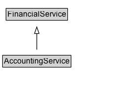

# AccountingService

Accountancy business.\n\nAs a [[LocalBusiness]] it can be described as a [[provider]] of one or more [[Service]]\(s).
      

## Diagram

=== "SVG (interactive)"

    <!-- Generated by graphviz version 14.1.3 (20260303.0454)
     -->
    <!-- Pages: 1 -->
    <svg width="200pt" height="132pt"
     viewBox="0.00 0.00 200.00 132.00" xmlns="http://www.w3.org/2000/svg" xmlns:xlink="http://www.w3.org/1999/xlink">
    <g id="graph0" class="graph" transform="scale(1 1) rotate(0) translate(4 128)">
    <polygon fill="white" stroke="none" points="-4,4 -4,-128 196.25,-128 196.25,4 -4,4"/>
    <g id="clust3" class="cluster">
    <title>cluster_associated</title>
    </g>
    <!-- FinancialService -->
    <g id="node1" class="node">
    <title>FinancialService</title>
    <g id="a_node1"><a xlink:href="../FinancialService" xlink:title="&lt;TABLE&gt;">
    <polygon fill="lightgray" stroke="none" points="6.25,-97.88 6.25,-114.12 98.25,-114.12 98.25,-97.88 6.25,-97.88"/>
    <text xml:space="preserve" text-anchor="start" x="7.25" y="-101.88" font-family="Arial" font-size="12.00">FinancialService</text>
    <polygon fill="none" stroke="black" points="5.25,-96.88 5.25,-115.12 99.25,-115.12 99.25,-96.88 5.25,-96.88"/>
    </a>
    </g>
    </g>
    <!-- AccountingService -->
    <g id="node2" class="node">
    <title>AccountingService</title>
    <g id="a_node2"><a xlink:href="../AccountingService" xlink:title="&lt;TABLE&gt;">
    <polygon fill="lightgray" stroke="none" points="1,-25.88 1,-42.12 103.5,-42.12 103.5,-25.88 1,-25.88"/>
    <text xml:space="preserve" text-anchor="start" x="2" y="-29.88" font-family="Arial" font-size="12.00">AccountingService</text>
    <polygon fill="none" stroke="black" points="0,-24.88 0,-43.12 104.5,-43.12 104.5,-24.88 0,-24.88"/>
    </a>
    </g>
    </g>
    <!-- AccountingService&#45;&gt;FinancialService -->
    <g id="edge1" class="edge">
    <title>AccountingService&#45;&gt;FinancialService</title>
    <path fill="none" stroke="black" d="M52.25,-51.79C52.25,-59.25 52.25,-68.24 52.25,-76.69"/>
    <polygon fill="none" stroke="black" points="48.75,-76.54 52.25,-86.54 55.75,-76.54 48.75,-76.54"/>
    </g>
    <!-- Invis -->
    </g>
    </svg>

=== "PNG"

    

## Formalization for AccountingService

| Property | Constraint |
|----------|------------|
| subClassOf | [FinancialService](FinancialService.md) |

