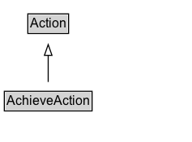

# AchieveAction

The act of accomplishing something via previous efforts. It is an instantaneous action rather than an ongoing process.

## Diagram

=== "SVG (interactive)"

    <!-- Generated by graphviz version 14.1.3 (20260303.0454)
     -->
    <!-- Pages: 1 -->
    <svg width="178pt" height="132pt"
     viewBox="0.00 0.00 178.00 132.00" xmlns="http://www.w3.org/2000/svg" xmlns:xlink="http://www.w3.org/1999/xlink">
    <g id="graph0" class="graph" transform="scale(1 1) rotate(0) translate(4 128)">
    <polygon fill="white" stroke="none" points="-4,4 -4,-128 173.62,-128 173.62,4 -4,4"/>
    <g id="clust3" class="cluster">
    <title>cluster_associated</title>
    </g>
    <!-- Action -->
    <g id="node1" class="node">
    <title>Action</title>
    <g id="a_node1"><a xlink:href="../Action" xlink:title="&lt;TABLE&gt;">
    <polygon fill="lightgray" stroke="none" points="22.75,-97.88 22.75,-114.12 58.5,-114.12 58.5,-97.88 22.75,-97.88"/>
    <text xml:space="preserve" text-anchor="start" x="23.75" y="-101.88" font-family="Arial" font-size="12.00">Action</text>
    <polygon fill="none" stroke="black" points="21.75,-96.88 21.75,-115.12 59.5,-115.12 59.5,-96.88 21.75,-96.88"/>
    </a>
    </g>
    </g>
    <!-- AchieveAction -->
    <g id="node2" class="node">
    <title>AchieveAction</title>
    <g id="a_node2"><a xlink:href="../AchieveAction" xlink:title="&lt;TABLE&gt;">
    <polygon fill="lightgray" stroke="none" points="1,-25.88 1,-42.12 80.25,-42.12 80.25,-25.88 1,-25.88"/>
    <text xml:space="preserve" text-anchor="start" x="2" y="-29.88" font-family="Arial" font-size="12.00">AchieveAction</text>
    <polygon fill="none" stroke="black" points="0,-24.88 0,-43.12 81.25,-43.12 81.25,-24.88 0,-24.88"/>
    </a>
    </g>
    </g>
    <!-- AchieveAction&#45;&gt;Action -->
    <g id="edge1" class="edge">
    <title>AchieveAction&#45;&gt;Action</title>
    <path fill="none" stroke="black" d="M40.62,-51.79C40.62,-59.25 40.62,-68.24 40.62,-76.69"/>
    <polygon fill="none" stroke="black" points="37.13,-76.54 40.63,-86.54 44.13,-76.54 37.13,-76.54"/>
    </g>
    <!-- Invis -->
    </g>
    </svg>

=== "PNG"

    

## Specializations of AchieveAction

| Class | Description |
|-------|-------------|
| [Lose Action](LoseAction.md) | The act of being defeated in a competitive activity. |
| [Tie Action](TieAction.md) | The act of reaching a draw in a competitive activity. |
| [Win Action](WinAction.md) | The act of achieving victory in a competitive activity. |

## Formalization for AchieveAction

| Property | Constraint |
|----------|------------|
| subClassOf | [Action](Action.md) |

