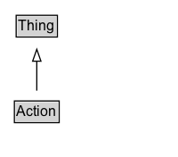

# Action

An action performed by a direct agent and indirect participants upon a direct object. Optionally happens at a location with the help of an inanimate instrument. The execution of the action may produce a result. Specific action sub-type documentation specifies the exact expectation of each argument/role.\n\nSee also [blog post](https://blog.schema.org/2014/04/16/announcing-schema-org-actions/) and [Actions overview document](http://schema.org/docs/actions.html).

## Diagram

=== "SVG (interactive)"

    <!-- Generated by graphviz version 14.1.3 (20260303.0454)
     -->
    <!-- Pages: 1 -->
    <svg width="150pt" height="132pt"
     viewBox="0.00 0.00 150.00 132.00" xmlns="http://www.w3.org/2000/svg" xmlns:xlink="http://www.w3.org/1999/xlink">
    <g id="graph0" class="graph" transform="scale(1 1) rotate(0) translate(4 128)">
    <polygon fill="white" stroke="none" points="-4,4 -4,-128 146,-128 146,4 -4,4"/>
    <g id="clust3" class="cluster">
    <title>cluster_associated</title>
    </g>
    <!-- Thing -->
    <g id="node1" class="node">
    <title>Thing</title>
    <g id="a_node1"><a xlink:href="../Thing" xlink:title="&lt;TABLE&gt;">
    <polygon fill="lightgray" stroke="none" points="10.62,-97.88 10.62,-114.12 43.38,-114.12 43.38,-97.88 10.62,-97.88"/>
    <text xml:space="preserve" text-anchor="start" x="11.62" y="-101.88" font-family="Arial" font-size="12.00">Thing</text>
    <polygon fill="none" stroke="black" points="9.62,-96.88 9.62,-115.12 44.38,-115.12 44.38,-96.88 9.62,-96.88"/>
    </a>
    </g>
    </g>
    <!-- Action -->
    <g id="node2" class="node">
    <title>Action</title>
    <g id="a_node2"><a xlink:href="../Action" xlink:title="&lt;TABLE&gt;">
    <polygon fill="lightgray" stroke="none" points="9.12,-25.88 9.12,-42.12 44.88,-42.12 44.88,-25.88 9.12,-25.88"/>
    <text xml:space="preserve" text-anchor="start" x="10.12" y="-29.88" font-family="Arial" font-size="12.00">Action</text>
    <polygon fill="none" stroke="black" points="8.12,-24.88 8.12,-43.12 45.88,-43.12 45.88,-24.88 8.12,-24.88"/>
    </a>
    </g>
    </g>
    <!-- Action&#45;&gt;Thing -->
    <g id="edge1" class="edge">
    <title>Action&#45;&gt;Thing</title>
    <path fill="none" stroke="black" d="M27,-51.79C27,-59.25 27,-68.24 27,-76.69"/>
    <polygon fill="none" stroke="black" points="23.5,-76.54 27,-86.54 30.5,-76.54 23.5,-76.54"/>
    </g>
    <!-- Invis -->
    </g>
    </svg>

=== "PNG"

    

## Specializations of Action

| Class | Description |
|-------|-------------|
| [Accept Action](AcceptAction.md) | The act of committing to/adopting an object.\n\nRelated actions:\n\n* [[RejectAction]]: The antonym of AcceptAction. |
| [Achieve Action](AchieveAction.md) | The act of accomplishing something via previous efforts. It is an instantaneous action rather than an ongoing process. |
| [Activate Action](ActivateAction.md) | The act of starting or activating a device or application (e.g. starting a timer or turning on a flashlight). |
| [Add Action](AddAction.md) | The act of editing by adding an object to a collection. |
| [Agree Action](AgreeAction.md) | The act of expressing a consistency of opinion with the object. An agent agrees to/about an object (a proposition, topic or theme) with participants. |
| [Allocate Action](AllocateAction.md) | The act of organizing tasks/objects/events by associating resources to it. |
| [Append Action](AppendAction.md) | The act of inserting at the end if an ordered collection. |
| [Apply Action](ApplyAction.md) | The act of registering to an organization/service without the guarantee to receive it.\n\nRelated actions:\n\n* [[RegisterAction]]: Unlike RegisterAction, ApplyAction has no guarantees that the application will be accepted. |
| [Arrive Action](ArriveAction.md) | The act of arriving at a place. An agent arrives at a destination from a fromLocation, optionally with participants. |
| [Ask Action](AskAction.md) | The act of posing a question / favor to someone.\n\nRelated actions:\n\n* [[ReplyAction]]: Appears generally as a response to AskAction. |
| [Assess Action](AssessAction.md) | The act of forming one's opinion, reaction or sentiment. |
| [Assign Action](AssignAction.md) | The act of allocating an action/event/task to some destination (someone or something). |
| [Authenticate Action](AuthenticateAction.md) | The action of authenticating into a device or application. |
| [Authorize Action](AuthorizeAction.md) | The act of granting permission to an object. |
| [Befriend Action](BefriendAction.md) | The act of forming a personal connection with someone (object) mutually/bidirectionally/symmetrically.\n\nRelated actions:\n\n* [[FollowAction]]: Unlike FollowAction, BefriendAction implies that the connection is reciprocal. |
| [Bookmark Action](BookmarkAction.md) | An agent bookmarks/flags/labels/tags/marks an object. |
| [Borrow Action](BorrowAction.md) | The act of obtaining an object under an agreement to return it at a later date. Reciprocal of LendAction.\n\nRelated actions:\n\n* [[LendAction]]: Reciprocal of BorrowAction. |
| [Buy Action](BuyAction.md) | The act of giving money to a seller in exchange for goods or services rendered. An agent buys an object, product, or service from a seller for a price. Reciprocal of SellAction. |
| [Cancel Action](CancelAction.md) | The act of asserting that a future event/action is no longer going to happen.\n\nRelated actions:\n\n* [[ConfirmAction]]: The antonym of CancelAction. |
| [Check Action](CheckAction.md) | An agent inspects, determines, investigates, inquires, or examines an object's accuracy, quality, condition, or state. |
| [Check In Action](CheckInAction.md) | The act of an agent communicating (service provider, social media, etc) their arrival by registering/confirming for a previously reserved service (e.g. flight check-in) or at a place (e.g. hotel), possibly resulting in a result (boarding pass, etc).\n\nRelated actions:\n\n* [[CheckOutAction]]: The antonym of CheckInAction.\n* [[ArriveAction]]: Unlike ArriveAction, CheckInAction implies that the agent is informing/confirming the start of a previously reserved service.\n* [[ConfirmAction]]: Unlike ConfirmAction, CheckInAction implies that the agent is informing/confirming the *start* of a previously reserved service rather than its validity/existence. |
| [Check Out Action](CheckOutAction.md) | The act of an agent communicating (service provider, social media, etc) their departure of a previously reserved service (e.g. flight check-in) or place (e.g. hotel).\n\nRelated actions:\n\n* [[CheckInAction]]: The antonym of CheckOutAction.\n* [[DepartAction]]: Unlike DepartAction, CheckOutAction implies that the agent is informing/confirming the end of a previously reserved service.\n* [[CancelAction]]: Unlike CancelAction, CheckOutAction implies that the agent is informing/confirming the end of a previously reserved service. |
| [Choose Action](ChooseAction.md) | The act of expressing a preference from a set of options or a large or unbounded set of choices/options. |
| [Comment Action](CommentAction.md) | The act of generating a comment about a subject. |
| [Communicate Action](CommunicateAction.md) | The act of conveying information to another person via a communication medium (instrument) such as speech, email, or telephone conversation. |
| [Confirm Action](ConfirmAction.md) | The act of notifying someone that a future event/action is going to happen as expected.\n\nRelated actions:\n\n* [[CancelAction]]: The antonym of ConfirmAction. |
| [Consume Action](ConsumeAction.md) | The act of ingesting information/resources/food. |
| [Control Action](ControlAction.md) | An agent controls a device or application. |
| [Cook Action](CookAction.md) | The act of producing/preparing food. |
| [Create Action](CreateAction.md) | The act of deliberately creating/producing/generating/building a result out of the agent. |
| [Deactivate Action](DeactivateAction.md) | The act of stopping or deactivating a device or application (e.g. stopping a timer or turning off a flashlight). |
| [Delete Action](DeleteAction.md) | The act of editing a recipient by removing one of its objects. |
| [Depart Action](DepartAction.md) | The act of  departing from a place. An agent departs from a fromLocation for a destination, optionally with participants. |
| [Disagree Action](DisagreeAction.md) | The act of expressing a difference of opinion with the object. An agent disagrees to/about an object (a proposition, topic or theme) with participants. |
| [Discover Action](DiscoverAction.md) | The act of discovering/finding an object. |
| [Dislike Action](DislikeAction.md) | The act of expressing a negative sentiment about the object. An agent dislikes an object (a proposition, topic or theme) with participants. |
| [Donate Action](DonateAction.md) | The act of providing goods, services, or money without compensation, often for philanthropic reasons. |
| [Download Action](DownloadAction.md) | The act of downloading an object. |
| [Draw Action](DrawAction.md) | The act of producing a visual/graphical representation of an object, typically with a pen/pencil and paper as instruments. |
| [Drink Action](DrinkAction.md) | The act of swallowing liquids. |
| [Eat Action](EatAction.md) | The act of swallowing solid objects. |
| [Endorse Action](EndorseAction.md) | An agent approves/certifies/likes/supports/sanctions an object. |
| [Exercise Action](ExerciseAction.md) | The act of participating in exertive activity for the purposes of improving health and fitness. |
| [Film Action](FilmAction.md) | The act of capturing sound and moving images on film, video, or digitally. |
| [Find Action](FindAction.md) | The act of finding an object.\n\nRelated actions:\n\n* [[SearchAction]]: FindAction is generally lead by a SearchAction, but not necessarily. |
| [Follow Action](FollowAction.md) | The act of forming a personal connection with someone/something (object) unidirectionally/asymmetrically to get updates polled from.\n\nRelated actions:\n\n* [[BefriendAction]]: Unlike BefriendAction, FollowAction implies that the connection is *not* necessarily reciprocal.\n* [[SubscribeAction]]: Unlike SubscribeAction, FollowAction implies that the follower acts as an active agent constantly/actively polling for updates.\n* [[RegisterAction]]: Unlike RegisterAction, FollowAction implies that the agent is interested in continuing receiving updates from the object.\n* [[JoinAction]]: Unlike JoinAction, FollowAction implies that the agent is interested in getting updates from the object.\n* [[TrackAction]]: Unlike TrackAction, FollowAction refers to the polling of updates of all aspects of animate objects rather than the location of inanimate objects (e.g. you track a package, but you don't follow it). |
| [Give Action](GiveAction.md) | The act of transferring ownership of an object to a destination. Reciprocal of TakeAction.\n\nRelated actions:\n\n* [[TakeAction]]: Reciprocal of GiveAction.\n* [[SendAction]]: Unlike SendAction, GiveAction implies that ownership is being transferred (e.g. I may send my laptop to you, but that doesn't mean I'm giving it to you). |
| [Ignore Action](IgnoreAction.md) | The act of intentionally disregarding the object. An agent ignores an object. |
| [Inform Action](InformAction.md) | The act of notifying someone of information pertinent to them, with no expectation of a response. |
| [Insert Action](InsertAction.md) | The act of adding at a specific location in an ordered collection. |
| [Install Action](InstallAction.md) | The act of installing an application. |
| [Interact Action](InteractAction.md) | The act of interacting with another person or organization. |
| [Invite Action](InviteAction.md) | The act of asking someone to attend an event. Reciprocal of RsvpAction. |
| [Join Action](JoinAction.md) | An agent joins an event/group with participants/friends at a location.\n\nRelated actions:\n\n* [[RegisterAction]]: Unlike RegisterAction, JoinAction refers to joining a group/team of people.\n* [[SubscribeAction]]: Unlike SubscribeAction, JoinAction does not imply that you'll be receiving updates.\n* [[FollowAction]]: Unlike FollowAction, JoinAction does not imply that you'll be polling for updates. |
| [Leave Action](LeaveAction.md) | An agent leaves an event / group with participants/friends at a location.\n\nRelated actions:\n\n* [[JoinAction]]: The antonym of LeaveAction.\n* [[UnRegisterAction]]: Unlike UnRegisterAction, LeaveAction implies leaving a group/team of people rather than a service. |
| [Lend Action](LendAction.md) | The act of providing an object under an agreement that it will be returned at a later date. Reciprocal of BorrowAction.\n\nRelated actions:\n\n* [[BorrowAction]]: Reciprocal of LendAction. |
| [Like Action](LikeAction.md) | The act of expressing a positive sentiment about the object. An agent likes an object (a proposition, topic or theme) with participants. |
| [Listen Action](ListenAction.md) | The act of consuming audio content. |
| [Login Action](LoginAction.md) | The action of logging into a device or application. |
| [Lose Action](LoseAction.md) | The act of being defeated in a competitive activity. |
| [Marry Action](MarryAction.md) | The act of marrying a person. |
| [Money Transfer](MoneyTransfer.md) | The act of transferring money from one place to another place. This may occur electronically or physically. |
| [Move Action](MoveAction.md) | The act of an agent relocating to a place.\n\nRelated actions:\n\n* [[TransferAction]]: Unlike TransferAction, the subject of the move is a living Person or Organization rather than an inanimate object. |
| [Order Action](OrderAction.md) | An agent orders an object/product/service to be delivered/sent. |
| [Organize Action](OrganizeAction.md) | The act of manipulating/administering/supervising/controlling one or more objects. |
| [Paint Action](PaintAction.md) | The act of producing a painting, typically with paint and canvas as instruments. |
| [Pay Action](PayAction.md) | An agent pays a price to a participant. |
| [Perform Action](PerformAction.md) | The act of participating in performance arts. |
| [Photograph Action](PhotographAction.md) | The act of capturing still images of objects using a camera. |
| [Plan Action](PlanAction.md) | The act of planning the execution of an event/task/action/reservation/plan to a future date. |
| [Play Action](PlayAction.md) | The act of playing/exercising/training/performing for enjoyment, leisure, recreation, competition or exercise.\n\nRelated actions:\n\n* [[ListenAction]]: Unlike ListenAction (which is under ConsumeAction), PlayAction refers to performing for an audience or at an event, rather than consuming music.\n* [[WatchAction]]: Unlike WatchAction (which is under ConsumeAction), PlayAction refers to showing/displaying for an audience or at an event, rather than consuming visual content. |
| [Play Game Action](PlayGameAction.md) | The act of playing a video game. |
| [Pre Order Action](PreOrderAction.md) | An agent orders a (not yet released) object/product/service to be delivered/sent. |
| [Prepend Action](PrependAction.md) | The act of inserting at the beginning if an ordered collection. |
| [Quote Action](QuoteAction.md) | An agent quotes/estimates/appraises an object/product/service with a price at a location/store. |
| [React Action](ReactAction.md) | The act of responding instinctively and emotionally to an object, expressing a sentiment. |
| [Read Action](ReadAction.md) | The act of consuming written content. |
| [Receive Action](ReceiveAction.md) | The act of physically/electronically taking delivery of an object that has been transferred from an origin to a destination. Reciprocal of SendAction.\n\nRelated actions:\n\n* [[SendAction]]: The reciprocal of ReceiveAction.\n* [[TakeAction]]: Unlike TakeAction, ReceiveAction does not imply that the ownership has been transferred (e.g. I can receive a package, but it does not mean the package is now mine). |
| [Register Action](RegisterAction.md) | The act of registering to be a user of a service, product or web page.\n\nRelated actions:\n\n* [[JoinAction]]: Unlike JoinAction, RegisterAction implies you are registering to be a user of a service, *not* a group/team of people.\n* [[FollowAction]]: Unlike FollowAction, RegisterAction doesn't imply that the agent is expecting to poll for updates from the object.\n* [[SubscribeAction]]: Unlike SubscribeAction, RegisterAction doesn't imply that the agent is expecting updates from the object. |
| [Reject Action](RejectAction.md) | The act of rejecting to/adopting an object.\n\nRelated actions:\n\n* [[AcceptAction]]: The antonym of RejectAction. |
| [Rent Action](RentAction.md) | The act of giving money in return for temporary use, but not ownership, of an object such as a vehicle or property. For example, an agent rents a property from a landlord in exchange for a periodic payment. |
| [Replace Action](ReplaceAction.md) | The act of editing a recipient by replacing an old object with a new object. |
| [Reply Action](ReplyAction.md) | The act of responding to a question/message asked/sent by the object. Related to [[AskAction]].\n\nRelated actions:\n\n* [[AskAction]]: Appears generally as an origin of a ReplyAction. |
| [Reserve Action](ReserveAction.md) | Reserving a concrete object.\n\nRelated actions:\n\n* [[ScheduleAction]]: Unlike ScheduleAction, ReserveAction reserves concrete objects (e.g. a table, a hotel) towards a time slot / spatial allocation. |
| [Reset Password Action](ResetPasswordAction.md) | The action of resetting the password of a device or application. |
| [Resume Action](ResumeAction.md) | The act of resuming a device or application which was formerly paused (e.g. resume music playback or resume a timer). |
| [Return Action](ReturnAction.md) | The act of returning to the origin that which was previously received (concrete objects) or taken (ownership). |
| [Review Action](ReviewAction.md) | The act of producing a balanced opinion about the object for an audience. An agent reviews an object with participants resulting in a review. |
| [Rsvp Action](RsvpAction.md) | The act of notifying an event organizer as to whether you expect to attend the event. |
| [Schedule Action](ScheduleAction.md) | Scheduling future actions, events, or tasks.\n\nRelated actions:\n\n* [[ReserveAction]]: Unlike ReserveAction, ScheduleAction allocates future actions (e.g. an event, a task, etc) towards a time slot / spatial allocation. |
| [Search Action](SearchAction.md) | The act of searching for an object.\n\nRelated actions:\n\n* [[FindAction]]: SearchAction generally leads to a FindAction, but not necessarily. |
| [Seek To Action](SeekToAction.md) | This is the [[Action]] of navigating to a specific [[startOffset]] timestamp within a [[VideoObject]], typically represented with a URL template structure. |
| [Sell Action](SellAction.md) | The act of taking money from a buyer in exchange for goods or services rendered. An agent sells an object, product, or service to a buyer for a price. Reciprocal of BuyAction. |
| [Send Action](SendAction.md) | The act of physically/electronically dispatching an object for transfer from an origin to a destination. Related actions:\n\n* [[ReceiveAction]]: The reciprocal of SendAction.\n* [[GiveAction]]: Unlike GiveAction, SendAction does not imply the transfer of ownership (e.g. I can send you my laptop, but I'm not necessarily giving it to you). |
| [Share Action](ShareAction.md) | The act of distributing content to people for their amusement or edification. |
| [Solve Math Action](SolveMathAction.md) | The action that takes in a math expression and directs users to a page potentially capable of solving/simplifying that expression. |
| [Subscribe Action](SubscribeAction.md) | The act of forming a personal connection with someone/something (object) unidirectionally/asymmetrically to get updates pushed to.\n\nRelated actions:\n\n* [[FollowAction]]: Unlike FollowAction, SubscribeAction implies that the subscriber acts as a passive agent being constantly/actively pushed for updates.\n* [[RegisterAction]]: Unlike RegisterAction, SubscribeAction implies that the agent is interested in continuing receiving updates from the object.\n* [[JoinAction]]: Unlike JoinAction, SubscribeAction implies that the agent is interested in continuing receiving updates from the object. |
| [Suspend Action](SuspendAction.md) | The act of momentarily pausing a device or application (e.g. pause music playback or pause a timer). |
| [Take Action](TakeAction.md) | The act of gaining ownership of an object from an origin. Reciprocal of GiveAction.\n\nRelated actions:\n\n* [[GiveAction]]: The reciprocal of TakeAction.\n* [[ReceiveAction]]: Unlike ReceiveAction, TakeAction implies that ownership has been transferred. |
| [Tie Action](TieAction.md) | The act of reaching a draw in a competitive activity. |
| [Tip Action](TipAction.md) | The act of giving money voluntarily to a beneficiary in recognition of services rendered. |
| [Track Action](TrackAction.md) | An agent tracks an object for updates.\n\nRelated actions:\n\n* [[FollowAction]]: Unlike FollowAction, TrackAction refers to the interest on the location of innanimates objects.\n* [[SubscribeAction]]: Unlike SubscribeAction, TrackAction refers to  the interest on the location of innanimate objects. |
| [Trade Action](TradeAction.md) | The act of participating in an exchange of goods and services for monetary compensation. An agent trades an object, product or service with a participant in exchange for a one time or periodic payment. |
| [Transfer Action](TransferAction.md) | The act of transferring/moving (abstract or concrete) animate or inanimate objects from one place to another. |
| [Travel Action](TravelAction.md) | The act of traveling from a fromLocation to a destination by a specified mode of transport, optionally with participants. |
| [Un Register Action](UnRegisterAction.md) | The act of un-registering from a service.\n\nRelated actions:\n\n* [[RegisterAction]]: antonym of UnRegisterAction.\n* [[LeaveAction]]: Unlike LeaveAction, UnRegisterAction implies that you are unregistering from a service you were previously registered, rather than leaving a team/group of people. |
| [Update Action](UpdateAction.md) | The act of managing by changing/editing the state of the object. |
| [Use Action](UseAction.md) | The act of applying an object to its intended purpose. |
| [View Action](ViewAction.md) | The act of consuming static visual content. |
| [Vote Action](VoteAction.md) | The act of expressing a preference from a fixed/finite/structured set of choices/options. |
| [Want Action](WantAction.md) | The act of expressing a desire about the object. An agent wants an object. |
| [Watch Action](WatchAction.md) | The act of consuming dynamic/moving visual content. |
| [Wear Action](WearAction.md) | The act of dressing oneself in clothing. |
| [Win Action](WinAction.md) | The act of achieving victory in a competitive activity. |
| [Write Action](WriteAction.md) | The act of authoring written creative content. |

## Formalization for Action

| Property | Constraint |
|----------|------------|
| subClassOf | [Thing](Thing.md) |

