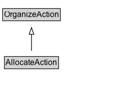

# AllocateAction

The act of organizing tasks/objects/events by associating resources to it.

## Diagram

=== "SVG (interactive)"

    <!-- Generated by graphviz version 14.1.3 (20260303.0454)
     -->
    <!-- Pages: 1 -->
    <svg width="180pt" height="132pt"
     viewBox="0.00 0.00 180.00 132.00" xmlns="http://www.w3.org/2000/svg" xmlns:xlink="http://www.w3.org/1999/xlink">
    <g id="graph0" class="graph" transform="scale(1 1) rotate(0) translate(4 128)">
    <polygon fill="white" stroke="none" points="-4,4 -4,-128 176.25,-128 176.25,4 -4,4"/>
    <g id="clust3" class="cluster">
    <title>cluster_associated</title>
    </g>
    <!-- OrganizeAction -->
    <g id="node1" class="node">
    <title>OrganizeAction</title>
    <g id="a_node1"><a xlink:href="../OrganizeAction" xlink:title="&lt;TABLE&gt;">
    <polygon fill="lightgray" stroke="none" points="1,-97.88 1,-114.12 85.5,-114.12 85.5,-97.88 1,-97.88"/>
    <text xml:space="preserve" text-anchor="start" x="2" y="-101.88" font-family="Arial" font-size="12.00">OrganizeAction</text>
    <polygon fill="none" stroke="black" points="0,-96.88 0,-115.12 86.5,-115.12 86.5,-96.88 0,-96.88"/>
    </a>
    </g>
    </g>
    <!-- AllocateAction -->
    <g id="node2" class="node">
    <title>AllocateAction</title>
    <g id="a_node2"><a xlink:href="../AllocateAction" xlink:title="&lt;TABLE&gt;">
    <polygon fill="lightgray" stroke="none" points="3.62,-25.88 3.62,-42.12 82.88,-42.12 82.88,-25.88 3.62,-25.88"/>
    <text xml:space="preserve" text-anchor="start" x="4.62" y="-29.88" font-family="Arial" font-size="12.00">AllocateAction</text>
    <polygon fill="none" stroke="black" points="2.62,-24.88 2.62,-43.12 83.88,-43.12 83.88,-24.88 2.62,-24.88"/>
    </a>
    </g>
    </g>
    <!-- AllocateAction&#45;&gt;OrganizeAction -->
    <g id="edge1" class="edge">
    <title>AllocateAction&#45;&gt;OrganizeAction</title>
    <path fill="none" stroke="black" d="M43.25,-51.79C43.25,-59.25 43.25,-68.24 43.25,-76.69"/>
    <polygon fill="none" stroke="black" points="39.75,-76.54 43.25,-86.54 46.75,-76.54 39.75,-76.54"/>
    </g>
    <!-- Invis -->
    </g>
    </svg>

=== "PNG"

    

## Specializations of AllocateAction

| Class | Description |
|-------|-------------|
| [Accept Action](AcceptAction.md) | The act of committing to/adopting an object.\n\nRelated actions:\n\n* [[RejectAction]]: The antonym of AcceptAction. |
| [Assign Action](AssignAction.md) | The act of allocating an action/event/task to some destination (someone or something). |
| [Authorize Action](AuthorizeAction.md) | The act of granting permission to an object. |
| [Reject Action](RejectAction.md) | The act of rejecting to/adopting an object.\n\nRelated actions:\n\n* [[AcceptAction]]: The antonym of RejectAction. |

## Formalization for AllocateAction

| Property | Constraint |
|----------|------------|
| subClassOf | [OrganizeAction](OrganizeAction.md) |

