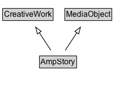

# AmpStory

A creative work with a visual storytelling format intended to be viewed online, particularly on mobile devices.

## Diagram

=== "SVG (interactive)"

    <!-- Generated by graphviz version 14.1.3 (20260303.0454)
     -->
    <!-- Pages: 1 -->
    <svg width="208pt" height="132pt"
     viewBox="0.00 0.00 208.00 132.00" xmlns="http://www.w3.org/2000/svg" xmlns:xlink="http://www.w3.org/1999/xlink">
    <g id="graph0" class="graph" transform="scale(1 1) rotate(0) translate(4 128)">
    <polygon fill="white" stroke="none" points="-4,4 -4,-128 204.38,-128 204.38,4 -4,4"/>
    <g id="clust3" class="cluster">
    <title>cluster_associated</title>
    </g>
    <!-- CreativeWork -->
    <g id="node1" class="node">
    <title>CreativeWork</title>
    <g id="a_node1"><a xlink:href="../CreativeWork" xlink:title="&lt;TABLE&gt;">
    <polygon fill="lightgray" stroke="none" points="1,-97.88 1,-114.12 75.75,-114.12 75.75,-97.88 1,-97.88"/>
    <text xml:space="preserve" text-anchor="start" x="2" y="-101.88" font-family="Arial" font-size="12.00">CreativeWork</text>
    <polygon fill="none" stroke="black" points="0,-96.88 0,-115.12 76.75,-115.12 76.75,-96.88 0,-96.88"/>
    </a>
    </g>
    </g>
    <!-- MediaObject -->
    <g id="node2" class="node">
    <title>MediaObject</title>
    <g id="a_node2"><a xlink:href="../MediaObject" xlink:title="&lt;TABLE&gt;">
    <polygon fill="lightgray" stroke="none" points="95.62,-97.88 95.62,-114.12 165.12,-114.12 165.12,-97.88 95.62,-97.88"/>
    <text xml:space="preserve" text-anchor="start" x="96.62" y="-101.88" font-family="Arial" font-size="12.00">MediaObject</text>
    <polygon fill="none" stroke="black" points="94.62,-96.88 94.62,-115.12 166.12,-115.12 166.12,-96.88 94.62,-96.88"/>
    </a>
    </g>
    </g>
    <!-- AmpStory -->
    <g id="node3" class="node">
    <title>AmpStory</title>
    <g id="a_node3"><a xlink:href="../AmpStory" xlink:title="&lt;TABLE&gt;">
    <polygon fill="lightgray" stroke="none" points="57.12,-25.88 57.12,-42.12 111.62,-42.12 111.62,-25.88 57.12,-25.88"/>
    <text xml:space="preserve" text-anchor="start" x="58.12" y="-29.88" font-family="Arial" font-size="12.00">AmpStory</text>
    <polygon fill="none" stroke="black" points="56.12,-24.88 56.12,-43.12 112.62,-43.12 112.62,-24.88 56.12,-24.88"/>
    </a>
    </g>
    </g>
    <!-- AmpStory&#45;&gt;CreativeWork -->
    <g id="edge1" class="edge">
    <title>AmpStory&#45;&gt;CreativeWork</title>
    <path fill="none" stroke="black" d="M73.34,-51.79C68.05,-59.85 61.58,-69.69 55.65,-78.71"/>
    <polygon fill="none" stroke="black" points="52.91,-76.51 50.34,-86.79 58.76,-80.36 52.91,-76.51"/>
    </g>
    <!-- AmpStory&#45;&gt;MediaObject -->
    <g id="edge2" class="edge">
    <title>AmpStory&#45;&gt;MediaObject</title>
    <path fill="none" stroke="black" d="M95.41,-51.79C100.7,-59.85 107.17,-69.69 113.1,-78.71"/>
    <polygon fill="none" stroke="black" points="109.99,-80.36 118.41,-86.79 115.84,-76.51 109.99,-80.36"/>
    </g>
    <!-- Invis -->
    </g>
    </svg>

=== "PNG"

    

## Formalization for AmpStory

| Property | Constraint |
|----------|------------|
| subClassOf | [CreativeWork](CreativeWork.md) |
| subClassOf | [MediaObject](MediaObject.md) |

