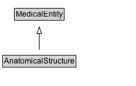

# AnatomicalStructure

Any part of the human body, typically a component of an anatomical system. Organs, tissues, and cells are all anatomical structures.

## Diagram

=== "SVG (interactive)"

    <!-- Generated by graphviz version 14.1.3 (20260303.0454)
     -->
    <!-- Pages: 1 -->
    <svg width="208pt" height="132pt"
     viewBox="0.00 0.00 208.00 132.00" xmlns="http://www.w3.org/2000/svg" xmlns:xlink="http://www.w3.org/1999/xlink">
    <g id="graph0" class="graph" transform="scale(1 1) rotate(0) translate(4 128)">
    <polygon fill="white" stroke="none" points="-4,4 -4,-128 204,-128 204,4 -4,4"/>
    <g id="clust3" class="cluster">
    <title>cluster_associated</title>
    </g>
    <!-- MedicalEntity -->
    <g id="node1" class="node">
    <title>MedicalEntity</title>
    <g id="a_node1"><a xlink:href="../MedicalEntity" xlink:title="&lt;TABLE&gt;">
    <polygon fill="lightgray" stroke="none" points="19,-97.88 19,-114.12 93,-114.12 93,-97.88 19,-97.88"/>
    <text xml:space="preserve" text-anchor="start" x="20" y="-101.88" font-family="Arial" font-size="12.00">MedicalEntity</text>
    <polygon fill="none" stroke="black" points="18,-96.88 18,-115.12 94,-115.12 94,-96.88 18,-96.88"/>
    </a>
    </g>
    </g>
    <!-- AnatomicalStructure -->
    <g id="node2" class="node">
    <title>AnatomicalStructure</title>
    <g id="a_node2"><a xlink:href="../AnatomicalStructure" xlink:title="&lt;TABLE&gt;">
    <polygon fill="lightgray" stroke="none" points="1,-25.88 1,-42.12 111,-42.12 111,-25.88 1,-25.88"/>
    <text xml:space="preserve" text-anchor="start" x="2" y="-29.88" font-family="Arial" font-size="12.00">AnatomicalStructure</text>
    <polygon fill="none" stroke="black" points="0,-24.88 0,-43.12 112,-43.12 112,-24.88 0,-24.88"/>
    </a>
    </g>
    </g>
    <!-- AnatomicalStructure&#45;&gt;MedicalEntity -->
    <g id="edge1" class="edge">
    <title>AnatomicalStructure&#45;&gt;MedicalEntity</title>
    <path fill="none" stroke="black" d="M56,-51.79C56,-59.25 56,-68.24 56,-76.69"/>
    <polygon fill="none" stroke="black" points="52.5,-76.54 56,-86.54 59.5,-76.54 52.5,-76.54"/>
    </g>
    <!-- Invis -->
    </g>
    </svg>

=== "PNG"

    

## Specializations of AnatomicalStructure

| Class | Description |
|-------|-------------|
| [Artery](Artery.md) | A type of blood vessel that specifically carries blood away from the heart. |
| [Bone](Bone.md) | Rigid connective tissue that comprises up the skeletal structure of the human body. |
| [Brain Structure](BrainStructure.md) | Any anatomical structure which pertains to the soft nervous tissue functioning as the coordinating center of sensation and intellectual and nervous activity. |
| [Joint](Joint.md) | The anatomical location at which two or more bones make contact. |
| [Ligament](Ligament.md) | A short band of tough, flexible, fibrous connective tissue that functions to connect multiple bones, cartilages, and structurally support joints. |
| [Lymphatic Vessel](LymphaticVessel.md) | A type of blood vessel that specifically carries lymph fluid unidirectionally toward the heart. |
| [Muscle](Muscle.md) | A muscle is an anatomical structure consisting of a contractile form of tissue that animals use to effect movement. |
| [Nerve](Nerve.md) | A common pathway for the electrochemical nerve impulses that are transmitted along each of the axons. |
| [Vein](Vein.md) | A type of blood vessel that specifically carries blood to the heart. |
| [Vessel](Vessel.md) | A component of the human body circulatory system comprised of an intricate network of hollow tubes that transport blood throughout the entire body. |

## Formalization for AnatomicalStructure

| Property | Constraint |
|----------|------------|
| subClassOf | [MedicalEntity](MedicalEntity.md) |

