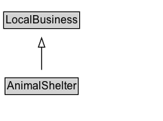

# AnimalShelter

Animal shelter.

## Diagram

=== "SVG (interactive)"

    <!-- Generated by graphviz version 14.1.3 (20260303.0454)
     -->
    <!-- Pages: 1 -->
    <svg width="177pt" height="132pt"
     viewBox="0.00 0.00 177.00 132.00" xmlns="http://www.w3.org/2000/svg" xmlns:xlink="http://www.w3.org/1999/xlink">
    <g id="graph0" class="graph" transform="scale(1 1) rotate(0) translate(4 128)">
    <polygon fill="white" stroke="none" points="-4,4 -4,-128 173.38,-128 173.38,4 -4,4"/>
    <g id="clust3" class="cluster">
    <title>cluster_associated</title>
    </g>
    <!-- LocalBusiness -->
    <g id="node1" class="node">
    <title>LocalBusiness</title>
    <g id="a_node1"><a xlink:href="../LocalBusiness" xlink:title="&lt;TABLE&gt;">
    <polygon fill="lightgray" stroke="none" points="1,-97.88 1,-114.12 81.75,-114.12 81.75,-97.88 1,-97.88"/>
    <text xml:space="preserve" text-anchor="start" x="2" y="-101.88" font-family="Arial" font-size="12.00">LocalBusiness</text>
    <polygon fill="none" stroke="black" points="0,-96.88 0,-115.12 82.75,-115.12 82.75,-96.88 0,-96.88"/>
    </a>
    </g>
    </g>
    <!-- AnimalShelter -->
    <g id="node2" class="node">
    <title>AnimalShelter</title>
    <g id="a_node2"><a xlink:href="../AnimalShelter" xlink:title="&lt;TABLE&gt;">
    <polygon fill="lightgray" stroke="none" points="2.5,-25.88 2.5,-42.12 80.25,-42.12 80.25,-25.88 2.5,-25.88"/>
    <text xml:space="preserve" text-anchor="start" x="3.5" y="-29.88" font-family="Arial" font-size="12.00">AnimalShelter</text>
    <polygon fill="none" stroke="black" points="1.5,-24.88 1.5,-43.12 81.25,-43.12 81.25,-24.88 1.5,-24.88"/>
    </a>
    </g>
    </g>
    <!-- AnimalShelter&#45;&gt;LocalBusiness -->
    <g id="edge1" class="edge">
    <title>AnimalShelter&#45;&gt;LocalBusiness</title>
    <path fill="none" stroke="black" d="M41.38,-51.79C41.38,-59.25 41.38,-68.24 41.38,-76.69"/>
    <polygon fill="none" stroke="black" points="37.88,-76.54 41.38,-86.54 44.88,-76.54 37.88,-76.54"/>
    </g>
    <!-- Invis -->
    </g>
    </svg>

=== "PNG"

    

## Formalization for AnimalShelter

| Property | Constraint |
|----------|------------|
| subClassOf | [LocalBusiness](LocalBusiness.md) |

