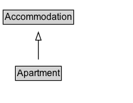

# Apartment

An apartment (in American English) or flat (in British English) is a self-contained housing unit (a type of residential real estate) that occupies only part of a building (source: Wikipedia, the free encyclopedia, see <a href="http://en.wikipedia.org/wiki/Apartment">http://en.wikipedia.org/wiki/Apartment</a>).

## Diagram

=== "SVG (interactive)"

    <!-- Generated by graphviz version 14.1.3 (20260303.0454)
     -->
    <!-- Pages: 1 -->
    <svg width="170pt" height="132pt"
     viewBox="0.00 0.00 170.00 132.00" xmlns="http://www.w3.org/2000/svg" xmlns:xlink="http://www.w3.org/1999/xlink">
    <g id="graph0" class="graph" transform="scale(1 1) rotate(0) translate(4 128)">
    <polygon fill="white" stroke="none" points="-4,4 -4,-128 166.12,-128 166.12,4 -4,4"/>
    <g id="clust3" class="cluster">
    <title>cluster_associated</title>
    </g>
    <!-- Accommodation -->
    <g id="node1" class="node">
    <title>Accommodation</title>
    <g id="a_node1"><a xlink:href="../Accommodation" xlink:title="&lt;TABLE&gt;">
    <polygon fill="lightgray" stroke="none" points="1,-97.88 1,-114.12 89.25,-114.12 89.25,-97.88 1,-97.88"/>
    <text xml:space="preserve" text-anchor="start" x="2" y="-101.88" font-family="Arial" font-size="12.00">Accommodation</text>
    <polygon fill="none" stroke="black" points="0,-96.88 0,-115.12 90.25,-115.12 90.25,-96.88 0,-96.88"/>
    </a>
    </g>
    </g>
    <!-- Apartment -->
    <g id="node2" class="node">
    <title>Apartment</title>
    <g id="a_node2"><a xlink:href="../Apartment" xlink:title="&lt;TABLE&gt;">
    <polygon fill="lightgray" stroke="none" points="16.75,-25.88 16.75,-42.12 73.5,-42.12 73.5,-25.88 16.75,-25.88"/>
    <text xml:space="preserve" text-anchor="start" x="17.75" y="-29.88" font-family="Arial" font-size="12.00">Apartment</text>
    <polygon fill="none" stroke="black" points="15.75,-24.88 15.75,-43.12 74.5,-43.12 74.5,-24.88 15.75,-24.88"/>
    </a>
    </g>
    </g>
    <!-- Apartment&#45;&gt;Accommodation -->
    <g id="edge1" class="edge">
    <title>Apartment&#45;&gt;Accommodation</title>
    <path fill="none" stroke="black" d="M45.12,-51.79C45.12,-59.25 45.12,-68.24 45.12,-76.69"/>
    <polygon fill="none" stroke="black" points="41.63,-76.54 45.13,-86.54 48.63,-76.54 41.63,-76.54"/>
    </g>
    <!-- Invis -->
    </g>
    </svg>

=== "PNG"

    

## Formalization for Apartment

| Property | Constraint |
|----------|------------|
| subClassOf | [Accommodation](Accommodation.md) |

