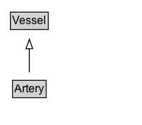

# Artery

A type of blood vessel that specifically carries blood away from the heart.

## Diagram

=== "SVG (interactive)"

    <!-- Generated by graphviz version 14.1.3 (20260303.0454)
     -->
    <!-- Pages: 1 -->
    <svg width="150pt" height="132pt"
     viewBox="0.00 0.00 150.00 132.00" xmlns="http://www.w3.org/2000/svg" xmlns:xlink="http://www.w3.org/1999/xlink">
    <g id="graph0" class="graph" transform="scale(1 1) rotate(0) translate(4 128)">
    <polygon fill="white" stroke="none" points="-4,4 -4,-128 146,-128 146,4 -4,4"/>
    <g id="clust3" class="cluster">
    <title>cluster_associated</title>
    </g>
    <!-- Vessel -->
    <g id="node1" class="node">
    <title>Vessel</title>
    <g id="a_node1"><a xlink:href="../Vessel" xlink:title="&lt;TABLE&gt;">
    <polygon fill="lightgray" stroke="none" points="8,-97.88 8,-114.12 46,-114.12 46,-97.88 8,-97.88"/>
    <text xml:space="preserve" text-anchor="start" x="9" y="-101.88" font-family="Arial" font-size="12.00">Vessel</text>
    <polygon fill="none" stroke="black" points="7,-96.88 7,-115.12 47,-115.12 47,-96.88 7,-96.88"/>
    </a>
    </g>
    </g>
    <!-- Artery -->
    <g id="node2" class="node">
    <title>Artery</title>
    <g id="a_node2"><a xlink:href="../Artery" xlink:title="&lt;TABLE&gt;">
    <polygon fill="lightgray" stroke="none" points="10.25,-25.88 10.25,-42.12 43.75,-42.12 43.75,-25.88 10.25,-25.88"/>
    <text xml:space="preserve" text-anchor="start" x="11.25" y="-29.88" font-family="Arial" font-size="12.00">Artery</text>
    <polygon fill="none" stroke="black" points="9.25,-24.88 9.25,-43.12 44.75,-43.12 44.75,-24.88 9.25,-24.88"/>
    </a>
    </g>
    </g>
    <!-- Artery&#45;&gt;Vessel -->
    <g id="edge1" class="edge">
    <title>Artery&#45;&gt;Vessel</title>
    <path fill="none" stroke="black" d="M27,-51.79C27,-59.25 27,-68.24 27,-76.69"/>
    <polygon fill="none" stroke="black" points="23.5,-76.54 27,-86.54 30.5,-76.54 23.5,-76.54"/>
    </g>
    <!-- Invis -->
    </g>
    </svg>

=== "PNG"

    

## Formalization for Artery

| Property | Constraint |
|----------|------------|
| subClassOf | [Vessel](Vessel.md) |

