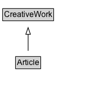

# Article

An article, such as a news article or piece of investigative report. Newspapers and magazines have articles of many different types and this is intended to cover them all.\n\nSee also [blog post](https://blog.schema.org/2014/09/02/schema-org-support-for-bibliographic-relationships-and-periodicals/).

## Diagram

=== "SVG (interactive)"

    <!-- Generated by graphviz version 14.1.3 (20260303.0454)
     -->
    <!-- Pages: 1 -->
    <svg width="161pt" height="132pt"
     viewBox="0.00 0.00 161.00 132.00" xmlns="http://www.w3.org/2000/svg" xmlns:xlink="http://www.w3.org/1999/xlink">
    <g id="graph0" class="graph" transform="scale(1 1) rotate(0) translate(4 128)">
    <polygon fill="white" stroke="none" points="-4,4 -4,-128 157.38,-128 157.38,4 -4,4"/>
    <g id="clust3" class="cluster">
    <title>cluster_associated</title>
    </g>
    <!-- CreativeWork -->
    <g id="node1" class="node">
    <title>CreativeWork</title>
    <g id="a_node1"><a xlink:href="../CreativeWork" xlink:title="&lt;TABLE&gt;">
    <polygon fill="lightgray" stroke="none" points="1,-97.88 1,-114.12 75.75,-114.12 75.75,-97.88 1,-97.88"/>
    <text xml:space="preserve" text-anchor="start" x="2" y="-101.88" font-family="Arial" font-size="12.00">CreativeWork</text>
    <polygon fill="none" stroke="black" points="0,-96.88 0,-115.12 76.75,-115.12 76.75,-96.88 0,-96.88"/>
    </a>
    </g>
    </g>
    <!-- Article -->
    <g id="node2" class="node">
    <title>Article</title>
    <g id="a_node2"><a xlink:href="../Article" xlink:title="&lt;TABLE&gt;">
    <polygon fill="lightgray" stroke="none" points="20.5,-25.88 20.5,-42.12 56.25,-42.12 56.25,-25.88 20.5,-25.88"/>
    <text xml:space="preserve" text-anchor="start" x="21.5" y="-29.88" font-family="Arial" font-size="12.00">Article</text>
    <polygon fill="none" stroke="black" points="19.5,-24.88 19.5,-43.12 57.25,-43.12 57.25,-24.88 19.5,-24.88"/>
    </a>
    </g>
    </g>
    <!-- Article&#45;&gt;CreativeWork -->
    <g id="edge1" class="edge">
    <title>Article&#45;&gt;CreativeWork</title>
    <path fill="none" stroke="black" d="M38.38,-51.79C38.38,-59.25 38.38,-68.24 38.38,-76.69"/>
    <polygon fill="none" stroke="black" points="34.88,-76.54 38.38,-86.54 41.88,-76.54 34.88,-76.54"/>
    </g>
    <!-- Invis -->
    </g>
    </svg>

=== "PNG"

    

## Specializations of Article

| Class | Description |
|-------|-------------|
| [Advertiser Content Article](AdvertiserContentArticle.md) | An [[Article]] that an external entity has paid to place or to produce to its specifications. Includes [advertorials](https://en.wikipedia.org/wiki/Advertorial), sponsored content, native advertising and other paid content. |
| [Analysis News Article](AnalysisNewsArticle.md) | An AnalysisNewsArticle is a [[NewsArticle]] that, while based on factual reporting, incorporates the expertise of the author/producer, offering interpretations and conclusions. |
| [Api Reference](APIReference.md) | Reference documentation for application programming interfaces (APIs). |
| [Ask Public News Article](AskPublicNewsArticle.md) | A [[NewsArticle]] expressing an open call by a [[NewsMediaOrganization]] asking the public for input, insights, clarifications, anecdotes, documentation, etc., on an issue, for reporting purposes. |
| [Background News Article](BackgroundNewsArticle.md) | A [[NewsArticle]] providing historical context, definition and detail on a specific topic (aka "explainer" or "backgrounder"). For example, an in-depth article or frequently-asked-questions ([FAQ](https://en.wikipedia.org/wiki/FAQ)) document on topics such as Climate Change or the European Union. Other kinds of background material from a non-news setting are often described using [[Book]] or [[Article]], in particular [[ScholarlyArticle]]. See also [[NewsArticle]] for related vocabulary from a learning/education perspective. |
| [Blog Posting](BlogPosting.md) | A blog post. |
| [Discussion Forum Posting](DiscussionForumPosting.md) | A posting to a discussion forum. |
| [Live Blog Posting](LiveBlogPosting.md) | A [[LiveBlogPosting]] is a [[BlogPosting]] intended to provide a rolling textual coverage of an ongoing event through continuous updates. |
| [Medical Scholarly Article](MedicalScholarlyArticle.md) | A scholarly article in the medical domain. |
| [News Article](NewsArticle.md) | A NewsArticle is an article whose content reports news, or provides background context and supporting materials for understanding the news.

A more detailed overview of [schema.org News markup](/docs/news.html) is also available.
 |
| [Opinion News Article](OpinionNewsArticle.md) | An [[OpinionNewsArticle]] is a [[NewsArticle]] that primarily expresses opinions rather than journalistic reporting of news and events. For example, a [[NewsArticle]] consisting of a column or [[Blog]]/[[BlogPosting]] entry in the Opinions section of a news publication.  |
| [Report](Report.md) | A Report generated by governmental or non-governmental organization. |
| [Reportage News Article](ReportageNewsArticle.md) | The [[ReportageNewsArticle]] type is a subtype of [[NewsArticle]] representing
 news articles which are the result of journalistic news reporting conventions.

In practice many news publishers produce a wide variety of article types, many of which might be considered a [[NewsArticle]] but not a [[ReportageNewsArticle]]. For example, opinion pieces, reviews, analysis, sponsored or satirical articles, or articles that combine several of these elements.

The [[ReportageNewsArticle]] type is based on a stricter ideal for "news" as a work of journalism, with articles based on factual information either observed or verified by the author, or reported and verified from knowledgeable sources.  This often includes perspectives from multiple viewpoints on a particular issue (distinguishing news reports from public relations or propaganda).  News reports in the [[ReportageNewsArticle]] sense de-emphasize the opinion of the author, with commentary and value judgements typically expressed elsewhere.

A [[ReportageNewsArticle]] which goes deeper into analysis can also be marked with an additional type of [[AnalysisNewsArticle]].
 |
| [Review News Article](ReviewNewsArticle.md) | A [[NewsArticle]] and [[CriticReview]] providing a professional critic's assessment of a service, product, performance, or artistic or literary work. |
| [Satirical Article](SatiricalArticle.md) | An [[Article]] whose content is primarily [[satirical]](https://en.wikipedia.org/wiki/Satire) in nature, i.e. unlikely to be literally true. A satirical article is sometimes but not necessarily also a [[NewsArticle]]. [[ScholarlyArticle]]s are also sometimes satirized. |
| [Scholarly Article](ScholarlyArticle.md) | A scholarly article. |
| [Social Media Posting](SocialMediaPosting.md) | A post to a social media platform, including blog posts, tweets, Facebook posts, etc. |
| [Tech Article](TechArticle.md) | A technical article - Example: How-to (task) topics, step-by-step, procedural troubleshooting, specifications, etc. |

## Formalization for Article

| Property | Constraint |
|----------|------------|
| subClassOf | [CreativeWork](CreativeWork.md) |

