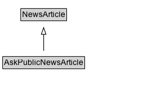

# AskPublicNewsArticle

A [[NewsArticle]] expressing an open call by a [[NewsMediaOrganization]] asking the public for input, insights, clarifications, anecdotes, documentation, etc., on an issue, for reporting purposes.

## Diagram

=== "SVG (interactive)"

    <!-- Generated by graphviz version 14.1.3 (20260303.0454)
     -->
    <!-- Pages: 1 -->
    <svg width="218pt" height="132pt"
     viewBox="0.00 0.00 218.00 132.00" xmlns="http://www.w3.org/2000/svg" xmlns:xlink="http://www.w3.org/1999/xlink">
    <g id="graph0" class="graph" transform="scale(1 1) rotate(0) translate(4 128)">
    <polygon fill="white" stroke="none" points="-4,4 -4,-128 214.25,-128 214.25,4 -4,4"/>
    <g id="clust3" class="cluster">
    <title>cluster_associated</title>
    </g>
    <!-- NewsArticle -->
    <g id="node1" class="node">
    <title>NewsArticle</title>
    <g id="a_node1"><a xlink:href="../NewsArticle" xlink:title="&lt;TABLE&gt;">
    <polygon fill="lightgray" stroke="none" points="28,-97.88 28,-114.12 94.5,-114.12 94.5,-97.88 28,-97.88"/>
    <text xml:space="preserve" text-anchor="start" x="29" y="-101.88" font-family="Arial" font-size="12.00">NewsArticle</text>
    <polygon fill="none" stroke="black" points="27,-96.88 27,-115.12 95.5,-115.12 95.5,-96.88 27,-96.88"/>
    </a>
    </g>
    </g>
    <!-- AskPublicNewsArticle -->
    <g id="node2" class="node">
    <title>AskPublicNewsArticle</title>
    <g id="a_node2"><a xlink:href="../AskPublicNewsArticle" xlink:title="&lt;TABLE&gt;">
    <polygon fill="lightgray" stroke="none" points="1,-25.88 1,-42.12 121.5,-42.12 121.5,-25.88 1,-25.88"/>
    <text xml:space="preserve" text-anchor="start" x="2" y="-29.88" font-family="Arial" font-size="12.00">AskPublicNewsArticle</text>
    <polygon fill="none" stroke="black" points="0,-24.88 0,-43.12 122.5,-43.12 122.5,-24.88 0,-24.88"/>
    </a>
    </g>
    </g>
    <!-- AskPublicNewsArticle&#45;&gt;NewsArticle -->
    <g id="edge1" class="edge">
    <title>AskPublicNewsArticle&#45;&gt;NewsArticle</title>
    <path fill="none" stroke="black" d="M61.25,-51.79C61.25,-59.25 61.25,-68.24 61.25,-76.69"/>
    <polygon fill="none" stroke="black" points="57.75,-76.54 61.25,-86.54 64.75,-76.54 57.75,-76.54"/>
    </g>
    <!-- Invis -->
    </g>
    </svg>

=== "PNG"

    

## Formalization for AskPublicNewsArticle

| Property | Constraint |
|----------|------------|
| subClassOf | [NewsArticle](NewsArticle.md) |

