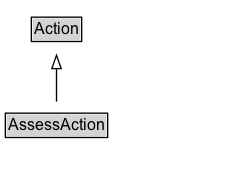

# AssessAction

The act of forming one's opinion, reaction or sentiment.

## Diagram

=== "SVG (interactive)"

    <!-- Generated by graphviz version 14.1.3 (20260303.0454)
     -->
    <!-- Pages: 1 -->
    <svg width="172pt" height="132pt"
     viewBox="0.00 0.00 172.00 132.00" xmlns="http://www.w3.org/2000/svg" xmlns:xlink="http://www.w3.org/1999/xlink">
    <g id="graph0" class="graph" transform="scale(1 1) rotate(0) translate(4 128)">
    <polygon fill="white" stroke="none" points="-4,4 -4,-128 168.38,-128 168.38,4 -4,4"/>
    <g id="clust3" class="cluster">
    <title>cluster_associated</title>
    </g>
    <!-- Action -->
    <g id="node1" class="node">
    <title>Action</title>
    <g id="a_node1"><a xlink:href="../Action" xlink:title="&lt;TABLE&gt;">
    <polygon fill="lightgray" stroke="none" points="20.5,-97.88 20.5,-114.12 56.25,-114.12 56.25,-97.88 20.5,-97.88"/>
    <text xml:space="preserve" text-anchor="start" x="21.5" y="-101.88" font-family="Arial" font-size="12.00">Action</text>
    <polygon fill="none" stroke="black" points="19.5,-96.88 19.5,-115.12 57.25,-115.12 57.25,-96.88 19.5,-96.88"/>
    </a>
    </g>
    </g>
    <!-- AssessAction -->
    <g id="node2" class="node">
    <title>AssessAction</title>
    <g id="a_node2"><a xlink:href="../AssessAction" xlink:title="&lt;TABLE&gt;">
    <polygon fill="lightgray" stroke="none" points="1,-25.88 1,-42.12 75.75,-42.12 75.75,-25.88 1,-25.88"/>
    <text xml:space="preserve" text-anchor="start" x="2" y="-29.88" font-family="Arial" font-size="12.00">AssessAction</text>
    <polygon fill="none" stroke="black" points="0,-24.88 0,-43.12 76.75,-43.12 76.75,-24.88 0,-24.88"/>
    </a>
    </g>
    </g>
    <!-- AssessAction&#45;&gt;Action -->
    <g id="edge1" class="edge">
    <title>AssessAction&#45;&gt;Action</title>
    <path fill="none" stroke="black" d="M38.38,-51.79C38.38,-59.25 38.38,-68.24 38.38,-76.69"/>
    <polygon fill="none" stroke="black" points="34.88,-76.54 38.38,-86.54 41.88,-76.54 34.88,-76.54"/>
    </g>
    <!-- Invis -->
    </g>
    </svg>

=== "PNG"

    

## Specializations of AssessAction

| Class | Description |
|-------|-------------|
| [Agree Action](AgreeAction.md) | The act of expressing a consistency of opinion with the object. An agent agrees to/about an object (a proposition, topic or theme) with participants. |
| [Choose Action](ChooseAction.md) | The act of expressing a preference from a set of options or a large or unbounded set of choices/options. |
| [Disagree Action](DisagreeAction.md) | The act of expressing a difference of opinion with the object. An agent disagrees to/about an object (a proposition, topic or theme) with participants. |
| [Dislike Action](DislikeAction.md) | The act of expressing a negative sentiment about the object. An agent dislikes an object (a proposition, topic or theme) with participants. |
| [Endorse Action](EndorseAction.md) | An agent approves/certifies/likes/supports/sanctions an object. |
| [Ignore Action](IgnoreAction.md) | The act of intentionally disregarding the object. An agent ignores an object. |
| [Like Action](LikeAction.md) | The act of expressing a positive sentiment about the object. An agent likes an object (a proposition, topic or theme) with participants. |
| [React Action](ReactAction.md) | The act of responding instinctively and emotionally to an object, expressing a sentiment. |
| [Review Action](ReviewAction.md) | The act of producing a balanced opinion about the object for an audience. An agent reviews an object with participants resulting in a review. |
| [Vote Action](VoteAction.md) | The act of expressing a preference from a fixed/finite/structured set of choices/options. |
| [Want Action](WantAction.md) | The act of expressing a desire about the object. An agent wants an object. |

## Formalization for AssessAction

| Property | Constraint |
|----------|------------|
| subClassOf | [Action](Action.md) |

