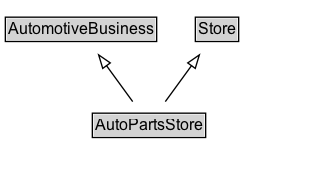

# AutoPartsStore

An auto parts store.

## Diagram

=== "SVG (interactive)"

    <!-- Generated by graphviz version 14.1.3 (20260303.0454)
     -->
    <!-- Pages: 1 -->
    <svg width="247pt" height="132pt"
     viewBox="0.00 0.00 247.00 132.00" xmlns="http://www.w3.org/2000/svg" xmlns:xlink="http://www.w3.org/1999/xlink">
    <g id="graph0" class="graph" transform="scale(1 1) rotate(0) translate(4 128)">
    <polygon fill="white" stroke="none" points="-4,4 -4,-128 242.75,-128 242.75,4 -4,4"/>
    <g id="clust3" class="cluster">
    <title>cluster_associated</title>
    </g>
    <!-- AutomotiveBusiness -->
    <g id="node1" class="node">
    <title>AutomotiveBusiness</title>
    <g id="a_node1"><a xlink:href="../AutomotiveBusiness" xlink:title="&lt;TABLE&gt;">
    <polygon fill="lightgray" stroke="none" points="1,-97.88 1,-114.12 112.5,-114.12 112.5,-97.88 1,-97.88"/>
    <text xml:space="preserve" text-anchor="start" x="2" y="-101.88" font-family="Arial" font-size="12.00">AutomotiveBusiness</text>
    <polygon fill="none" stroke="black" points="0,-96.88 0,-115.12 113.5,-115.12 113.5,-96.88 0,-96.88"/>
    </a>
    </g>
    </g>
    <!-- Store -->
    <g id="node2" class="node">
    <title>Store</title>
    <g id="a_node2"><a xlink:href="../Store" xlink:title="&lt;TABLE&gt;">
    <polygon fill="lightgray" stroke="none" points="143.5,-97.88 143.5,-114.12 174,-114.12 174,-97.88 143.5,-97.88"/>
    <text xml:space="preserve" text-anchor="start" x="144.5" y="-101.88" font-family="Arial" font-size="12.00">Store</text>
    <polygon fill="none" stroke="black" points="142.5,-96.88 142.5,-115.12 175,-115.12 175,-96.88 142.5,-96.88"/>
    </a>
    </g>
    </g>
    <!-- AutoPartsStore -->
    <g id="node3" class="node">
    <title>AutoPartsStore</title>
    <g id="a_node3"><a xlink:href="../AutoPartsStore" xlink:title="&lt;TABLE&gt;">
    <polygon fill="lightgray" stroke="none" points="66.25,-25.88 66.25,-42.12 149.25,-42.12 149.25,-25.88 66.25,-25.88"/>
    <text xml:space="preserve" text-anchor="start" x="67.25" y="-29.88" font-family="Arial" font-size="12.00">AutoPartsStore</text>
    <polygon fill="none" stroke="black" points="65.25,-24.88 65.25,-43.12 150.25,-43.12 150.25,-24.88 65.25,-24.88"/>
    </a>
    </g>
    </g>
    <!-- AutoPartsStore&#45;&gt;AutomotiveBusiness -->
    <g id="edge1" class="edge">
    <title>AutoPartsStore&#45;&gt;AutomotiveBusiness</title>
    <path fill="none" stroke="black" d="M95.52,-51.79C89.58,-59.93 82.32,-69.9 75.69,-79"/>
    <polygon fill="none" stroke="black" points="73.05,-76.69 69.99,-86.83 78.7,-80.81 73.05,-76.69"/>
    </g>
    <!-- AutoPartsStore&#45;&gt;Store -->
    <g id="edge2" class="edge">
    <title>AutoPartsStore&#45;&gt;Store</title>
    <path fill="none" stroke="black" d="M119.98,-51.79C125.92,-59.93 133.18,-69.9 139.81,-79"/>
    <polygon fill="none" stroke="black" points="136.8,-80.81 145.51,-86.83 142.45,-76.69 136.8,-80.81"/>
    </g>
    <!-- Invis -->
    </g>
    </svg>

=== "PNG"

    

## Formalization for AutoPartsStore

| Property | Constraint |
|----------|------------|
| subClassOf | [AutomotiveBusiness](AutomotiveBusiness.md) |
| subClassOf | [Store](Store.md) |

