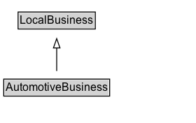

# AutomotiveBusiness

Car repair, sales, or parts.

## Diagram

=== "SVG (interactive)"

    <!-- Generated by graphviz version 14.1.3 (20260303.0454)
     -->
    <!-- Pages: 1 -->
    <svg width="210pt" height="132pt"
     viewBox="0.00 0.00 210.00 132.00" xmlns="http://www.w3.org/2000/svg" xmlns:xlink="http://www.w3.org/1999/xlink">
    <g id="graph0" class="graph" transform="scale(1 1) rotate(0) translate(4 128)">
    <polygon fill="white" stroke="none" points="-4,4 -4,-128 205.75,-128 205.75,4 -4,4"/>
    <g id="clust3" class="cluster">
    <title>cluster_associated</title>
    </g>
    <!-- LocalBusiness -->
    <g id="node1" class="node">
    <title>LocalBusiness</title>
    <g id="a_node1"><a xlink:href="../LocalBusiness" xlink:title="&lt;TABLE&gt;">
    <polygon fill="lightgray" stroke="none" points="16.38,-97.88 16.38,-114.12 97.12,-114.12 97.12,-97.88 16.38,-97.88"/>
    <text xml:space="preserve" text-anchor="start" x="17.38" y="-101.88" font-family="Arial" font-size="12.00">LocalBusiness</text>
    <polygon fill="none" stroke="black" points="15.38,-96.88 15.38,-115.12 98.12,-115.12 98.12,-96.88 15.38,-96.88"/>
    </a>
    </g>
    </g>
    <!-- AutomotiveBusiness -->
    <g id="node2" class="node">
    <title>AutomotiveBusiness</title>
    <g id="a_node2"><a xlink:href="../AutomotiveBusiness" xlink:title="&lt;TABLE&gt;">
    <polygon fill="lightgray" stroke="none" points="1,-25.88 1,-42.12 112.5,-42.12 112.5,-25.88 1,-25.88"/>
    <text xml:space="preserve" text-anchor="start" x="2" y="-29.88" font-family="Arial" font-size="12.00">AutomotiveBusiness</text>
    <polygon fill="none" stroke="black" points="0,-24.88 0,-43.12 113.5,-43.12 113.5,-24.88 0,-24.88"/>
    </a>
    </g>
    </g>
    <!-- AutomotiveBusiness&#45;&gt;LocalBusiness -->
    <g id="edge1" class="edge">
    <title>AutomotiveBusiness&#45;&gt;LocalBusiness</title>
    <path fill="none" stroke="black" d="M56.75,-51.79C56.75,-59.25 56.75,-68.24 56.75,-76.69"/>
    <polygon fill="none" stroke="black" points="53.25,-76.54 56.75,-86.54 60.25,-76.54 53.25,-76.54"/>
    </g>
    <!-- Invis -->
    </g>
    </svg>

=== "PNG"

    

## Specializations of AutomotiveBusiness

| Class | Description |
|-------|-------------|
| [Auto Body Shop](AutoBodyShop.md) | Auto body shop. |
| [Auto Dealer](AutoDealer.md) | An car dealership. |
| [Auto Parts Store](AutoPartsStore.md) | An auto parts store. |
| [Auto Rental](AutoRental.md) | A car rental business. |
| [Auto Repair](AutoRepair.md) | Car repair business. |
| [Auto Wash](AutoWash.md) | A car wash business. |
| [Gas Station](GasStation.md) | A gas station. |
| [Motorcycle Dealer](MotorcycleDealer.md) | A motorcycle dealer. |
| [Motorcycle Repair](MotorcycleRepair.md) | A motorcycle repair shop. |

## Formalization for AutomotiveBusiness

| Property | Constraint |
|----------|------------|
| subClassOf | [LocalBusiness](LocalBusiness.md) |

