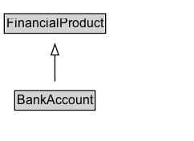

# BankAccount

A product or service offered by a bank whereby one may deposit, withdraw or transfer money and in some cases be paid interest.

## Diagram

=== "SVG (interactive)"

    <!-- Generated by graphviz version 14.1.3 (20260303.0454)
     -->
    <!-- Pages: 1 -->
    <svg width="181pt" height="132pt"
     viewBox="0.00 0.00 181.00 132.00" xmlns="http://www.w3.org/2000/svg" xmlns:xlink="http://www.w3.org/1999/xlink">
    <g id="graph0" class="graph" transform="scale(1 1) rotate(0) translate(4 128)">
    <polygon fill="white" stroke="none" points="-4,4 -4,-128 177.38,-128 177.38,4 -4,4"/>
    <g id="clust3" class="cluster">
    <title>cluster_associated</title>
    </g>
    <!-- FinancialProduct -->
    <g id="node1" class="node">
    <title>FinancialProduct</title>
    <g id="a_node1"><a xlink:href="../FinancialProduct" xlink:title="&lt;TABLE&gt;">
    <polygon fill="lightgray" stroke="none" points="1,-97.88 1,-114.12 93.75,-114.12 93.75,-97.88 1,-97.88"/>
    <text xml:space="preserve" text-anchor="start" x="2" y="-101.88" font-family="Arial" font-size="12.00">FinancialProduct</text>
    <polygon fill="none" stroke="black" points="0,-96.88 0,-115.12 94.75,-115.12 94.75,-96.88 0,-96.88"/>
    </a>
    </g>
    </g>
    <!-- BankAccount -->
    <g id="node2" class="node">
    <title>BankAccount</title>
    <g id="a_node2"><a xlink:href="../BankAccount" xlink:title="&lt;TABLE&gt;">
    <polygon fill="lightgray" stroke="none" points="10.75,-25.88 10.75,-42.12 84,-42.12 84,-25.88 10.75,-25.88"/>
    <text xml:space="preserve" text-anchor="start" x="11.75" y="-29.88" font-family="Arial" font-size="12.00">BankAccount</text>
    <polygon fill="none" stroke="black" points="9.75,-24.88 9.75,-43.12 85,-43.12 85,-24.88 9.75,-24.88"/>
    </a>
    </g>
    </g>
    <!-- BankAccount&#45;&gt;FinancialProduct -->
    <g id="edge1" class="edge">
    <title>BankAccount&#45;&gt;FinancialProduct</title>
    <path fill="none" stroke="black" d="M47.38,-51.79C47.38,-59.25 47.38,-68.24 47.38,-76.69"/>
    <polygon fill="none" stroke="black" points="43.88,-76.54 47.38,-86.54 50.88,-76.54 43.88,-76.54"/>
    </g>
    <!-- Invis -->
    </g>
    </svg>

=== "PNG"

    

## Specializations of BankAccount

| Class | Description |
|-------|-------------|
| [Deposit Account](DepositAccount.md) | A type of Bank Account with a main purpose of depositing funds to gain interest or other benefits. |

## Formalization for BankAccount

| Property | Constraint |
|----------|------------|
| subClassOf | [FinancialProduct](FinancialProduct.md) |

