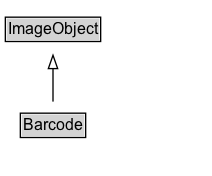

# Barcode

An image of a visual machine-readable code such as a barcode or QR code.

## Diagram

=== "SVG (interactive)"

    <!-- Generated by graphviz version 14.1.3 (20260303.0454)
     -->
    <!-- Pages: 1 -->
    <svg width="159pt" height="132pt"
     viewBox="0.00 0.00 159.00 132.00" xmlns="http://www.w3.org/2000/svg" xmlns:xlink="http://www.w3.org/1999/xlink">
    <g id="graph0" class="graph" transform="scale(1 1) rotate(0) translate(4 128)">
    <polygon fill="white" stroke="none" points="-4,4 -4,-128 154.75,-128 154.75,4 -4,4"/>
    <g id="clust3" class="cluster">
    <title>cluster_associated</title>
    </g>
    <!-- ImageObject -->
    <g id="node1" class="node">
    <title>ImageObject</title>
    <g id="a_node1"><a xlink:href="../ImageObject" xlink:title="&lt;TABLE&gt;">
    <polygon fill="lightgray" stroke="none" points="1,-97.88 1,-114.12 70.5,-114.12 70.5,-97.88 1,-97.88"/>
    <text xml:space="preserve" text-anchor="start" x="2" y="-101.88" font-family="Arial" font-size="12.00">ImageObject</text>
    <polygon fill="none" stroke="black" points="0,-96.88 0,-115.12 71.5,-115.12 71.5,-96.88 0,-96.88"/>
    </a>
    </g>
    </g>
    <!-- Barcode -->
    <g id="node2" class="node">
    <title>Barcode</title>
    <g id="a_node2"><a xlink:href="../Barcode" xlink:title="&lt;TABLE&gt;">
    <polygon fill="lightgray" stroke="none" points="12.25,-25.88 12.25,-42.12 59.25,-42.12 59.25,-25.88 12.25,-25.88"/>
    <text xml:space="preserve" text-anchor="start" x="13.25" y="-29.88" font-family="Arial" font-size="12.00">Barcode</text>
    <polygon fill="none" stroke="black" points="11.25,-24.88 11.25,-43.12 60.25,-43.12 60.25,-24.88 11.25,-24.88"/>
    </a>
    </g>
    </g>
    <!-- Barcode&#45;&gt;ImageObject -->
    <g id="edge1" class="edge">
    <title>Barcode&#45;&gt;ImageObject</title>
    <path fill="none" stroke="black" d="M35.75,-51.79C35.75,-59.25 35.75,-68.24 35.75,-76.69"/>
    <polygon fill="none" stroke="black" points="32.25,-76.54 35.75,-86.54 39.25,-76.54 32.25,-76.54"/>
    </g>
    <!-- Invis -->
    </g>
    </svg>

=== "PNG"

    

## Formalization for Barcode

| Property | Constraint |
|----------|------------|
| subClassOf | [ImageObject](ImageObject.md) |

