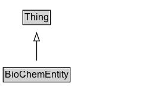

# BioChemEntity

Any biological, chemical, or biochemical thing. For example: a protein; a gene; a chemical; a synthetic chemical.

## Diagram

=== "SVG (interactive)"

    <!-- Generated by graphviz version 14.1.3 (20260303.0454)
     -->
    <!-- Pages: 1 -->
    <svg width="180pt" height="132pt"
     viewBox="0.00 0.00 180.00 132.00" xmlns="http://www.w3.org/2000/svg" xmlns:xlink="http://www.w3.org/1999/xlink">
    <g id="graph0" class="graph" transform="scale(1 1) rotate(0) translate(4 128)">
    <polygon fill="white" stroke="none" points="-4,4 -4,-128 176.12,-128 176.12,4 -4,4"/>
    <g id="clust3" class="cluster">
    <title>cluster_associated</title>
    </g>
    <!-- Thing -->
    <g id="node1" class="node">
    <title>Thing</title>
    <g id="a_node1"><a xlink:href="../Thing" xlink:title="&lt;TABLE&gt;">
    <polygon fill="lightgray" stroke="none" points="25.75,-97.88 25.75,-114.12 58.5,-114.12 58.5,-97.88 25.75,-97.88"/>
    <text xml:space="preserve" text-anchor="start" x="26.75" y="-101.88" font-family="Arial" font-size="12.00">Thing</text>
    <polygon fill="none" stroke="black" points="24.75,-96.88 24.75,-115.12 59.5,-115.12 59.5,-96.88 24.75,-96.88"/>
    </a>
    </g>
    </g>
    <!-- BioChemEntity -->
    <g id="node2" class="node">
    <title>BioChemEntity</title>
    <g id="a_node2"><a xlink:href="../BioChemEntity" xlink:title="&lt;TABLE&gt;">
    <polygon fill="lightgray" stroke="none" points="1,-25.88 1,-42.12 83.25,-42.12 83.25,-25.88 1,-25.88"/>
    <text xml:space="preserve" text-anchor="start" x="2" y="-29.88" font-family="Arial" font-size="12.00">BioChemEntity</text>
    <polygon fill="none" stroke="black" points="0,-24.88 0,-43.12 84.25,-43.12 84.25,-24.88 0,-24.88"/>
    </a>
    </g>
    </g>
    <!-- BioChemEntity&#45;&gt;Thing -->
    <g id="edge1" class="edge">
    <title>BioChemEntity&#45;&gt;Thing</title>
    <path fill="none" stroke="black" d="M42.12,-51.79C42.12,-59.25 42.12,-68.24 42.12,-76.69"/>
    <polygon fill="none" stroke="black" points="38.63,-76.54 42.13,-86.54 45.63,-76.54 38.63,-76.54"/>
    </g>
    <!-- Invis -->
    </g>
    </svg>

=== "PNG"

    

## Specializations of BioChemEntity

| Class | Description |
|-------|-------------|
| [Chemical Substance](ChemicalSubstance.md) | A chemical substance is 'a portion of matter of constant composition, composed of molecular entities of the same type or of different types' (source: [ChEBI:59999](https://www.ebi.ac.uk/chebi/searchId.do?chebiId=59999)). |
| [Gene](Gene.md) | A discrete unit of inheritance which affects one or more biological traits (Source: [https://en.wikipedia.org/wiki/Gene](https://en.wikipedia.org/wiki/Gene)). Examples include FOXP2 (Forkhead box protein P2), SCARNA21 (small Cajal body-specific RNA 21), A- (agouti genotype). |
| [Molecular Entity](MolecularEntity.md) | Any constitutionally or isotopically distinct atom, molecule, ion, ion pair, radical, radical ion, complex, conformer etc., identifiable as a separately distinguishable entity. |
| [Protein](Protein.md) | Protein is here used in its widest possible definition, as classes of amino acid based molecules. Amyloid-beta Protein in human (UniProt P05067), eukaryota (e.g. an OrthoDB group) or even a single molecule that one can point to are all of type :Protein. A protein can thus be a subclass of another protein, e.g. :Protein as a UniProt record can have multiple isoforms inside it which would also be :Protein. They can be imagined, synthetic, hypothetical or naturally occurring. |

## Formalization for BioChemEntity

| Property | Constraint |
|----------|------------|
| subClassOf | [Thing](Thing.md) |

