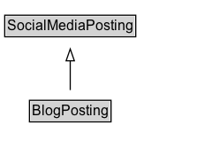

# BlogPosting

A blog post.

## Diagram

=== "SVG (interactive)"

    <!-- Generated by graphviz version 14.1.3 (20260303.0454)
     -->
    <!-- Pages: 1 -->
    <svg width="187pt" height="132pt"
     viewBox="0.00 0.00 187.00 132.00" xmlns="http://www.w3.org/2000/svg" xmlns:xlink="http://www.w3.org/1999/xlink">
    <g id="graph0" class="graph" transform="scale(1 1) rotate(0) translate(4 128)">
    <polygon fill="white" stroke="none" points="-4,4 -4,-128 182.62,-128 182.62,4 -4,4"/>
    <g id="clust3" class="cluster">
    <title>cluster_associated</title>
    </g>
    <!-- SocialMediaPosting -->
    <g id="node1" class="node">
    <title>SocialMediaPosting</title>
    <g id="a_node1"><a xlink:href="../SocialMediaPosting" xlink:title="&lt;TABLE&gt;">
    <polygon fill="lightgray" stroke="none" points="1,-97.88 1,-114.12 110.25,-114.12 110.25,-97.88 1,-97.88"/>
    <text xml:space="preserve" text-anchor="start" x="2" y="-101.88" font-family="Arial" font-size="12.00">SocialMediaPosting</text>
    <polygon fill="none" stroke="black" points="0,-96.88 0,-115.12 111.25,-115.12 111.25,-96.88 0,-96.88"/>
    </a>
    </g>
    </g>
    <!-- BlogPosting -->
    <g id="node2" class="node">
    <title>BlogPosting</title>
    <g id="a_node2"><a xlink:href="../BlogPosting" xlink:title="&lt;TABLE&gt;">
    <polygon fill="lightgray" stroke="none" points="22,-25.88 22,-42.12 89.25,-42.12 89.25,-25.88 22,-25.88"/>
    <text xml:space="preserve" text-anchor="start" x="23" y="-29.88" font-family="Arial" font-size="12.00">BlogPosting</text>
    <polygon fill="none" stroke="black" points="21,-24.88 21,-43.12 90.25,-43.12 90.25,-24.88 21,-24.88"/>
    </a>
    </g>
    </g>
    <!-- BlogPosting&#45;&gt;SocialMediaPosting -->
    <g id="edge1" class="edge">
    <title>BlogPosting&#45;&gt;SocialMediaPosting</title>
    <path fill="none" stroke="black" d="M55.62,-51.79C55.62,-59.25 55.62,-68.24 55.62,-76.69"/>
    <polygon fill="none" stroke="black" points="52.13,-76.54 55.63,-86.54 59.13,-76.54 52.13,-76.54"/>
    </g>
    <!-- Invis -->
    </g>
    </svg>

=== "PNG"

    

## Specializations of BlogPosting

| Class | Description |
|-------|-------------|
| [Live Blog Posting](LiveBlogPosting.md) | A [[LiveBlogPosting]] is a [[BlogPosting]] intended to provide a rolling textual coverage of an ongoing event through continuous updates. |

## Formalization for BlogPosting

| Property | Constraint |
|----------|------------|
| subClassOf | [SocialMediaPosting](SocialMediaPosting.md) |

