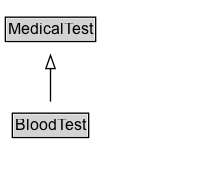

# BloodTest

A medical test performed on a sample of a patient's blood.

## Diagram

=== "SVG (interactive)"

    <!-- Generated by graphviz version 14.1.3 (20260303.0454)
     -->
    <!-- Pages: 1 -->
    <svg width="159pt" height="132pt"
     viewBox="0.00 0.00 159.00 132.00" xmlns="http://www.w3.org/2000/svg" xmlns:xlink="http://www.w3.org/1999/xlink">
    <g id="graph0" class="graph" transform="scale(1 1) rotate(0) translate(4 128)">
    <polygon fill="white" stroke="none" points="-4,4 -4,-128 154.88,-128 154.88,4 -4,4"/>
    <g id="clust3" class="cluster">
    <title>cluster_associated</title>
    </g>
    <!-- MedicalTest -->
    <g id="node1" class="node">
    <title>MedicalTest</title>
    <g id="a_node1"><a xlink:href="../MedicalTest" xlink:title="&lt;TABLE&gt;">
    <polygon fill="lightgray" stroke="none" points="1,-97.88 1,-114.12 66.75,-114.12 66.75,-97.88 1,-97.88"/>
    <text xml:space="preserve" text-anchor="start" x="2" y="-101.88" font-family="Arial" font-size="12.00">MedicalTest</text>
    <polygon fill="none" stroke="black" points="0,-96.88 0,-115.12 67.75,-115.12 67.75,-96.88 0,-96.88"/>
    </a>
    </g>
    </g>
    <!-- BloodTest -->
    <g id="node2" class="node">
    <title>BloodTest</title>
    <g id="a_node2"><a xlink:href="../BloodTest" xlink:title="&lt;TABLE&gt;">
    <polygon fill="lightgray" stroke="none" points="6.25,-25.88 6.25,-42.12 61.5,-42.12 61.5,-25.88 6.25,-25.88"/>
    <text xml:space="preserve" text-anchor="start" x="7.25" y="-29.88" font-family="Arial" font-size="12.00">BloodTest</text>
    <polygon fill="none" stroke="black" points="5.25,-24.88 5.25,-43.12 62.5,-43.12 62.5,-24.88 5.25,-24.88"/>
    </a>
    </g>
    </g>
    <!-- BloodTest&#45;&gt;MedicalTest -->
    <g id="edge1" class="edge">
    <title>BloodTest&#45;&gt;MedicalTest</title>
    <path fill="none" stroke="black" d="M33.88,-51.79C33.88,-59.25 33.88,-68.24 33.88,-76.69"/>
    <polygon fill="none" stroke="black" points="30.38,-76.54 33.88,-86.54 37.38,-76.54 30.38,-76.54"/>
    </g>
    <!-- Invis -->
    </g>
    </svg>

=== "PNG"

    

## Formalization for BloodTest

| Property | Constraint |
|----------|------------|
| subClassOf | [MedicalTest](MedicalTest.md) |

