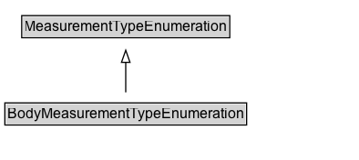

# BodyMeasurementTypeEnumeration

Enumerates types (or dimensions) of a person's body measurements, for example for fitting of clothes.

## Diagram

=== "SVG (interactive)"

    <!-- Generated by graphviz version 14.1.3 (20260303.0454)
     -->
    <!-- Pages: 1 -->
    <svg width="296pt" height="132pt"
     viewBox="0.00 0.00 296.00 132.00" xmlns="http://www.w3.org/2000/svg" xmlns:xlink="http://www.w3.org/1999/xlink">
    <g id="graph0" class="graph" transform="scale(1 1) rotate(0) translate(4 128)">
    <polygon fill="white" stroke="none" points="-4,4 -4,-128 291.5,-128 291.5,4 -4,4"/>
    <g id="clust3" class="cluster">
    <title>cluster_associated</title>
    </g>
    <!-- MeasurementTypeEnumeration -->
    <g id="node1" class="node">
    <title>MeasurementTypeEnumeration</title>
    <g id="a_node1"><a xlink:href="../MeasurementTypeEnumeration" xlink:title="&lt;TABLE&gt;">
    <polygon fill="lightgray" stroke="none" points="14.88,-97.88 14.88,-114.12 184.12,-114.12 184.12,-97.88 14.88,-97.88"/>
    <text xml:space="preserve" text-anchor="start" x="15.88" y="-101.88" font-family="Arial" font-size="12.00">MeasurementTypeEnumeration</text>
    <polygon fill="none" stroke="black" points="13.88,-96.88 13.88,-115.12 185.12,-115.12 185.12,-96.88 13.88,-96.88"/>
    </a>
    </g>
    </g>
    <!-- BodyMeasurementTypeEnumeration -->
    <g id="node2" class="node">
    <title>BodyMeasurementTypeEnumeration</title>
    <g id="a_node2"><a xlink:href="../BodyMeasurementTypeEnumeration" xlink:title="&lt;TABLE&gt;">
    <polygon fill="lightgray" stroke="none" points="1,-25.88 1,-42.12 198,-42.12 198,-25.88 1,-25.88"/>
    <text xml:space="preserve" text-anchor="start" x="2" y="-29.88" font-family="Arial" font-size="12.00">BodyMeasurementTypeEnumeration</text>
    <polygon fill="none" stroke="black" points="0,-24.88 0,-43.12 199,-43.12 199,-24.88 0,-24.88"/>
    </a>
    </g>
    </g>
    <!-- BodyMeasurementTypeEnumeration&#45;&gt;MeasurementTypeEnumeration -->
    <g id="edge1" class="edge">
    <title>BodyMeasurementTypeEnumeration&#45;&gt;MeasurementTypeEnumeration</title>
    <path fill="none" stroke="black" d="M99.5,-51.79C99.5,-59.25 99.5,-68.24 99.5,-76.69"/>
    <polygon fill="none" stroke="black" points="96,-76.54 99.5,-86.54 103,-76.54 96,-76.54"/>
    </g>
    <!-- Invis -->
    </g>
    </svg>

=== "PNG"

    

## Formalization for BodyMeasurementTypeEnumeration

| Property | Constraint |
|----------|------------|
| subClassOf | [MeasurementTypeEnumeration](MeasurementTypeEnumeration.md) |

