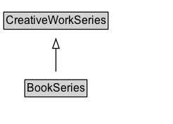

# BookSeries

A series of books. Included books can be indicated with the hasPart property.

## Diagram

=== "SVG (interactive)"

    <!-- Generated by graphviz version 14.1.3 (20260303.0454)
     -->
    <!-- Pages: 1 -->
    <svg width="185pt" height="132pt"
     viewBox="0.00 0.00 185.00 132.00" xmlns="http://www.w3.org/2000/svg" xmlns:xlink="http://www.w3.org/1999/xlink">
    <g id="graph0" class="graph" transform="scale(1 1) rotate(0) translate(4 128)">
    <polygon fill="white" stroke="none" points="-4,4 -4,-128 180.62,-128 180.62,4 -4,4"/>
    <g id="clust3" class="cluster">
    <title>cluster_associated</title>
    </g>
    <!-- CreativeWorkSeries -->
    <g id="node1" class="node">
    <title>CreativeWorkSeries</title>
    <g id="a_node1"><a xlink:href="../CreativeWorkSeries" xlink:title="&lt;TABLE&gt;">
    <polygon fill="lightgray" stroke="none" points="1,-97.88 1,-114.12 110.25,-114.12 110.25,-97.88 1,-97.88"/>
    <text xml:space="preserve" text-anchor="start" x="2" y="-101.88" font-family="Arial" font-size="12.00">CreativeWorkSeries</text>
    <polygon fill="none" stroke="black" points="0,-96.88 0,-115.12 111.25,-115.12 111.25,-96.88 0,-96.88"/>
    </a>
    </g>
    </g>
    <!-- BookSeries -->
    <g id="node2" class="node">
    <title>BookSeries</title>
    <g id="a_node2"><a xlink:href="../BookSeries" xlink:title="&lt;TABLE&gt;">
    <polygon fill="lightgray" stroke="none" points="23.5,-25.88 23.5,-42.12 87.75,-42.12 87.75,-25.88 23.5,-25.88"/>
    <text xml:space="preserve" text-anchor="start" x="24.5" y="-29.88" font-family="Arial" font-size="12.00">BookSeries</text>
    <polygon fill="none" stroke="black" points="22.5,-24.88 22.5,-43.12 88.75,-43.12 88.75,-24.88 22.5,-24.88"/>
    </a>
    </g>
    </g>
    <!-- BookSeries&#45;&gt;CreativeWorkSeries -->
    <g id="edge1" class="edge">
    <title>BookSeries&#45;&gt;CreativeWorkSeries</title>
    <path fill="none" stroke="black" d="M55.62,-51.79C55.62,-59.25 55.62,-68.24 55.62,-76.69"/>
    <polygon fill="none" stroke="black" points="52.13,-76.54 55.63,-86.54 59.13,-76.54 52.13,-76.54"/>
    </g>
    <!-- Invis -->
    </g>
    </svg>

=== "PNG"

    

## Formalization for BookSeries

| Property | Constraint |
|----------|------------|
| subClassOf | [CreativeWorkSeries](CreativeWorkSeries.md) |

