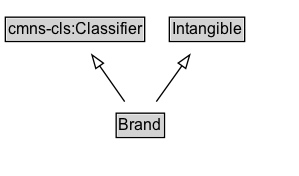

# Brand

A brand is a name used by an organization or business person for labeling a product, product group, or similar.

## Diagram

=== "SVG (interactive)"

    <!-- Generated by graphviz version 14.1.3 (20260303.0454)
     -->
    <!-- Pages: 1 -->
    <svg width="224pt" height="132pt"
     viewBox="0.00 0.00 224.00 132.00" xmlns="http://www.w3.org/2000/svg" xmlns:xlink="http://www.w3.org/1999/xlink">
    <g id="graph0" class="graph" transform="scale(1 1) rotate(0) translate(4 128)">
    <polygon fill="white" stroke="none" points="-4,4 -4,-128 220.25,-128 220.25,4 -4,4"/>
    <g id="clust3" class="cluster">
    <title>cluster_associated</title>
    </g>
    <!-- cmns&#45;cls_Classifier -->
    <g id="node1" class="node">
    <title>cmns&#45;cls_Classifier</title>
    <g id="a_node1"><a xlink:href="https://w3id.org/citydata/imported/cmns-cls/latest/Classifier" xlink:title="&lt;TABLE&gt;">
    <polygon fill="lightgray" stroke="none" points="1,-97.88 1,-114.12 103.5,-114.12 103.5,-97.88 1,-97.88"/>
    <text xml:space="preserve" text-anchor="start" x="2" y="-101.88" font-family="Arial" font-size="12.00">cmns&#45;cls:Classifier</text>
    <polygon fill="none" stroke="black" points="0,-96.88 0,-115.12 104.5,-115.12 104.5,-96.88 0,-96.88"/>
    </a>
    </g>
    </g>
    <!-- Intangible -->
    <g id="node2" class="node">
    <title>Intangible</title>
    <g id="a_node2"><a xlink:href="../Intangible" xlink:title="&lt;TABLE&gt;">
    <polygon fill="lightgray" stroke="none" points="124,-97.88 124,-114.12 178.5,-114.12 178.5,-97.88 124,-97.88"/>
    <text xml:space="preserve" text-anchor="start" x="125" y="-101.88" font-family="Arial" font-size="12.00">Intangible</text>
    <polygon fill="none" stroke="black" points="123,-96.88 123,-115.12 179.5,-115.12 179.5,-96.88 123,-96.88"/>
    </a>
    </g>
    </g>
    <!-- Brand -->
    <g id="node3" class="node">
    <title>Brand</title>
    <g id="a_node3"><a xlink:href="../Brand" xlink:title="&lt;TABLE&gt;">
    <polygon fill="lightgray" stroke="none" points="84.12,-25.88 84.12,-42.12 118.38,-42.12 118.38,-25.88 84.12,-25.88"/>
    <text xml:space="preserve" text-anchor="start" x="85.12" y="-29.88" font-family="Arial" font-size="12.00">Brand</text>
    <polygon fill="none" stroke="black" points="83.12,-24.88 83.12,-43.12 119.38,-43.12 119.38,-24.88 83.12,-24.88"/>
    </a>
    </g>
    </g>
    <!-- Brand&#45;&gt;cmns&#45;cls_Classifier -->
    <g id="edge1" class="edge">
    <title>Brand&#45;&gt;cmns&#45;cls_Classifier</title>
    <path fill="none" stroke="black" d="M89.5,-51.79C83.86,-59.85 76.96,-69.69 70.65,-78.71"/>
    <polygon fill="none" stroke="black" points="67.85,-76.62 64.98,-86.82 73.58,-80.63 67.85,-76.62"/>
    </g>
    <!-- Brand&#45;&gt;Intangible -->
    <g id="edge2" class="edge">
    <title>Brand&#45;&gt;Intangible</title>
    <path fill="none" stroke="black" d="M113.24,-51.79C119,-59.85 126.03,-69.69 132.47,-78.71"/>
    <polygon fill="none" stroke="black" points="129.61,-80.72 138.27,-86.82 135.3,-76.65 129.61,-80.72"/>
    </g>
    <!-- Invis -->
    </g>
    </svg>

=== "PNG"

    

## Formalization for Brand

| Property | Constraint |
|----------|------------|
| subClassOf | [Intangible](Intangible.md) |
| subClassOf | [cmns-cls:Classifier](https://w3id.org/citydata/imported/cmns-cls/Classifier) |

