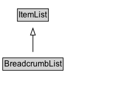

# BreadcrumbList

A BreadcrumbList is an ItemList consisting of a chain of linked Web pages, typically described using at least their URL and their name, and typically ending with the current page.\n\nThe [[position]] property is used to reconstruct the order of the items in a BreadcrumbList. The convention is that a breadcrumb list has an [[itemListOrder]] of [[ItemListOrderAscending]] (lower values listed first), and that the first items in this list correspond to the "top" or beginning of the breadcrumb trail, e.g. with a site or section homepage. The specific values of 'position' are not assigned meaning for a BreadcrumbList, but they should be integers, e.g. beginning with '1' for the first item in the list.
      

## Diagram

=== "SVG (interactive)"

    <!-- Generated by graphviz version 14.1.3 (20260303.0454)
     -->
    <!-- Pages: 1 -->
    <svg width="184pt" height="132pt"
     viewBox="0.00 0.00 184.00 132.00" xmlns="http://www.w3.org/2000/svg" xmlns:xlink="http://www.w3.org/1999/xlink">
    <g id="graph0" class="graph" transform="scale(1 1) rotate(0) translate(4 128)">
    <polygon fill="white" stroke="none" points="-4,4 -4,-128 180,-128 180,4 -4,4"/>
    <g id="clust3" class="cluster">
    <title>cluster_associated</title>
    </g>
    <!-- ItemList -->
    <g id="node1" class="node">
    <title>ItemList</title>
    <g id="a_node1"><a xlink:href="../ItemList" xlink:title="&lt;TABLE&gt;">
    <polygon fill="lightgray" stroke="none" points="22.38,-97.88 22.38,-114.12 65.62,-114.12 65.62,-97.88 22.38,-97.88"/>
    <text xml:space="preserve" text-anchor="start" x="23.38" y="-101.88" font-family="Arial" font-size="12.00">ItemList</text>
    <polygon fill="none" stroke="black" points="21.38,-96.88 21.38,-115.12 66.62,-115.12 66.62,-96.88 21.38,-96.88"/>
    </a>
    </g>
    </g>
    <!-- BreadcrumbList -->
    <g id="node2" class="node">
    <title>BreadcrumbList</title>
    <g id="a_node2"><a xlink:href="../BreadcrumbList" xlink:title="&lt;TABLE&gt;">
    <polygon fill="lightgray" stroke="none" points="1,-25.88 1,-42.12 87,-42.12 87,-25.88 1,-25.88"/>
    <text xml:space="preserve" text-anchor="start" x="2" y="-29.88" font-family="Arial" font-size="12.00">BreadcrumbList</text>
    <polygon fill="none" stroke="black" points="0,-24.88 0,-43.12 88,-43.12 88,-24.88 0,-24.88"/>
    </a>
    </g>
    </g>
    <!-- BreadcrumbList&#45;&gt;ItemList -->
    <g id="edge1" class="edge">
    <title>BreadcrumbList&#45;&gt;ItemList</title>
    <path fill="none" stroke="black" d="M44,-51.79C44,-59.25 44,-68.24 44,-76.69"/>
    <polygon fill="none" stroke="black" points="40.5,-76.54 44,-86.54 47.5,-76.54 40.5,-76.54"/>
    </g>
    <!-- Invis -->
    </g>
    </svg>

=== "PNG"

    

## Formalization for BreadcrumbList

| Property | Constraint |
|----------|------------|
| subClassOf | [ItemList](ItemList.md) |

