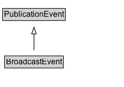

# BroadcastEvent

An over the air or online broadcast event.

## Diagram

=== "SVG (interactive)"

    <!-- Generated by graphviz version 14.1.3 (20260303.0454)
     -->
    <!-- Pages: 1 -->
    <svg width="187pt" height="132pt"
     viewBox="0.00 0.00 187.00 132.00" xmlns="http://www.w3.org/2000/svg" xmlns:xlink="http://www.w3.org/1999/xlink">
    <g id="graph0" class="graph" transform="scale(1 1) rotate(0) translate(4 128)">
    <polygon fill="white" stroke="none" points="-4,4 -4,-128 183.38,-128 183.38,4 -4,4"/>
    <g id="clust3" class="cluster">
    <title>cluster_associated</title>
    </g>
    <!-- PublicationEvent -->
    <g id="node1" class="node">
    <title>PublicationEvent</title>
    <g id="a_node1"><a xlink:href="../PublicationEvent" xlink:title="&lt;TABLE&gt;">
    <polygon fill="lightgray" stroke="none" points="1,-97.88 1,-114.12 93.75,-114.12 93.75,-97.88 1,-97.88"/>
    <text xml:space="preserve" text-anchor="start" x="2" y="-101.88" font-family="Arial" font-size="12.00">PublicationEvent</text>
    <polygon fill="none" stroke="black" points="0,-96.88 0,-115.12 94.75,-115.12 94.75,-96.88 0,-96.88"/>
    </a>
    </g>
    </g>
    <!-- BroadcastEvent -->
    <g id="node2" class="node">
    <title>BroadcastEvent</title>
    <g id="a_node2"><a xlink:href="../BroadcastEvent" xlink:title="&lt;TABLE&gt;">
    <polygon fill="lightgray" stroke="none" points="4,-25.88 4,-42.12 90.75,-42.12 90.75,-25.88 4,-25.88"/>
    <text xml:space="preserve" text-anchor="start" x="5" y="-29.88" font-family="Arial" font-size="12.00">BroadcastEvent</text>
    <polygon fill="none" stroke="black" points="3,-24.88 3,-43.12 91.75,-43.12 91.75,-24.88 3,-24.88"/>
    </a>
    </g>
    </g>
    <!-- BroadcastEvent&#45;&gt;PublicationEvent -->
    <g id="edge1" class="edge">
    <title>BroadcastEvent&#45;&gt;PublicationEvent</title>
    <path fill="none" stroke="black" d="M47.38,-51.79C47.38,-59.25 47.38,-68.24 47.38,-76.69"/>
    <polygon fill="none" stroke="black" points="43.88,-76.54 47.38,-86.54 50.88,-76.54 43.88,-76.54"/>
    </g>
    <!-- Invis -->
    </g>
    </svg>

=== "PNG"

    

## Formalization for BroadcastEvent

| Property | Constraint |
|----------|------------|
| subClassOf | [PublicationEvent](PublicationEvent.md) |

