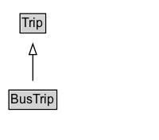

# BusTrip

A trip on a commercial bus line.

## Diagram

=== "SVG (interactive)"

    <!-- Generated by graphviz version 14.1.3 (20260303.0454)
     -->
    <!-- Pages: 1 -->
    <svg width="150pt" height="132pt"
     viewBox="0.00 0.00 150.00 132.00" xmlns="http://www.w3.org/2000/svg" xmlns:xlink="http://www.w3.org/1999/xlink">
    <g id="graph0" class="graph" transform="scale(1 1) rotate(0) translate(4 128)">
    <polygon fill="white" stroke="none" points="-4,4 -4,-128 146,-128 146,4 -4,4"/>
    <g id="clust3" class="cluster">
    <title>cluster_associated</title>
    </g>
    <!-- Trip -->
    <g id="node1" class="node">
    <title>Trip</title>
    <g id="a_node1"><a xlink:href="../Trip" xlink:title="&lt;TABLE&gt;">
    <polygon fill="lightgray" stroke="none" points="15.88,-97.88 15.88,-114.12 38.12,-114.12 38.12,-97.88 15.88,-97.88"/>
    <text xml:space="preserve" text-anchor="start" x="16.88" y="-101.88" font-family="Arial" font-size="12.00">Trip</text>
    <polygon fill="none" stroke="black" points="14.88,-96.88 14.88,-115.12 39.12,-115.12 39.12,-96.88 14.88,-96.88"/>
    </a>
    </g>
    </g>
    <!-- BusTrip -->
    <g id="node2" class="node">
    <title>BusTrip</title>
    <g id="a_node2"><a xlink:href="../BusTrip" xlink:title="&lt;TABLE&gt;">
    <polygon fill="lightgray" stroke="none" points="5.38,-25.88 5.38,-42.12 48.62,-42.12 48.62,-25.88 5.38,-25.88"/>
    <text xml:space="preserve" text-anchor="start" x="6.38" y="-29.88" font-family="Arial" font-size="12.00">BusTrip</text>
    <polygon fill="none" stroke="black" points="4.38,-24.88 4.38,-43.12 49.62,-43.12 49.62,-24.88 4.38,-24.88"/>
    </a>
    </g>
    </g>
    <!-- BusTrip&#45;&gt;Trip -->
    <g id="edge1" class="edge">
    <title>BusTrip&#45;&gt;Trip</title>
    <path fill="none" stroke="black" d="M27,-51.79C27,-59.25 27,-68.24 27,-76.69"/>
    <polygon fill="none" stroke="black" points="23.5,-76.54 27,-86.54 30.5,-76.54 23.5,-76.54"/>
    </g>
    <!-- Invis -->
    </g>
    </svg>

=== "PNG"

    

## Formalization for BusTrip

| Property | Constraint |
|----------|------------|
| subClassOf | [Trip](Trip.md) |

