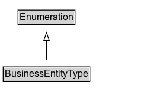

# BusinessEntityType

A business entity type is a conceptual entity representing the legal form, the size, the main line of business, the position in the value chain, or any combination thereof, of an organization or business person.\n\nCommonly used values:\n\n* http://purl.org/goodrelations/v1#Business\n* http://purl.org/goodrelations/v1#Enduser\n* http://purl.org/goodrelations/v1#PublicInstitution\n* http://purl.org/goodrelations/v1#Reseller
    

## Diagram

=== "SVG (interactive)"

    <!-- Generated by graphviz version 14.1.3 (20260303.0454)
     -->
    <!-- Pages: 1 -->
    <svg width="206pt" height="132pt"
     viewBox="0.00 0.00 206.00 132.00" xmlns="http://www.w3.org/2000/svg" xmlns:xlink="http://www.w3.org/1999/xlink">
    <g id="graph0" class="graph" transform="scale(1 1) rotate(0) translate(4 128)">
    <polygon fill="white" stroke="none" points="-4,4 -4,-128 201.88,-128 201.88,4 -4,4"/>
    <g id="clust3" class="cluster">
    <title>cluster_associated</title>
    </g>
    <!-- Enumeration -->
    <g id="node1" class="node">
    <title>Enumeration</title>
    <g id="a_node1"><a xlink:href="../Enumeration" xlink:title="&lt;TABLE&gt;">
    <polygon fill="lightgray" stroke="none" points="19.75,-97.88 19.75,-114.12 90,-114.12 90,-97.88 19.75,-97.88"/>
    <text xml:space="preserve" text-anchor="start" x="20.75" y="-101.88" font-family="Arial" font-size="12.00">Enumeration</text>
    <polygon fill="none" stroke="black" points="18.75,-96.88 18.75,-115.12 91,-115.12 91,-96.88 18.75,-96.88"/>
    </a>
    </g>
    </g>
    <!-- BusinessEntityType -->
    <g id="node2" class="node">
    <title>BusinessEntityType</title>
    <g id="a_node2"><a xlink:href="../BusinessEntityType" xlink:title="&lt;TABLE&gt;">
    <polygon fill="lightgray" stroke="none" points="1,-25.88 1,-42.12 108.75,-42.12 108.75,-25.88 1,-25.88"/>
    <text xml:space="preserve" text-anchor="start" x="2" y="-29.88" font-family="Arial" font-size="12.00">BusinessEntityType</text>
    <polygon fill="none" stroke="black" points="0,-24.88 0,-43.12 109.75,-43.12 109.75,-24.88 0,-24.88"/>
    </a>
    </g>
    </g>
    <!-- BusinessEntityType&#45;&gt;Enumeration -->
    <g id="edge1" class="edge">
    <title>BusinessEntityType&#45;&gt;Enumeration</title>
    <path fill="none" stroke="black" d="M54.88,-51.79C54.88,-59.25 54.88,-68.24 54.88,-76.69"/>
    <polygon fill="none" stroke="black" points="51.38,-76.54 54.88,-86.54 58.38,-76.54 51.38,-76.54"/>
    </g>
    <!-- Invis -->
    </g>
    </svg>

=== "PNG"

    

## Formalization for BusinessEntityType

| Property | Constraint |
|----------|------------|
| subClassOf | [Enumeration](Enumeration.md) |

