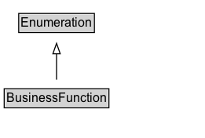

# BusinessFunction

The business function specifies the type of activity or access (i.e., the bundle of rights) offered by the organization or business person through the offer. Typical are sell, rental or lease, maintenance or repair, manufacture / produce, recycle / dispose, engineering / construction, or installation. Proprietary specifications of access rights are also instances of this class.\n\nCommonly used values:\n\n* http://purl.org/goodrelations/v1#ConstructionInstallation\n* http://purl.org/goodrelations/v1#Dispose\n* http://purl.org/goodrelations/v1#LeaseOut\n* http://purl.org/goodrelations/v1#Maintain\n* http://purl.org/goodrelations/v1#ProvideService\n* http://purl.org/goodrelations/v1#Repair\n* http://purl.org/goodrelations/v1#Sell\n* http://purl.org/goodrelations/v1#Buy
        

## Diagram

=== "SVG (interactive)"

    <!-- Generated by graphviz version 14.1.3 (20260303.0454)
     -->
    <!-- Pages: 1 -->
    <svg width="196pt" height="132pt"
     viewBox="0.00 0.00 196.00 132.00" xmlns="http://www.w3.org/2000/svg" xmlns:xlink="http://www.w3.org/1999/xlink">
    <g id="graph0" class="graph" transform="scale(1 1) rotate(0) translate(4 128)">
    <polygon fill="white" stroke="none" points="-4,4 -4,-128 192,-128 192,4 -4,4"/>
    <g id="clust3" class="cluster">
    <title>cluster_associated</title>
    </g>
    <!-- Enumeration -->
    <g id="node1" class="node">
    <title>Enumeration</title>
    <g id="a_node1"><a xlink:href="../Enumeration" xlink:title="&lt;TABLE&gt;">
    <polygon fill="lightgray" stroke="none" points="14.88,-97.88 14.88,-114.12 85.12,-114.12 85.12,-97.88 14.88,-97.88"/>
    <text xml:space="preserve" text-anchor="start" x="15.88" y="-101.88" font-family="Arial" font-size="12.00">Enumeration</text>
    <polygon fill="none" stroke="black" points="13.88,-96.88 13.88,-115.12 86.12,-115.12 86.12,-96.88 13.88,-96.88"/>
    </a>
    </g>
    </g>
    <!-- BusinessFunction -->
    <g id="node2" class="node">
    <title>BusinessFunction</title>
    <g id="a_node2"><a xlink:href="../BusinessFunction" xlink:title="&lt;TABLE&gt;">
    <polygon fill="lightgray" stroke="none" points="1,-25.88 1,-42.12 99,-42.12 99,-25.88 1,-25.88"/>
    <text xml:space="preserve" text-anchor="start" x="2" y="-29.88" font-family="Arial" font-size="12.00">BusinessFunction</text>
    <polygon fill="none" stroke="black" points="0,-24.88 0,-43.12 100,-43.12 100,-24.88 0,-24.88"/>
    </a>
    </g>
    </g>
    <!-- BusinessFunction&#45;&gt;Enumeration -->
    <g id="edge1" class="edge">
    <title>BusinessFunction&#45;&gt;Enumeration</title>
    <path fill="none" stroke="black" d="M50,-51.79C50,-59.25 50,-68.24 50,-76.69"/>
    <polygon fill="none" stroke="black" points="46.5,-76.54 50,-86.54 53.5,-76.54 46.5,-76.54"/>
    </g>
    <!-- Invis -->
    </g>
    </svg>

=== "PNG"

    

## Formalization for BusinessFunction

| Property | Constraint |
|----------|------------|
| subClassOf | [Enumeration](Enumeration.md) |

