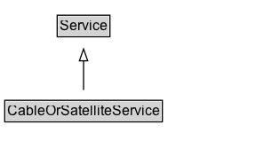

# CableOrSatelliteService

A service which provides access to media programming like TV or radio. Access may be via cable or satellite.

## Diagram

=== "SVG (interactive)"

    <!-- Generated by graphviz version 14.1.3 (20260303.0454)
     -->
    <!-- Pages: 1 -->
    <svg width="230pt" height="132pt"
     viewBox="0.00 0.00 230.00 132.00" xmlns="http://www.w3.org/2000/svg" xmlns:xlink="http://www.w3.org/1999/xlink">
    <g id="graph0" class="graph" transform="scale(1 1) rotate(0) translate(4 128)">
    <polygon fill="white" stroke="none" points="-4,4 -4,-128 225.5,-128 225.5,4 -4,4"/>
    <g id="clust3" class="cluster">
    <title>cluster_associated</title>
    </g>
    <!-- Service -->
    <g id="node1" class="node">
    <title>Service</title>
    <g id="a_node1"><a xlink:href="../Service" xlink:title="&lt;TABLE&gt;">
    <polygon fill="lightgray" stroke="none" points="45.25,-97.88 45.25,-114.12 87.75,-114.12 87.75,-97.88 45.25,-97.88"/>
    <text xml:space="preserve" text-anchor="start" x="46.25" y="-101.88" font-family="Arial" font-size="12.00">Service</text>
    <polygon fill="none" stroke="black" points="44.25,-96.88 44.25,-115.12 88.75,-115.12 88.75,-96.88 44.25,-96.88"/>
    </a>
    </g>
    </g>
    <!-- CableOrSatelliteService -->
    <g id="node2" class="node">
    <title>CableOrSatelliteService</title>
    <g id="a_node2"><a xlink:href="../CableOrSatelliteService" xlink:title="&lt;TABLE&gt;">
    <polygon fill="lightgray" stroke="none" points="1,-25.88 1,-42.12 132,-42.12 132,-25.88 1,-25.88"/>
    <text xml:space="preserve" text-anchor="start" x="2" y="-29.88" font-family="Arial" font-size="12.00">CableOrSatelliteService</text>
    <polygon fill="none" stroke="black" points="0,-24.88 0,-43.12 133,-43.12 133,-24.88 0,-24.88"/>
    </a>
    </g>
    </g>
    <!-- CableOrSatelliteService&#45;&gt;Service -->
    <g id="edge1" class="edge">
    <title>CableOrSatelliteService&#45;&gt;Service</title>
    <path fill="none" stroke="black" d="M66.5,-51.79C66.5,-59.25 66.5,-68.24 66.5,-76.69"/>
    <polygon fill="none" stroke="black" points="63,-76.54 66.5,-86.54 70,-76.54 63,-76.54"/>
    </g>
    <!-- Invis -->
    </g>
    </svg>

=== "PNG"

    

## Formalization for CableOrSatelliteService

| Property | Constraint |
|----------|------------|
| subClassOf | [Service](Service.md) |

