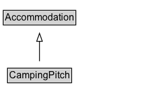

# CampingPitch

A [[CampingPitch]] is an individual place for overnight stay in the outdoors, typically being part of a larger camping site, or [[Campground]].\n\n
In British English a campsite, or campground, is an area, usually divided into a number of pitches, where people can camp overnight using tents or camper vans or caravans; this British English use of the word is synonymous with the American English expression campground. In American English the term campsite generally means an area where an individual, family, group, or military unit can pitch a tent or park a camper; a campground may contain many campsites.
(Source: Wikipedia, see [https://en.wikipedia.org/wiki/Campsite](https://en.wikipedia.org/wiki/Campsite).)\n\n
See also the dedicated [document on the use of schema.org for marking up hotels and other forms of accommodations](/docs/hotels.html).

## Diagram

=== "SVG (interactive)"

    <!-- Generated by graphviz version 14.1.3 (20260303.0454)
     -->
    <!-- Pages: 1 -->
    <svg width="181pt" height="132pt"
     viewBox="0.00 0.00 181.00 132.00" xmlns="http://www.w3.org/2000/svg" xmlns:xlink="http://www.w3.org/1999/xlink">
    <g id="graph0" class="graph" transform="scale(1 1) rotate(0) translate(4 128)">
    <polygon fill="white" stroke="none" points="-4,4 -4,-128 177.12,-128 177.12,4 -4,4"/>
    <g id="clust3" class="cluster">
    <title>cluster_associated</title>
    </g>
    <!-- Accommodation -->
    <g id="node1" class="node">
    <title>Accommodation</title>
    <g id="a_node1"><a xlink:href="../Accommodation" xlink:title="&lt;TABLE&gt;">
    <polygon fill="lightgray" stroke="none" points="1,-97.88 1,-114.12 89.25,-114.12 89.25,-97.88 1,-97.88"/>
    <text xml:space="preserve" text-anchor="start" x="2" y="-101.88" font-family="Arial" font-size="12.00">Accommodation</text>
    <polygon fill="none" stroke="black" points="0,-96.88 0,-115.12 90.25,-115.12 90.25,-96.88 0,-96.88"/>
    </a>
    </g>
    </g>
    <!-- CampingPitch -->
    <g id="node2" class="node">
    <title>CampingPitch</title>
    <g id="a_node2"><a xlink:href="../CampingPitch" xlink:title="&lt;TABLE&gt;">
    <polygon fill="lightgray" stroke="none" points="6.25,-25.88 6.25,-42.12 84,-42.12 84,-25.88 6.25,-25.88"/>
    <text xml:space="preserve" text-anchor="start" x="7.25" y="-29.88" font-family="Arial" font-size="12.00">CampingPitch</text>
    <polygon fill="none" stroke="black" points="5.25,-24.88 5.25,-43.12 85,-43.12 85,-24.88 5.25,-24.88"/>
    </a>
    </g>
    </g>
    <!-- CampingPitch&#45;&gt;Accommodation -->
    <g id="edge1" class="edge">
    <title>CampingPitch&#45;&gt;Accommodation</title>
    <path fill="none" stroke="black" d="M45.12,-51.79C45.12,-59.25 45.12,-68.24 45.12,-76.69"/>
    <polygon fill="none" stroke="black" points="41.63,-76.54 45.13,-86.54 48.63,-76.54 41.63,-76.54"/>
    </g>
    <!-- Invis -->
    </g>
    </svg>

=== "PNG"

    

## Formalization for CampingPitch

| Property | Constraint |
|----------|------------|
| subClassOf | [Accommodation](Accommodation.md) |

