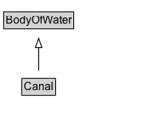

# Canal

A canal, like the Panama Canal.

## Diagram

=== "SVG (interactive)"

    <!-- Generated by graphviz version 14.1.3 (20260303.0454)
     -->
    <!-- Pages: 1 -->
    <svg width="161pt" height="132pt"
     viewBox="0.00 0.00 161.00 132.00" xmlns="http://www.w3.org/2000/svg" xmlns:xlink="http://www.w3.org/1999/xlink">
    <g id="graph0" class="graph" transform="scale(1 1) rotate(0) translate(4 128)">
    <polygon fill="white" stroke="none" points="-4,4 -4,-128 156.62,-128 156.62,4 -4,4"/>
    <g id="clust3" class="cluster">
    <title>cluster_associated</title>
    </g>
    <!-- BodyOfWater -->
    <g id="node1" class="node">
    <title>BodyOfWater</title>
    <g id="a_node1"><a xlink:href="../BodyOfWater" xlink:title="&lt;TABLE&gt;">
    <polygon fill="lightgray" stroke="none" points="1,-97.88 1,-114.12 74.25,-114.12 74.25,-97.88 1,-97.88"/>
    <text xml:space="preserve" text-anchor="start" x="2" y="-101.88" font-family="Arial" font-size="12.00">BodyOfWater</text>
    <polygon fill="none" stroke="black" points="0,-96.88 0,-115.12 75.25,-115.12 75.25,-96.88 0,-96.88"/>
    </a>
    </g>
    </g>
    <!-- Canal -->
    <g id="node2" class="node">
    <title>Canal</title>
    <g id="a_node2"><a xlink:href="../Canal" xlink:title="&lt;TABLE&gt;">
    <polygon fill="lightgray" stroke="none" points="20.5,-25.88 20.5,-42.12 54.75,-42.12 54.75,-25.88 20.5,-25.88"/>
    <text xml:space="preserve" text-anchor="start" x="21.5" y="-29.88" font-family="Arial" font-size="12.00">Canal</text>
    <polygon fill="none" stroke="black" points="19.5,-24.88 19.5,-43.12 55.75,-43.12 55.75,-24.88 19.5,-24.88"/>
    </a>
    </g>
    </g>
    <!-- Canal&#45;&gt;BodyOfWater -->
    <g id="edge1" class="edge">
    <title>Canal&#45;&gt;BodyOfWater</title>
    <path fill="none" stroke="black" d="M37.62,-51.79C37.62,-59.25 37.62,-68.24 37.62,-76.69"/>
    <polygon fill="none" stroke="black" points="34.13,-76.54 37.63,-86.54 41.13,-76.54 34.13,-76.54"/>
    </g>
    <!-- Invis -->
    </g>
    </svg>

=== "PNG"

    

## Formalization for Canal

| Property | Constraint |
|----------|------------|
| subClassOf | [BodyOfWater](BodyOfWater.md) |

