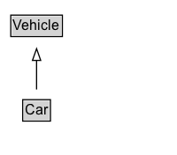

# Car

A car is a wheeled, self-powered motor vehicle used for transportation.

## Diagram

=== "SVG (interactive)"

    <!-- Generated by graphviz version 14.1.3 (20260303.0454)
     -->
    <!-- Pages: 1 -->
    <svg width="150pt" height="132pt"
     viewBox="0.00 0.00 150.00 132.00" xmlns="http://www.w3.org/2000/svg" xmlns:xlink="http://www.w3.org/1999/xlink">
    <g id="graph0" class="graph" transform="scale(1 1) rotate(0) translate(4 128)">
    <polygon fill="white" stroke="none" points="-4,4 -4,-128 146,-128 146,4 -4,4"/>
    <g id="clust3" class="cluster">
    <title>cluster_associated</title>
    </g>
    <!-- Vehicle -->
    <g id="node1" class="node">
    <title>Vehicle</title>
    <g id="a_node1"><a xlink:href="../Vehicle" xlink:title="&lt;TABLE&gt;">
    <polygon fill="lightgray" stroke="none" points="6.12,-97.88 6.12,-114.12 47.88,-114.12 47.88,-97.88 6.12,-97.88"/>
    <text xml:space="preserve" text-anchor="start" x="7.12" y="-101.88" font-family="Arial" font-size="12.00">Vehicle</text>
    <polygon fill="none" stroke="black" points="5.12,-96.88 5.12,-115.12 48.88,-115.12 48.88,-96.88 5.12,-96.88"/>
    </a>
    </g>
    </g>
    <!-- Car -->
    <g id="node2" class="node">
    <title>Car</title>
    <g id="a_node2"><a xlink:href="../Car" xlink:title="&lt;TABLE&gt;">
    <polygon fill="lightgray" stroke="none" points="16.25,-25.88 16.25,-42.12 37.75,-42.12 37.75,-25.88 16.25,-25.88"/>
    <text xml:space="preserve" text-anchor="start" x="17.25" y="-29.88" font-family="Arial" font-size="12.00">Car</text>
    <polygon fill="none" stroke="black" points="15.25,-24.88 15.25,-43.12 38.75,-43.12 38.75,-24.88 15.25,-24.88"/>
    </a>
    </g>
    </g>
    <!-- Car&#45;&gt;Vehicle -->
    <g id="edge1" class="edge">
    <title>Car&#45;&gt;Vehicle</title>
    <path fill="none" stroke="black" d="M27,-51.79C27,-59.25 27,-68.24 27,-76.69"/>
    <polygon fill="none" stroke="black" points="23.5,-76.54 27,-86.54 30.5,-76.54 23.5,-76.54"/>
    </g>
    <!-- Invis -->
    </g>
    </svg>

=== "PNG"

    

## Formalization for Car

| Property | Constraint |
|----------|------------|
| subClassOf | [Vehicle](Vehicle.md) |

