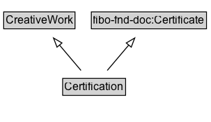

# Certification

A Certification is an official and authoritative statement about a subject, for example a product, service, person, or organization. A certification is typically issued by an indendent certification body, for example a professional organization or government. It formally attests certain characteristics about the subject, for example Organizations can be ISO certified, Food products can be certified Organic or Vegan, a Person can be a certified professional, a Place can be certified for food processing. There are certifications for many domains: regulatory, organizational, recycling, food, efficiency, educational, ecological, etc. A certification is a form of credential, as are accreditations and licenses. Mapped from the [gs1:CertificationDetails](https://www.gs1.org/voc/CertificationDetails) class in the GS1 Web Vocabulary.

## Diagram

=== "SVG (interactive)"

    <!-- Generated by graphviz version 14.1.3 (20260303.0454)
     -->
    <!-- Pages: 1 -->
    <svg width="227pt" height="132pt"
     viewBox="0.00 0.00 227.00 132.00" xmlns="http://www.w3.org/2000/svg" xmlns:xlink="http://www.w3.org/1999/xlink">
    <g id="graph0" class="graph" transform="scale(1 1) rotate(0) translate(4 128)">
    <polygon fill="white" stroke="none" points="-4,4 -4,-128 223.38,-128 223.38,4 -4,4"/>
    <g id="clust3" class="cluster">
    <title>cluster_associated</title>
    </g>
    <!-- CreativeWork -->
    <g id="node1" class="node">
    <title>CreativeWork</title>
    <g id="a_node1"><a xlink:href="../CreativeWork" xlink:title="&lt;TABLE&gt;">
    <polygon fill="lightgray" stroke="none" points="1,-97.88 1,-114.12 75.75,-114.12 75.75,-97.88 1,-97.88"/>
    <text xml:space="preserve" text-anchor="start" x="2" y="-101.88" font-family="Arial" font-size="12.00">CreativeWork</text>
    <polygon fill="none" stroke="black" points="0,-96.88 0,-115.12 76.75,-115.12 76.75,-96.88 0,-96.88"/>
    </a>
    </g>
    </g>
    <!-- fibo&#45;fnd&#45;doc_Certificate -->
    <g id="node2" class="node">
    <title>fibo&#45;fnd&#45;doc_Certificate</title>
    <g id="a_node2"><a xlink:href="https://w3id.org/citydata/imported/fibo-fnd-doc/latest/Certificate" xlink:title="&lt;TABLE&gt;">
    <polygon fill="lightgray" stroke="none" points="95.38,-97.88 95.38,-114.12 217.38,-114.12 217.38,-97.88 95.38,-97.88"/>
    <text xml:space="preserve" text-anchor="start" x="96.38" y="-101.88" font-family="Arial" font-size="12.00">fibo&#45;fnd&#45;doc:Certificate</text>
    <polygon fill="none" stroke="black" points="94.38,-96.88 94.38,-115.12 218.38,-115.12 218.38,-96.88 94.38,-96.88"/>
    </a>
    </g>
    </g>
    <!-- Certification -->
    <g id="node3" class="node">
    <title>Certification</title>
    <g id="a_node3"><a xlink:href="../Certification" xlink:title="&lt;TABLE&gt;">
    <polygon fill="lightgray" stroke="none" points="64.5,-25.88 64.5,-42.12 130.25,-42.12 130.25,-25.88 64.5,-25.88"/>
    <text xml:space="preserve" text-anchor="start" x="65.5" y="-29.88" font-family="Arial" font-size="12.00">Certification</text>
    <polygon fill="none" stroke="black" points="63.5,-24.88 63.5,-43.12 131.25,-43.12 131.25,-24.88 63.5,-24.88"/>
    </a>
    </g>
    </g>
    <!-- Certification&#45;&gt;CreativeWork -->
    <g id="edge1" class="edge">
    <title>Certification&#45;&gt;CreativeWork</title>
    <path fill="none" stroke="black" d="M83.22,-51.79C76.29,-60.02 67.78,-70.11 60.05,-79.29"/>
    <polygon fill="none" stroke="black" points="57.4,-77 53.63,-86.9 62.75,-81.51 57.4,-77"/>
    </g>
    <!-- Certification&#45;&gt;fibo&#45;fnd&#45;doc_Certificate -->
    <g id="edge2" class="edge">
    <title>Certification&#45;&gt;fibo&#45;fnd&#45;doc_Certificate</title>
    <path fill="none" stroke="black" d="M111.53,-51.79C118.46,-60.02 126.97,-70.11 134.7,-79.29"/>
    <polygon fill="none" stroke="black" points="132,-81.51 141.12,-86.9 137.35,-77 132,-81.51"/>
    </g>
    <!-- Invis -->
    </g>
    </svg>

=== "PNG"

    

## Formalization for Certification

| Property | Constraint |
|----------|------------|
| subClassOf | [CreativeWork](CreativeWork.md) |
| subClassOf | [fibo-fnd-doc:Certificate](https://w3id.org/citydata/imported/fibo-fnd-doc/Certificate) |

