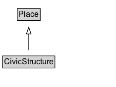

# CivicStructure

A public structure, such as a town hall or concert hall.

## Diagram

=== "SVG (interactive)"

    <!-- Generated by graphviz version 14.1.3 (20260303.0454)
     -->
    <!-- Pages: 1 -->
    <svg width="176pt" height="132pt"
     viewBox="0.00 0.00 176.00 132.00" xmlns="http://www.w3.org/2000/svg" xmlns:xlink="http://www.w3.org/1999/xlink">
    <g id="graph0" class="graph" transform="scale(1 1) rotate(0) translate(4 128)">
    <polygon fill="white" stroke="none" points="-4,4 -4,-128 171.5,-128 171.5,4 -4,4"/>
    <g id="clust3" class="cluster">
    <title>cluster_associated</title>
    </g>
    <!-- Place -->
    <g id="node1" class="node">
    <title>Place</title>
    <g id="a_node1"><a xlink:href="../Place" xlink:title="&lt;TABLE&gt;">
    <polygon fill="lightgray" stroke="none" points="23.12,-97.88 23.12,-114.12 55.88,-114.12 55.88,-97.88 23.12,-97.88"/>
    <text xml:space="preserve" text-anchor="start" x="24.12" y="-101.88" font-family="Arial" font-size="12.00">Place</text>
    <polygon fill="none" stroke="black" points="22.12,-96.88 22.12,-115.12 56.88,-115.12 56.88,-96.88 22.12,-96.88"/>
    </a>
    </g>
    </g>
    <!-- CivicStructure -->
    <g id="node2" class="node">
    <title>CivicStructure</title>
    <g id="a_node2"><a xlink:href="../CivicStructure" xlink:title="&lt;TABLE&gt;">
    <polygon fill="lightgray" stroke="none" points="1,-25.88 1,-42.12 78,-42.12 78,-25.88 1,-25.88"/>
    <text xml:space="preserve" text-anchor="start" x="2" y="-29.88" font-family="Arial" font-size="12.00">CivicStructure</text>
    <polygon fill="none" stroke="black" points="0,-24.88 0,-43.12 79,-43.12 79,-24.88 0,-24.88"/>
    </a>
    </g>
    </g>
    <!-- CivicStructure&#45;&gt;Place -->
    <g id="edge1" class="edge">
    <title>CivicStructure&#45;&gt;Place</title>
    <path fill="none" stroke="black" d="M39.5,-51.79C39.5,-59.25 39.5,-68.24 39.5,-76.69"/>
    <polygon fill="none" stroke="black" points="36,-76.54 39.5,-86.54 43,-76.54 36,-76.54"/>
    </g>
    <!-- Invis -->
    </g>
    </svg>

=== "PNG"

    

## Specializations of CivicStructure

| Class | Description |
|-------|-------------|
| [Airport](Airport.md) | An airport. |
| [Aquarium](Aquarium.md) | Aquarium. |
| [Beach](Beach.md) | Beach. |
| [Boat Terminal](BoatTerminal.md) | A terminal for boats, ships, and other water vessels. |
| [Bridge](Bridge.md) | A bridge. |
| [Buddhist Temple](BuddhistTemple.md) | A Buddhist temple. |
| [Bus Station](BusStation.md) | A bus station. |
| [Bus Stop](BusStop.md) | A bus stop. |
| [Campground](Campground.md) | A camping site, campsite, or [[Campground]] is a place used for overnight stay in the outdoors, typically containing individual [[CampingPitch]] locations. \n\n
In British English a campsite is an area, usually divided into a number of pitches, where people can camp overnight using tents or camper vans or caravans; this British English use of the word is synonymous with the American English expression campground. In American English the term campsite generally means an area where an individual, family, group, or military unit can pitch a tent or park a camper; a campground may contain many campsites (source: Wikipedia, see [https://en.wikipedia.org/wiki/Campsite](https://en.wikipedia.org/wiki/Campsite)).\n\n

See also the dedicated [document on the use of schema.org for marking up hotels and other forms of accommodations](/docs/hotels.html).
 |
| [Catholic Church](CatholicChurch.md) | A Catholic church. |
| [Cemetery](Cemetery.md) | A graveyard. |
| [Church](Church.md) | A church. |
| [City Hall](CityHall.md) | A city hall. |
| [College Or University](CollegeOrUniversity.md) | A college, university, or other third-level educational institution. |
| [Courthouse](Courthouse.md) | A courthouse. |
| [Crematorium](Crematorium.md) | A crematorium. |
| [Defence Establishment](DefenceEstablishment.md) | A defence establishment, such as an army or navy base. |
| [Educational Organization](EducationalOrganization.md) | An educational organization. |
| [Elementary School](ElementarySchool.md) | An elementary school. |
| [Embassy](Embassy.md) | An embassy. |
| [Event Venue](EventVenue.md) | An event venue. |
| [Fire Station](FireStation.md) | A fire station. With firemen. |
| [Government Building](GovernmentBuilding.md) | A government building. |
| [High School](HighSchool.md) | A high school. |
| [Hindu Temple](HinduTemple.md) | A Hindu temple. |
| [Hospital](Hospital.md) | A hospital. |
| [Legislative Building](LegislativeBuilding.md) | A legislative building&#x2014;for example, the state capitol. |
| [Middle School](MiddleSchool.md) | A middle school (typically for children aged around 11-14, although this varies somewhat). |
| [Mosque](Mosque.md) | A mosque. |
| [Movie Theater](MovieTheater.md) | A movie theater. |
| [Museum](Museum.md) | A museum. |
| [Music Venue](MusicVenue.md) | A music venue. |
| [Park](Park.md) | A park. |
| [Parking Facility](ParkingFacility.md) | A parking lot or other parking facility. |
| [Performing Arts Theater](PerformingArtsTheater.md) | A theater or other performing art center. |
| [Place Of Worship](PlaceOfWorship.md) | Place of worship, such as a church, synagogue, or mosque. |
| [Playground](Playground.md) | A playground. |
| [Police Station](PoliceStation.md) | A police station. |
| [Preschool](Preschool.md) | A preschool. |
| [Public Toilet](PublicToilet.md) | A public toilet is a room or small building containing one or more toilets (and possibly also urinals) which is available for use by the general public, or by customers or employees of certain businesses. |
| [Rv Park](RVPark.md) | A place offering space for "Recreational Vehicles", Caravans, mobile homes and the like. |
| [School](School.md) | A school. |
| [Stadium Or Arena](StadiumOrArena.md) | A stadium. |
| [Subway Station](SubwayStation.md) | A subway station. |
| [Synagogue](Synagogue.md) | A synagogue. |
| [Taxi Stand](TaxiStand.md) | A taxi stand. |
| [Train Station](TrainStation.md) | A train station. |
| [Zoo](Zoo.md) | A zoo. |

## Formalization for CivicStructure

| Property | Constraint |
|----------|------------|
| subClassOf | [Place](Place.md) |

