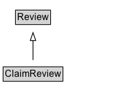

# ClaimReview

A fact-checking review of claims made (or reported) in some creative work (referenced via itemReviewed).

## Diagram

=== "SVG (interactive)"

    <!-- Generated by graphviz version 14.1.3 (20260303.0454)
     -->
    <!-- Pages: 1 -->
    <svg width="172pt" height="132pt"
     viewBox="0.00 0.00 172.00 132.00" xmlns="http://www.w3.org/2000/svg" xmlns:xlink="http://www.w3.org/1999/xlink">
    <g id="graph0" class="graph" transform="scale(1 1) rotate(0) translate(4 128)">
    <polygon fill="white" stroke="none" points="-4,4 -4,-128 168,-128 168,4 -4,4"/>
    <g id="clust3" class="cluster">
    <title>cluster_associated</title>
    </g>
    <!-- Review -->
    <g id="node1" class="node">
    <title>Review</title>
    <g id="a_node1"><a xlink:href="../Review" xlink:title="&lt;TABLE&gt;">
    <polygon fill="lightgray" stroke="none" points="16.75,-97.88 16.75,-114.12 59.25,-114.12 59.25,-97.88 16.75,-97.88"/>
    <text xml:space="preserve" text-anchor="start" x="17.75" y="-101.88" font-family="Arial" font-size="12.00">Review</text>
    <polygon fill="none" stroke="black" points="15.75,-96.88 15.75,-115.12 60.25,-115.12 60.25,-96.88 15.75,-96.88"/>
    </a>
    </g>
    </g>
    <!-- ClaimReview -->
    <g id="node2" class="node">
    <title>ClaimReview</title>
    <g id="a_node2"><a xlink:href="../ClaimReview" xlink:title="&lt;TABLE&gt;">
    <polygon fill="lightgray" stroke="none" points="1,-25.88 1,-42.12 75,-42.12 75,-25.88 1,-25.88"/>
    <text xml:space="preserve" text-anchor="start" x="2" y="-29.88" font-family="Arial" font-size="12.00">ClaimReview</text>
    <polygon fill="none" stroke="black" points="0,-24.88 0,-43.12 76,-43.12 76,-24.88 0,-24.88"/>
    </a>
    </g>
    </g>
    <!-- ClaimReview&#45;&gt;Review -->
    <g id="edge1" class="edge">
    <title>ClaimReview&#45;&gt;Review</title>
    <path fill="none" stroke="black" d="M38,-51.79C38,-59.25 38,-68.24 38,-76.69"/>
    <polygon fill="none" stroke="black" points="34.5,-76.54 38,-86.54 41.5,-76.54 34.5,-76.54"/>
    </g>
    <!-- Invis -->
    </g>
    </svg>

=== "PNG"

    

## Formalization for ClaimReview

| Property | Constraint |
|----------|------------|
| subClassOf | [Review](Review.md) |

