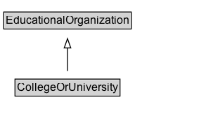

# CollegeOrUniversity

A college, university, or other third-level educational institution.

## Diagram

=== "SVG (interactive)"

    <!-- Generated by graphviz version 14.1.3 (20260303.0454)
     -->
    <!-- Pages: 1 -->
    <svg width="220pt" height="132pt"
     viewBox="0.00 0.00 220.00 132.00" xmlns="http://www.w3.org/2000/svg" xmlns:xlink="http://www.w3.org/1999/xlink">
    <g id="graph0" class="graph" transform="scale(1 1) rotate(0) translate(4 128)">
    <polygon fill="white" stroke="none" points="-4,4 -4,-128 216,-128 216,4 -4,4"/>
    <g id="clust3" class="cluster">
    <title>cluster_associated</title>
    </g>
    <!-- EducationalOrganization -->
    <g id="node1" class="node">
    <title>EducationalOrganization</title>
    <g id="a_node1"><a xlink:href="../EducationalOrganization" xlink:title="&lt;TABLE&gt;">
    <polygon fill="lightgray" stroke="none" points="1,-97.88 1,-114.12 135,-114.12 135,-97.88 1,-97.88"/>
    <text xml:space="preserve" text-anchor="start" x="2" y="-101.88" font-family="Arial" font-size="12.00">EducationalOrganization</text>
    <polygon fill="none" stroke="black" points="0,-96.88 0,-115.12 136,-115.12 136,-96.88 0,-96.88"/>
    </a>
    </g>
    </g>
    <!-- CollegeOrUniversity -->
    <g id="node2" class="node">
    <title>CollegeOrUniversity</title>
    <g id="a_node2"><a xlink:href="../CollegeOrUniversity" xlink:title="&lt;TABLE&gt;">
    <polygon fill="lightgray" stroke="none" points="13,-25.88 13,-42.12 123,-42.12 123,-25.88 13,-25.88"/>
    <text xml:space="preserve" text-anchor="start" x="14" y="-29.88" font-family="Arial" font-size="12.00">CollegeOrUniversity</text>
    <polygon fill="none" stroke="black" points="12,-24.88 12,-43.12 124,-43.12 124,-24.88 12,-24.88"/>
    </a>
    </g>
    </g>
    <!-- CollegeOrUniversity&#45;&gt;EducationalOrganization -->
    <g id="edge1" class="edge">
    <title>CollegeOrUniversity&#45;&gt;EducationalOrganization</title>
    <path fill="none" stroke="black" d="M68,-51.79C68,-59.25 68,-68.24 68,-76.69"/>
    <polygon fill="none" stroke="black" points="64.5,-76.54 68,-86.54 71.5,-76.54 64.5,-76.54"/>
    </g>
    <!-- Invis -->
    </g>
    </svg>

=== "PNG"

    

## Formalization for CollegeOrUniversity

| Property | Constraint |
|----------|------------|
| subClassOf | [EducationalOrganization](EducationalOrganization.md) |

