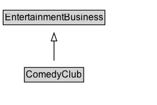

# ComedyClub

A comedy club.

## Diagram

=== "SVG (interactive)"

    <!-- Generated by graphviz version 14.1.3 (20260303.0454)
     -->
    <!-- Pages: 1 -->
    <svg width="197pt" height="132pt"
     viewBox="0.00 0.00 197.00 132.00" xmlns="http://www.w3.org/2000/svg" xmlns:xlink="http://www.w3.org/1999/xlink">
    <g id="graph0" class="graph" transform="scale(1 1) rotate(0) translate(4 128)">
    <polygon fill="white" stroke="none" points="-4,4 -4,-128 192.88,-128 192.88,4 -4,4"/>
    <g id="clust3" class="cluster">
    <title>cluster_associated</title>
    </g>
    <!-- EntertainmentBusiness -->
    <g id="node1" class="node">
    <title>EntertainmentBusiness</title>
    <g id="a_node1"><a xlink:href="../EntertainmentBusiness" xlink:title="&lt;TABLE&gt;">
    <polygon fill="lightgray" stroke="none" points="1,-97.88 1,-114.12 126.75,-114.12 126.75,-97.88 1,-97.88"/>
    <text xml:space="preserve" text-anchor="start" x="2" y="-101.88" font-family="Arial" font-size="12.00">EntertainmentBusiness</text>
    <polygon fill="none" stroke="black" points="0,-96.88 0,-115.12 127.75,-115.12 127.75,-96.88 0,-96.88"/>
    </a>
    </g>
    </g>
    <!-- ComedyClub -->
    <g id="node2" class="node">
    <title>ComedyClub</title>
    <g id="a_node2"><a xlink:href="../ComedyClub" xlink:title="&lt;TABLE&gt;">
    <polygon fill="lightgray" stroke="none" points="27.62,-25.88 27.62,-42.12 100.12,-42.12 100.12,-25.88 27.62,-25.88"/>
    <text xml:space="preserve" text-anchor="start" x="28.62" y="-29.88" font-family="Arial" font-size="12.00">ComedyClub</text>
    <polygon fill="none" stroke="black" points="26.62,-24.88 26.62,-43.12 101.12,-43.12 101.12,-24.88 26.62,-24.88"/>
    </a>
    </g>
    </g>
    <!-- ComedyClub&#45;&gt;EntertainmentBusiness -->
    <g id="edge1" class="edge">
    <title>ComedyClub&#45;&gt;EntertainmentBusiness</title>
    <path fill="none" stroke="black" d="M63.88,-51.79C63.88,-59.25 63.88,-68.24 63.88,-76.69"/>
    <polygon fill="none" stroke="black" points="60.38,-76.54 63.88,-86.54 67.38,-76.54 60.38,-76.54"/>
    </g>
    <!-- Invis -->
    </g>
    </svg>

=== "PNG"

    

## Formalization for ComedyClub

| Property | Constraint |
|----------|------------|
| subClassOf | [EntertainmentBusiness](EntertainmentBusiness.md) |

