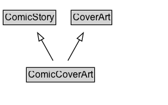

# ComicCoverArt

The artwork on the cover of a comic.

## Diagram

=== "SVG (interactive)"

    <!-- Generated by graphviz version 14.1.3 (20260303.0454)
     -->
    <!-- Pages: 1 -->
    <svg width="211pt" height="132pt"
     viewBox="0.00 0.00 211.00 132.00" xmlns="http://www.w3.org/2000/svg" xmlns:xlink="http://www.w3.org/1999/xlink">
    <g id="graph0" class="graph" transform="scale(1 1) rotate(0) translate(4 128)">
    <polygon fill="white" stroke="none" points="-4,4 -4,-128 207.12,-128 207.12,4 -4,4"/>
    <g id="clust3" class="cluster">
    <title>cluster_associated</title>
    </g>
    <!-- ComicStory -->
    <g id="node1" class="node">
    <title>ComicStory</title>
    <g id="a_node1"><a xlink:href="../ComicStory" xlink:title="&lt;TABLE&gt;">
    <polygon fill="lightgray" stroke="none" points="1,-97.88 1,-114.12 65.25,-114.12 65.25,-97.88 1,-97.88"/>
    <text xml:space="preserve" text-anchor="start" x="2" y="-101.88" font-family="Arial" font-size="12.00">ComicStory</text>
    <polygon fill="none" stroke="black" points="0,-96.88 0,-115.12 66.25,-115.12 66.25,-96.88 0,-96.88"/>
    </a>
    </g>
    </g>
    <!-- CoverArt -->
    <g id="node2" class="node">
    <title>CoverArt</title>
    <g id="a_node2"><a xlink:href="../CoverArt" xlink:title="&lt;TABLE&gt;">
    <polygon fill="lightgray" stroke="none" points="86.5,-97.88 86.5,-114.12 135.75,-114.12 135.75,-97.88 86.5,-97.88"/>
    <text xml:space="preserve" text-anchor="start" x="87.5" y="-101.88" font-family="Arial" font-size="12.00">CoverArt</text>
    <polygon fill="none" stroke="black" points="85.5,-96.88 85.5,-115.12 136.75,-115.12 136.75,-96.88 85.5,-96.88"/>
    </a>
    </g>
    </g>
    <!-- ComicCoverArt -->
    <g id="node3" class="node">
    <title>ComicCoverArt</title>
    <g id="a_node3"><a xlink:href="../ComicCoverArt" xlink:title="&lt;TABLE&gt;">
    <polygon fill="lightgray" stroke="none" points="30.25,-25.88 30.25,-42.12 114,-42.12 114,-25.88 30.25,-25.88"/>
    <text xml:space="preserve" text-anchor="start" x="31.25" y="-29.88" font-family="Arial" font-size="12.00">ComicCoverArt</text>
    <polygon fill="none" stroke="black" points="29.25,-24.88 29.25,-43.12 115,-43.12 115,-24.88 29.25,-24.88"/>
    </a>
    </g>
    </g>
    <!-- ComicCoverArt&#45;&gt;ComicStory -->
    <g id="edge1" class="edge">
    <title>ComicCoverArt&#45;&gt;ComicStory</title>
    <path fill="none" stroke="black" d="M62.77,-51.79C58.38,-59.68 53.03,-69.28 48.09,-78.14"/>
    <polygon fill="none" stroke="black" points="45.11,-76.29 43.3,-86.73 51.23,-79.7 45.11,-76.29"/>
    </g>
    <!-- ComicCoverArt&#45;&gt;CoverArt -->
    <g id="edge2" class="edge">
    <title>ComicCoverArt&#45;&gt;CoverArt</title>
    <path fill="none" stroke="black" d="M81.48,-51.79C85.87,-59.68 91.22,-69.28 96.16,-78.14"/>
    <polygon fill="none" stroke="black" points="93.02,-79.7 100.95,-86.73 99.14,-76.29 93.02,-79.7"/>
    </g>
    <!-- Invis -->
    </g>
    </svg>

=== "PNG"

    

## Formalization for ComicCoverArt

| Property | Constraint |
|----------|------------|
| subClassOf | [ComicStory](ComicStory.md) |
| subClassOf | [CoverArt](CoverArt.md) |

