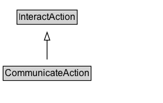

# CommunicateAction

The act of conveying information to another person via a communication medium (instrument) such as speech, email, or telephone conversation.

## Diagram

=== "SVG (interactive)"

    <!-- Generated by graphviz version 14.1.3 (20260303.0454)
     -->
    <!-- Pages: 1 -->
    <svg width="208pt" height="132pt"
     viewBox="0.00 0.00 208.00 132.00" xmlns="http://www.w3.org/2000/svg" xmlns:xlink="http://www.w3.org/1999/xlink">
    <g id="graph0" class="graph" transform="scale(1 1) rotate(0) translate(4 128)">
    <polygon fill="white" stroke="none" points="-4,4 -4,-128 204,-128 204,4 -4,4"/>
    <g id="clust3" class="cluster">
    <title>cluster_associated</title>
    </g>
    <!-- InteractAction -->
    <g id="node1" class="node">
    <title>InteractAction</title>
    <g id="a_node1"><a xlink:href="../InteractAction" xlink:title="&lt;TABLE&gt;">
    <polygon fill="lightgray" stroke="none" points="18.62,-97.88 18.62,-114.12 93.38,-114.12 93.38,-97.88 18.62,-97.88"/>
    <text xml:space="preserve" text-anchor="start" x="19.62" y="-101.88" font-family="Arial" font-size="12.00">InteractAction</text>
    <polygon fill="none" stroke="black" points="17.62,-96.88 17.62,-115.12 94.38,-115.12 94.38,-96.88 17.62,-96.88"/>
    </a>
    </g>
    </g>
    <!-- CommunicateAction -->
    <g id="node2" class="node">
    <title>CommunicateAction</title>
    <g id="a_node2"><a xlink:href="../CommunicateAction" xlink:title="&lt;TABLE&gt;">
    <polygon fill="lightgray" stroke="none" points="1,-25.88 1,-42.12 111,-42.12 111,-25.88 1,-25.88"/>
    <text xml:space="preserve" text-anchor="start" x="2" y="-29.88" font-family="Arial" font-size="12.00">CommunicateAction</text>
    <polygon fill="none" stroke="black" points="0,-24.88 0,-43.12 112,-43.12 112,-24.88 0,-24.88"/>
    </a>
    </g>
    </g>
    <!-- CommunicateAction&#45;&gt;InteractAction -->
    <g id="edge1" class="edge">
    <title>CommunicateAction&#45;&gt;InteractAction</title>
    <path fill="none" stroke="black" d="M56,-51.79C56,-59.25 56,-68.24 56,-76.69"/>
    <polygon fill="none" stroke="black" points="52.5,-76.54 56,-86.54 59.5,-76.54 52.5,-76.54"/>
    </g>
    <!-- Invis -->
    </g>
    </svg>

=== "PNG"

    

## Specializations of CommunicateAction

| Class | Description |
|-------|-------------|
| [Ask Action](AskAction.md) | The act of posing a question / favor to someone.\n\nRelated actions:\n\n* [[ReplyAction]]: Appears generally as a response to AskAction. |
| [Check In Action](CheckInAction.md) | The act of an agent communicating (service provider, social media, etc) their arrival by registering/confirming for a previously reserved service (e.g. flight check-in) or at a place (e.g. hotel), possibly resulting in a result (boarding pass, etc).\n\nRelated actions:\n\n* [[CheckOutAction]]: The antonym of CheckInAction.\n* [[ArriveAction]]: Unlike ArriveAction, CheckInAction implies that the agent is informing/confirming the start of a previously reserved service.\n* [[ConfirmAction]]: Unlike ConfirmAction, CheckInAction implies that the agent is informing/confirming the *start* of a previously reserved service rather than its validity/existence. |
| [Check Out Action](CheckOutAction.md) | The act of an agent communicating (service provider, social media, etc) their departure of a previously reserved service (e.g. flight check-in) or place (e.g. hotel).\n\nRelated actions:\n\n* [[CheckInAction]]: The antonym of CheckOutAction.\n* [[DepartAction]]: Unlike DepartAction, CheckOutAction implies that the agent is informing/confirming the end of a previously reserved service.\n* [[CancelAction]]: Unlike CancelAction, CheckOutAction implies that the agent is informing/confirming the end of a previously reserved service. |
| [Comment Action](CommentAction.md) | The act of generating a comment about a subject. |
| [Confirm Action](ConfirmAction.md) | The act of notifying someone that a future event/action is going to happen as expected.\n\nRelated actions:\n\n* [[CancelAction]]: The antonym of ConfirmAction. |
| [Inform Action](InformAction.md) | The act of notifying someone of information pertinent to them, with no expectation of a response. |
| [Invite Action](InviteAction.md) | The act of asking someone to attend an event. Reciprocal of RsvpAction. |
| [Reply Action](ReplyAction.md) | The act of responding to a question/message asked/sent by the object. Related to [[AskAction]].\n\nRelated actions:\n\n* [[AskAction]]: Appears generally as an origin of a ReplyAction. |
| [Rsvp Action](RsvpAction.md) | The act of notifying an event organizer as to whether you expect to attend the event. |
| [Share Action](ShareAction.md) | The act of distributing content to people for their amusement or edification. |

## Formalization for CommunicateAction

| Property | Constraint |
|----------|------------|
| subClassOf | [InteractAction](InteractAction.md) |

