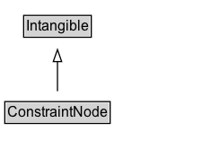

# ConstraintNode

The ConstraintNode type is provided to support usecases in which a node in a structured data graph is described with properties which appear to describe a single entity, but are being used in a situation where they serve a more abstract purpose. A [[ConstraintNode]] can be described using [[constraintProperty]] and [[numConstraints]]. These constraint properties can serve a
    variety of purposes, and their values may sometimes be understood to indicate sets of possible values rather than single, exact and specific values.

## Diagram

=== "SVG (interactive)"

    <!-- Generated by graphviz version 14.1.3 (20260303.0454)
     -->
    <!-- Pages: 1 -->
    <svg width="184pt" height="132pt"
     viewBox="0.00 0.00 184.00 132.00" xmlns="http://www.w3.org/2000/svg" xmlns:xlink="http://www.w3.org/1999/xlink">
    <g id="graph0" class="graph" transform="scale(1 1) rotate(0) translate(4 128)">
    <polygon fill="white" stroke="none" points="-4,4 -4,-128 180,-128 180,4 -4,4"/>
    <g id="clust3" class="cluster">
    <title>cluster_associated</title>
    </g>
    <!-- Intangible -->
    <g id="node1" class="node">
    <title>Intangible</title>
    <g id="a_node1"><a xlink:href="../Intangible" xlink:title="&lt;TABLE&gt;">
    <polygon fill="lightgray" stroke="none" points="16.75,-97.88 16.75,-114.12 71.25,-114.12 71.25,-97.88 16.75,-97.88"/>
    <text xml:space="preserve" text-anchor="start" x="17.75" y="-101.88" font-family="Arial" font-size="12.00">Intangible</text>
    <polygon fill="none" stroke="black" points="15.75,-96.88 15.75,-115.12 72.25,-115.12 72.25,-96.88 15.75,-96.88"/>
    </a>
    </g>
    </g>
    <!-- ConstraintNode -->
    <g id="node2" class="node">
    <title>ConstraintNode</title>
    <g id="a_node2"><a xlink:href="../ConstraintNode" xlink:title="&lt;TABLE&gt;">
    <polygon fill="lightgray" stroke="none" points="1,-25.88 1,-42.12 87,-42.12 87,-25.88 1,-25.88"/>
    <text xml:space="preserve" text-anchor="start" x="2" y="-29.88" font-family="Arial" font-size="12.00">ConstraintNode</text>
    <polygon fill="none" stroke="black" points="0,-24.88 0,-43.12 88,-43.12 88,-24.88 0,-24.88"/>
    </a>
    </g>
    </g>
    <!-- ConstraintNode&#45;&gt;Intangible -->
    <g id="edge1" class="edge">
    <title>ConstraintNode&#45;&gt;Intangible</title>
    <path fill="none" stroke="black" d="M44,-51.79C44,-59.25 44,-68.24 44,-76.69"/>
    <polygon fill="none" stroke="black" points="40.5,-76.54 44,-86.54 47.5,-76.54 40.5,-76.54"/>
    </g>
    <!-- Invis -->
    </g>
    </svg>

=== "PNG"

    

## Specializations of ConstraintNode

| Class | Description |
|-------|-------------|
| [Statistical Variable](StatisticalVariable.md) | [[StatisticalVariable]] represents any type of statistical metric that can be measured at a place and time. The usage pattern for [[StatisticalVariable]] is typically expressed using [[Observation]] with an explicit [[populationType]], which is a type, typically drawn from Schema.org. Each [[StatisticalVariable]] is marked as a [[ConstraintNode]], meaning that some properties (those listed using [[constraintProperty]]) serve in this setting solely to define the statistical variable rather than literally describe a specific person, place or thing. For example, a [[StatisticalVariable]] Median_Height_Person_Female representing the median height of women, could be written as follows: the population type is [[Person]]; the measuredProperty [[height]]; the [[statType]] [[median]]; the [[gender]] [[Female]]. It is important to note that there are many kinds of scientific quantitative observation which are not fully, perfectly or unambiguously described following this pattern, or with solely Schema.org terminology. The approach taken here is designed to allow partial, incremental or minimal description of [[StatisticalVariable]]s, and the use of detailed sets of entity and property IDs from external repositories. The [[measurementMethod]], [[unitCode]] and [[unitText]] properties can also be used to clarify the specific nature and notation of an observed measurement.  |

## Formalization for ConstraintNode

| Property | Constraint |
|----------|------------|
| subClassOf | [Intangible](Intangible.md) |

