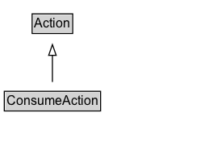

# ConsumeAction

The act of ingesting information/resources/food.

## Diagram

=== "SVG (interactive)"

    <!-- Generated by graphviz version 14.1.3 (20260303.0454)
     -->
    <!-- Pages: 1 -->
    <svg width="186pt" height="132pt"
     viewBox="0.00 0.00 186.00 132.00" xmlns="http://www.w3.org/2000/svg" xmlns:xlink="http://www.w3.org/1999/xlink">
    <g id="graph0" class="graph" transform="scale(1 1) rotate(0) translate(4 128)">
    <polygon fill="white" stroke="none" points="-4,4 -4,-128 181.75,-128 181.75,4 -4,4"/>
    <g id="clust3" class="cluster">
    <title>cluster_associated</title>
    </g>
    <!-- Action -->
    <g id="node1" class="node">
    <title>Action</title>
    <g id="a_node1"><a xlink:href="../Action" xlink:title="&lt;TABLE&gt;">
    <polygon fill="lightgray" stroke="none" points="26.88,-97.88 26.88,-114.12 62.62,-114.12 62.62,-97.88 26.88,-97.88"/>
    <text xml:space="preserve" text-anchor="start" x="27.88" y="-101.88" font-family="Arial" font-size="12.00">Action</text>
    <polygon fill="none" stroke="black" points="25.88,-96.88 25.88,-115.12 63.62,-115.12 63.62,-96.88 25.88,-96.88"/>
    </a>
    </g>
    </g>
    <!-- ConsumeAction -->
    <g id="node2" class="node">
    <title>ConsumeAction</title>
    <g id="a_node2"><a xlink:href="../ConsumeAction" xlink:title="&lt;TABLE&gt;">
    <polygon fill="lightgray" stroke="none" points="1,-25.88 1,-42.12 88.5,-42.12 88.5,-25.88 1,-25.88"/>
    <text xml:space="preserve" text-anchor="start" x="2" y="-29.88" font-family="Arial" font-size="12.00">ConsumeAction</text>
    <polygon fill="none" stroke="black" points="0,-24.88 0,-43.12 89.5,-43.12 89.5,-24.88 0,-24.88"/>
    </a>
    </g>
    </g>
    <!-- ConsumeAction&#45;&gt;Action -->
    <g id="edge1" class="edge">
    <title>ConsumeAction&#45;&gt;Action</title>
    <path fill="none" stroke="black" d="M44.75,-51.79C44.75,-59.25 44.75,-68.24 44.75,-76.69"/>
    <polygon fill="none" stroke="black" points="41.25,-76.54 44.75,-86.54 48.25,-76.54 41.25,-76.54"/>
    </g>
    <!-- Invis -->
    </g>
    </svg>

=== "PNG"

    

## Specializations of ConsumeAction

| Class | Description |
|-------|-------------|
| [Drink Action](DrinkAction.md) | The act of swallowing liquids. |
| [Eat Action](EatAction.md) | The act of swallowing solid objects. |
| [Install Action](InstallAction.md) | The act of installing an application. |
| [Listen Action](ListenAction.md) | The act of consuming audio content. |
| [Play Game Action](PlayGameAction.md) | The act of playing a video game. |
| [Read Action](ReadAction.md) | The act of consuming written content. |
| [Use Action](UseAction.md) | The act of applying an object to its intended purpose. |
| [View Action](ViewAction.md) | The act of consuming static visual content. |
| [Watch Action](WatchAction.md) | The act of consuming dynamic/moving visual content. |
| [Wear Action](WearAction.md) | The act of dressing oneself in clothing. |

## Formalization for ConsumeAction

| Property | Constraint |
|----------|------------|
| subClassOf | [Action](Action.md) |

