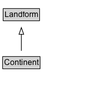

# Continent

One of the continents (for example, Europe or Africa).

## Diagram

=== "SVG (interactive)"

    <!-- Generated by graphviz version 14.1.3 (20260303.0454)
     -->
    <!-- Pages: 1 -->
    <svg width="152pt" height="132pt"
     viewBox="0.00 0.00 152.00 132.00" xmlns="http://www.w3.org/2000/svg" xmlns:xlink="http://www.w3.org/1999/xlink">
    <g id="graph0" class="graph" transform="scale(1 1) rotate(0) translate(4 128)">
    <polygon fill="white" stroke="none" points="-4,4 -4,-128 147.88,-128 147.88,4 -4,4"/>
    <g id="clust3" class="cluster">
    <title>cluster_associated</title>
    </g>
    <!-- Landform -->
    <g id="node1" class="node">
    <title>Landform</title>
    <g id="a_node1"><a xlink:href="../Landform" xlink:title="&lt;TABLE&gt;">
    <polygon fill="lightgray" stroke="none" points="1.75,-97.88 1.75,-114.12 54,-114.12 54,-97.88 1.75,-97.88"/>
    <text xml:space="preserve" text-anchor="start" x="2.75" y="-101.88" font-family="Arial" font-size="12.00">Landform</text>
    <polygon fill="none" stroke="black" points="0.75,-96.88 0.75,-115.12 55,-115.12 55,-96.88 0.75,-96.88"/>
    </a>
    </g>
    </g>
    <!-- Continent -->
    <g id="node2" class="node">
    <title>Continent</title>
    <g id="a_node2"><a xlink:href="../Continent" xlink:title="&lt;TABLE&gt;">
    <polygon fill="lightgray" stroke="none" points="1,-25.88 1,-42.12 54.75,-42.12 54.75,-25.88 1,-25.88"/>
    <text xml:space="preserve" text-anchor="start" x="2" y="-29.88" font-family="Arial" font-size="12.00">Continent</text>
    <polygon fill="none" stroke="black" points="0,-24.88 0,-43.12 55.75,-43.12 55.75,-24.88 0,-24.88"/>
    </a>
    </g>
    </g>
    <!-- Continent&#45;&gt;Landform -->
    <g id="edge1" class="edge">
    <title>Continent&#45;&gt;Landform</title>
    <path fill="none" stroke="black" d="M27.88,-51.79C27.88,-59.25 27.88,-68.24 27.88,-76.69"/>
    <polygon fill="none" stroke="black" points="24.38,-76.54 27.88,-86.54 31.38,-76.54 24.38,-76.54"/>
    </g>
    <!-- Invis -->
    </g>
    </svg>

=== "PNG"

    

## Formalization for Continent

| Property | Constraint |
|----------|------------|
| subClassOf | [Landform](Landform.md) |

