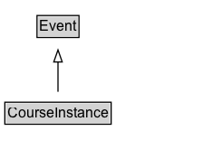

# CourseInstance

An instance of a [[Course]] which is distinct from other instances because it is offered at a different time or location or through different media or modes of study or to a specific section of students.

## Diagram

=== "SVG (interactive)"

    <!-- Generated by graphviz version 14.1.3 (20260303.0454)
     -->
    <!-- Pages: 1 -->
    <svg width="184pt" height="132pt"
     viewBox="0.00 0.00 184.00 132.00" xmlns="http://www.w3.org/2000/svg" xmlns:xlink="http://www.w3.org/1999/xlink">
    <g id="graph0" class="graph" transform="scale(1 1) rotate(0) translate(4 128)">
    <polygon fill="white" stroke="none" points="-4,4 -4,-128 180,-128 180,4 -4,4"/>
    <g id="clust3" class="cluster">
    <title>cluster_associated</title>
    </g>
    <!-- Event -->
    <g id="node1" class="node">
    <title>Event</title>
    <g id="a_node1"><a xlink:href="../Event" xlink:title="&lt;TABLE&gt;">
    <polygon fill="lightgray" stroke="none" points="27.62,-97.88 27.62,-114.12 60.38,-114.12 60.38,-97.88 27.62,-97.88"/>
    <text xml:space="preserve" text-anchor="start" x="28.62" y="-101.88" font-family="Arial" font-size="12.00">Event</text>
    <polygon fill="none" stroke="black" points="26.62,-96.88 26.62,-115.12 61.38,-115.12 61.38,-96.88 26.62,-96.88"/>
    </a>
    </g>
    </g>
    <!-- CourseInstance -->
    <g id="node2" class="node">
    <title>CourseInstance</title>
    <g id="a_node2"><a xlink:href="../CourseInstance" xlink:title="&lt;TABLE&gt;">
    <polygon fill="lightgray" stroke="none" points="1,-25.88 1,-42.12 87,-42.12 87,-25.88 1,-25.88"/>
    <text xml:space="preserve" text-anchor="start" x="2" y="-29.88" font-family="Arial" font-size="12.00">CourseInstance</text>
    <polygon fill="none" stroke="black" points="0,-24.88 0,-43.12 88,-43.12 88,-24.88 0,-24.88"/>
    </a>
    </g>
    </g>
    <!-- CourseInstance&#45;&gt;Event -->
    <g id="edge1" class="edge">
    <title>CourseInstance&#45;&gt;Event</title>
    <path fill="none" stroke="black" d="M44,-51.79C44,-59.25 44,-68.24 44,-76.69"/>
    <polygon fill="none" stroke="black" points="40.5,-76.54 44,-86.54 47.5,-76.54 40.5,-76.54"/>
    </g>
    <!-- Invis -->
    </g>
    </svg>

=== "PNG"

    

## Formalization for CourseInstance

| Property | Constraint |
|----------|------------|
| subClassOf | [Event](Event.md) |

