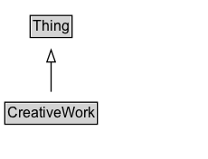

# CreativeWork

The most generic kind of creative work, including books, movies, photographs, software programs, etc.

## Diagram

=== "SVG (interactive)"

    <!-- Generated by graphviz version 14.1.3 (20260303.0454)
     -->
    <!-- Pages: 1 -->
    <svg width="172pt" height="132pt"
     viewBox="0.00 0.00 172.00 132.00" xmlns="http://www.w3.org/2000/svg" xmlns:xlink="http://www.w3.org/1999/xlink">
    <g id="graph0" class="graph" transform="scale(1 1) rotate(0) translate(4 128)">
    <polygon fill="white" stroke="none" points="-4,4 -4,-128 168.38,-128 168.38,4 -4,4"/>
    <g id="clust3" class="cluster">
    <title>cluster_associated</title>
    </g>
    <!-- Thing -->
    <g id="node1" class="node">
    <title>Thing</title>
    <g id="a_node1"><a xlink:href="../Thing" xlink:title="&lt;TABLE&gt;">
    <polygon fill="lightgray" stroke="none" points="22,-97.88 22,-114.12 54.75,-114.12 54.75,-97.88 22,-97.88"/>
    <text xml:space="preserve" text-anchor="start" x="23" y="-101.88" font-family="Arial" font-size="12.00">Thing</text>
    <polygon fill="none" stroke="black" points="21,-96.88 21,-115.12 55.75,-115.12 55.75,-96.88 21,-96.88"/>
    </a>
    </g>
    </g>
    <!-- CreativeWork -->
    <g id="node2" class="node">
    <title>CreativeWork</title>
    <g id="a_node2"><a xlink:href="../CreativeWork" xlink:title="&lt;TABLE&gt;">
    <polygon fill="lightgray" stroke="none" points="1,-25.88 1,-42.12 75.75,-42.12 75.75,-25.88 1,-25.88"/>
    <text xml:space="preserve" text-anchor="start" x="2" y="-29.88" font-family="Arial" font-size="12.00">CreativeWork</text>
    <polygon fill="none" stroke="black" points="0,-24.88 0,-43.12 76.75,-43.12 76.75,-24.88 0,-24.88"/>
    </a>
    </g>
    </g>
    <!-- CreativeWork&#45;&gt;Thing -->
    <g id="edge1" class="edge">
    <title>CreativeWork&#45;&gt;Thing</title>
    <path fill="none" stroke="black" d="M38.38,-51.79C38.38,-59.25 38.38,-68.24 38.38,-76.69"/>
    <polygon fill="none" stroke="black" points="34.88,-76.54 38.38,-86.54 41.88,-76.54 34.88,-76.54"/>
    </g>
    <!-- Invis -->
    </g>
    </svg>

=== "PNG"

    

## Specializations of CreativeWork

| Class | Description |
|-------|-------------|
| [3 D Model](3DModel.md) | A 3D model represents some kind of 3D content, which may have [[encoding]]s in one or more [[MediaObject]]s. Many 3D formats are available (e.g. see [Wikipedia](https://en.wikipedia.org/wiki/Category:3D_graphics_file_formats)); specific encoding formats can be represented using the [[encodingFormat]] property applied to the relevant [[MediaObject]]. For the
case of a single file published after Zip compression, the convention of appending '+zip' to the [[encodingFormat]] can be used. Geospatial, AR/VR, artistic/animation, gaming, engineering and scientific content can all be represented using [[3DModel]]. |
| [About Page](AboutPage.md) | Web page type: About page. |
| [Advertiser Content Article](AdvertiserContentArticle.md) | An [[Article]] that an external entity has paid to place or to produce to its specifications. Includes [advertorials](https://en.wikipedia.org/wiki/Advertorial), sponsored content, native advertising and other paid content. |
| [Amp Story](AmpStory.md) | A creative work with a visual storytelling format intended to be viewed online, particularly on mobile devices. |
| [Amp Story](AmpStory.md) | A creative work with a visual storytelling format intended to be viewed online, particularly on mobile devices. |
| [Analysis News Article](AnalysisNewsArticle.md) | An AnalysisNewsArticle is a [[NewsArticle]] that, while based on factual reporting, incorporates the expertise of the author/producer, offering interpretations and conclusions. |
| [Answer](Answer.md) | An answer offered to a question; perhaps correct, perhaps opinionated or wrong. |
| [Api Reference](APIReference.md) | Reference documentation for application programming interfaces (APIs). |
| [Archive Component](ArchiveComponent.md) | An intangible type to be applied to any archive content, carrying with it a set of properties required to describe archival items and collections. |
| [Article](Article.md) | An article, such as a news article or piece of investigative report. Newspapers and magazines have articles of many different types and this is intended to cover them all.\n\nSee also [blog post](https://blog.schema.org/2014/09/02/schema-org-support-for-bibliographic-relationships-and-periodicals/). |
| [Ask Public News Article](AskPublicNewsArticle.md) | A [[NewsArticle]] expressing an open call by a [[NewsMediaOrganization]] asking the public for input, insights, clarifications, anecdotes, documentation, etc., on an issue, for reporting purposes. |
| [Atlas](Atlas.md) | A collection or bound volume of maps, charts, plates or tables, physical or in media form illustrating any subject. |
| [Audiobook](Audiobook.md) | An audiobook. |
| [Audiobook](Audiobook.md) | An audiobook. |
| [Audio Object](AudioObject.md) | An audio file. |
| [Audio Object Snapshot](AudioObjectSnapshot.md) | A specific and exact (byte-for-byte) version of an [[AudioObject]]. Two byte-for-byte identical files, for the purposes of this type, considered identical. If they have different embedded metadata the files will differ. Different external facts about the files, e.g. creator or dateCreated that aren't represented in their actual content, do not affect this notion of identity. |
| [Background News Article](BackgroundNewsArticle.md) | A [[NewsArticle]] providing historical context, definition and detail on a specific topic (aka "explainer" or "backgrounder"). For example, an in-depth article or frequently-asked-questions ([FAQ](https://en.wikipedia.org/wiki/FAQ)) document on topics such as Climate Change or the European Union. Other kinds of background material from a non-news setting are often described using [[Book]] or [[Article]], in particular [[ScholarlyArticle]]. See also [[NewsArticle]] for related vocabulary from a learning/education perspective. |
| [Barcode](Barcode.md) | An image of a visual machine-readable code such as a barcode or QR code. |
| [Blog](Blog.md) | A [blog](https://en.wikipedia.org/wiki/Blog), sometimes known as a "weblog". Note that the individual posts ([[BlogPosting]]s) in a [[Blog]] are often colloquially referred to by the same term. |
| [Blog Posting](BlogPosting.md) | A blog post. |
| [Book](Book.md) | A book. |
| [Book Series](BookSeries.md) | A series of books. Included books can be indicated with the hasPart property. |
| [Category Code Set](CategoryCodeSet.md) | A set of Category Code values. |
| [Certification](Certification.md) | A Certification is an official and authoritative statement about a subject, for example a product, service, person, or organization. A certification is typically issued by an indendent certification body, for example a professional organization or government. It formally attests certain characteristics about the subject, for example Organizations can be ISO certified, Food products can be certified Organic or Vegan, a Person can be a certified professional, a Place can be certified for food processing. There are certifications for many domains: regulatory, organizational, recycling, food, efficiency, educational, ecological, etc. A certification is a form of credential, as are accreditations and licenses. Mapped from the [gs1:CertificationDetails](https://www.gs1.org/voc/CertificationDetails) class in the GS1 Web Vocabulary. |
| [Chapter](Chapter.md) | One of the sections into which a book is divided. A chapter usually has a section number or a name. |
| [Checkout Page](CheckoutPage.md) | Web page type: Checkout page. |
| [Claim](Claim.md) | A [[Claim]] in Schema.org represents a specific, factually-oriented claim that could be the [[itemReviewed]] in a [[ClaimReview]]. The content of a claim can be summarized with the [[text]] property. Variations on well known claims can have their common identity indicated via [[sameAs]] links, and summarized with a [[name]]. Ideally, a [[Claim]] description includes enough contextual information to minimize the risk of ambiguity or inclarity. In practice, many claims are better understood in the context in which they appear or the interpretations provided by claim reviews.

  Beyond [[ClaimReview]], the Claim type can be associated with related creative works - for example a [[ScholarlyArticle]] or [[Question]] might be [[about]] some [[Claim]].

  At this time, Schema.org does not define any types of relationship between claims. This is a natural area for future exploration.
   |
| [Claim Review](ClaimReview.md) | A fact-checking review of claims made (or reported) in some creative work (referenced via itemReviewed). |
| [Clip](Clip.md) | A short TV or radio program or a segment/part of a program. |
| [Code](Code.md) | Computer programming source code. Example: Full (compile ready) solutions, code snippet samples, scripts, templates. |
| [Collection](Collection.md) | A collection of items, e.g. creative works or products. |
| [Collection Page](CollectionPage.md) | Web page type: Collection page. |
| [Comic Cover Art](ComicCoverArt.md) | The artwork on the cover of a comic. |
| [Comic Cover Art](ComicCoverArt.md) | The artwork on the cover of a comic. |
| [Comic Issue](ComicIssue.md) | Individual comic issues are serially published as
    	part of a larger series. For the sake of consistency, even one-shot issues
    	belong to a series comprised of a single issue. All comic issues can be
    	uniquely identified by: the combination of the name and volume number of the
    	series to which the issue belongs; the issue number; and the variant
    	description of the issue (if any). |
| [Comic Series](ComicSeries.md) | A sequential publication of comic stories under a
    	unifying title, for example "The Amazing Spider-Man" or "Groo the
    	Wanderer". |
| [Comic Story](ComicStory.md) | The term "story" is any indivisible, re-printable
    	unit of a comic, including the interior stories, covers, and backmatter. Most
    	comics have at least two stories: a cover (ComicCoverArt) and an interior story. |
| [Comment](Comment.md) | A comment on an item - for example, a comment on a blog post. The comment's content is expressed via the [[text]] property, and its topic via [[about]], properties shared with all CreativeWorks. |
| [Complete Data Feed](CompleteDataFeed.md) | A [[CompleteDataFeed]] is a [[DataFeed]] whose standard representation includes content for every item currently in the feed.

This is the equivalent of Atom's element as defined in Feed Paging and Archiving [RFC 5005](https://tools.ietf.org/html/rfc5005), for example (and as defined for Atom), when using data from a feed that represents a collection of items that varies over time (e.g. "Top Twenty Records") there is no need to have newer entries mixed in alongside older, obsolete entries. By marking this feed as a CompleteDataFeed, old entries can be safely discarded when the feed is refreshed, since we can assume the feed has provided descriptions for all current items. |
| [Contact Page](ContactPage.md) | Web page type: Contact page. |
| [Conversation](Conversation.md) | One or more messages between organizations or people on a particular topic. Individual messages can be linked to the conversation with isPartOf or hasPart properties. |
| [Correction Comment](CorrectionComment.md) | A [[comment]] that corrects [[CreativeWork]]. |
| [Course](Course.md) | A description of an educational course which may be offered as distinct instances which take place at different times or take place at different locations, or be offered through different media or modes of study. An educational course is a sequence of one or more educational events and/or creative works which aims to build knowledge, competence or ability of learners. |
| [Course](Course.md) | A description of an educational course which may be offered as distinct instances which take place at different times or take place at different locations, or be offered through different media or modes of study. An educational course is a sequence of one or more educational events and/or creative works which aims to build knowledge, competence or ability of learners. |
| [Cover Art](CoverArt.md) | The artwork on the outer surface of a CreativeWork. |
| [Creative Work Season](CreativeWorkSeason.md) | A media season, e.g. TV, radio, video game etc. |
| [Creative Work Series](CreativeWorkSeries.md) | A CreativeWorkSeries in schema.org is a group of related items, typically but not necessarily of the same kind. CreativeWorkSeries are usually organized into some order, often chronological. Unlike [[ItemList]] which is a general purpose data structure for lists of things, the emphasis with CreativeWorkSeries is on published materials (written e.g. books and periodicals, or media such as TV, radio and games).\n\nSpecific subtypes are available for describing [[TVSeries]], [[RadioSeries]], [[MovieSeries]], [[BookSeries]], [[Periodical]] and [[VideoGameSeries]]. In each case, the [[hasPart]] / [[isPartOf]] properties can be used to relate the CreativeWorkSeries to its parts. The general CreativeWorkSeries type serves largely just to organize these more specific and practical subtypes.\n\nIt is common for properties applicable to an item from the series to be usefully applied to the containing group. Schema.org attempts to anticipate some of these cases, but publishers should be free to apply properties of the series parts to the series as a whole wherever they seem appropriate.
     |
| [Critic Review](CriticReview.md) | A [[CriticReview]] is a more specialized form of Review written or published by a source that is recognized for its reviewing activities. These can include online columns, travel and food guides, TV and radio shows, blogs and other independent Web sites. [[CriticReview]]s are typically more in-depth and professionally written. For simpler, casually written user/visitor/viewer/customer reviews, it is more appropriate to use the [[UserReview]] type. Review aggregator sites such as Metacritic already separate out the site's user reviews from selected critic reviews that originate from third-party sources. |
| [Data Catalog](DataCatalog.md) | A collection of datasets. |
| [Data Download](DataDownload.md) | All or part of a [[Dataset]] in downloadable form.  |
| [Data Feed](DataFeed.md) | A single feed providing structured information about one or more entities or topics. |
| [Dataset](Dataset.md) | A body of structured information describing some topic(s) of interest. |
| [Defined Term Set](DefinedTermSet.md) | A set of defined terms, for example a set of categories or a classification scheme, a glossary, dictionary or enumeration. Use the about property to specify what the term set is about. |
| [Diet](Diet.md) | A strategy of regulating the intake of food to achieve or maintain a specific health-related goal. |
| [Digital Document](DigitalDocument.md) | An electronic file or document. |
| [Discussion Forum Posting](DiscussionForumPosting.md) | A posting to a discussion forum. |
| [Drawing](Drawing.md) | A picture or diagram made with a pencil, pen, or crayon rather than paint. |
| [Educational Occupational Credential](EducationalOccupationalCredential.md) | An educational or occupational credential. A diploma, academic degree, certification, qualification, badge, etc., that may be awarded to a person or other entity that meets the requirements defined by the credentialer. |
| [Email Message](EmailMessage.md) | An email message. |
| [Employer Review](EmployerReview.md) | An [[EmployerReview]] is a review of an [[Organization]] regarding its role as an employer, written by a current or former employee of that organization. |
| [Episode](Episode.md) | A media episode (e.g. TV, radio, video game) which can be part of a series or season. |
| [Exercise Plan](ExercisePlan.md) | Fitness-related activity designed for a specific health-related purpose, including defined exercise routines as well as activity prescribed by a clinician. |
| [Faq Page](FAQPage.md) | A [[FAQPage]] is a [[WebPage]] presenting one or more "[Frequently asked questions](https://en.wikipedia.org/wiki/FAQ)" (see also [[QAPage]]). |
| [Game](Game.md) | The Game type represents things which are games. These are typically rule-governed recreational activities, e.g. role-playing games in which players assume the role of characters in a fictional setting. |
| [Guide](Guide.md) | [[Guide]] is a page or article that recommends specific products or services, or aspects of a thing for a user to consider. A [[Guide]] may represent a Buying Guide and detail aspects of products or services for a user to consider. A [[Guide]] may represent a Product Guide and recommend specific products or services. A [[Guide]] may represent a Ranked List and recommend specific products or services with ranking. |
| [Health Topic Content](HealthTopicContent.md) | [[HealthTopicContent]] is [[WebContent]] that is about some aspect of a health topic, e.g. a condition, its symptoms or treatments. Such content may be comprised of several parts or sections and use different types of media. Multiple instances of [[WebContent]] (and hence [[HealthTopicContent]]) can be related using [[hasPart]] / [[isPartOf]] where there is some kind of content hierarchy, and their content described with [[about]] and [[mentions]] e.g. building upon the existing [[MedicalCondition]] vocabulary.
   |
| [How To](HowTo.md) | Instructions that explain how to achieve a result by performing a sequence of steps. |
| [How To Direction](HowToDirection.md) | A direction indicating a single action to do in the instructions for how to achieve a result. |
| [How To Section](HowToSection.md) | A sub-grouping of steps in the instructions for how to achieve a result (e.g. steps for making a pie crust within a pie recipe). |
| [How To Step](HowToStep.md) | A step in the instructions for how to achieve a result. It is an ordered list with HowToDirection and/or HowToTip items. |
| [How To Tip](HowToTip.md) | An explanation in the instructions for how to achieve a result. It provides supplementary information about a technique, supply, author's preference, etc. It can explain what could be done, or what should not be done, but doesn't specify what should be done (see HowToDirection). |
| [Hyper Toc](HyperToc.md) | A HyperToc represents a hypertext table of contents for complex media objects, such as [[VideoObject]], [[AudioObject]]. Items in the table of contents are indicated using the [[tocEntry]] property, and typed [[HyperTocEntry]]. For cases where the same larger work is split into multiple files, [[associatedMedia]] can be used on individual [[HyperTocEntry]] items. |
| [Hyper Toc Entry](HyperTocEntry.md) | A HyperToEntry is an item within a [[HyperToc]], which represents a hypertext table of contents for complex media objects, such as [[VideoObject]], [[AudioObject]]. The media object itself is indicated using [[associatedMedia]]. Each section of interest within that content can be described with a [[HyperTocEntry]], with associated [[startOffset]] and [[endOffset]]. When several entries are all from the same file, [[associatedMedia]] is used on the overarching [[HyperTocEntry]]; if the content has been split into multiple files, they can be referenced using [[associatedMedia]] on each [[HyperTocEntry]]. |
| [Image Gallery](ImageGallery.md) | Web page type: Image gallery page. |
| [Image Object](ImageObject.md) | An image file. |
| [Image Object Snapshot](ImageObjectSnapshot.md) | A specific and exact (byte-for-byte) version of an [[ImageObject]]. Two byte-for-byte identical files, for the purposes of this type, considered identical. If they have different embedded metadata (e.g. XMP, EXIF) the files will differ. Different external facts about the files, e.g. creator or dateCreated that aren't represented in their actual content, do not affect this notion of identity. |
| [Item Page](ItemPage.md) | A page devoted to a single item, such as a particular product or hotel. |
| [Learning Resource](LearningResource.md) | The LearningResource type can be used to indicate [[CreativeWork]]s (whether physical or digital) that have a particular and explicit orientation towards learning, education, skill acquisition, and other educational purposes.

[[LearningResource]] is expected to be used as an addition to a primary type such as [[Book]], [[VideoObject]], [[Product]] etc.

[[EducationEvent]] serves a similar purpose for event-like things (e.g. a [[Trip]]). A [[LearningResource]] may be created as a result of an [[EducationEvent]], for example by recording one. |
| [Legislation](Legislation.md) | A legal document such as an act, decree, bill, etc. (enforceable or not) or a component of a legal act (like an article). |
| [Legislation Object](LegislationObject.md) | A specific object or file containing a Legislation. Note that the same Legislation can be published in multiple files. For example, a digitally signed PDF, a plain PDF and an HTML version. |
| [Legislation Object](LegislationObject.md) | A specific object or file containing a Legislation. Note that the same Legislation can be published in multiple files. For example, a digitally signed PDF, a plain PDF and an HTML version. |
| [Live Blog Posting](LiveBlogPosting.md) | A [[LiveBlogPosting]] is a [[BlogPosting]] intended to provide a rolling textual coverage of an ongoing event through continuous updates. |
| [Manuscript](Manuscript.md) | A book, document, or piece of music written by hand rather than typed or printed. |
| [Map](Map.md) | A map. |
| [Math Solver](MathSolver.md) | A math solver which is capable of solving a subset of mathematical problems. |
| [Media Gallery](MediaGallery.md) | Web page type: Media gallery page. A mixed-media page that can contain media such as images, videos, and other multimedia. |
| [Media Object](MediaObject.md) | A media object, such as an image, video, audio, or text object embedded in a web page or a downloadable dataset i.e. DataDownload. Note that a creative work may have many media objects associated with it on the same web page. For example, a page about a single song (MusicRecording) may have a music video (VideoObject), and a high and low bandwidth audio stream (2 AudioObject's). |
| [Media Review](MediaReview.md) | A [[MediaReview]] is a more specialized form of Review dedicated to the evaluation of media content online, typically in the context of fact-checking and misinformation.
    For more general reviews of media in the broader sense, use [[UserReview]], [[CriticReview]] or other [[Review]] types. This definition is
    a work in progress. While the [[MediaManipulationRatingEnumeration]] list reflects significant community review amongst fact-checkers and others working
    to combat misinformation, the specific structures for representing media objects, their versions and publication context, are still evolving. Similarly, best practices for the relationship between [[MediaReview]] and [[ClaimReview]] markup have not yet been finalized. |
| [Media Review Item](MediaReviewItem.md) | Represents an item or group of closely related items treated as a unit for the sake of evaluation in a [[MediaReview]]. Authorship etc. apply to the items rather than to the curation/grouping or reviewing party. |
| [Medical Scholarly Article](MedicalScholarlyArticle.md) | A scholarly article in the medical domain. |
| [Medical Web Page](MedicalWebPage.md) | A web page that provides medical information. |
| [Menu](Menu.md) | A structured representation of food or drink items available from a FoodEstablishment. |
| [Menu Section](MenuSection.md) | A sub-grouping of food or drink items in a menu. E.g. courses (such as 'Dinner', 'Breakfast', etc.), specific type of dishes (such as 'Meat', 'Vegan', 'Drinks', etc.), or some other classification made by the menu provider. |
| [Message](Message.md) | A single message from a sender to one or more organizations or people. |
| [Mobile Application](MobileApplication.md) | A software application designed specifically to work well on a mobile device such as a telephone. |
| [Movie](Movie.md) | A movie. |
| [Movie Clip](MovieClip.md) | A short segment/part of a movie. |
| [Movie Series](MovieSeries.md) | A series of movies. Included movies can be indicated with the hasPart property. |
| [Music Album](MusicAlbum.md) | A collection of music tracks. |
| [Music Composition](MusicComposition.md) | A musical composition. |
| [Music Playlist](MusicPlaylist.md) | A collection of music tracks in playlist form. |
| [Music Recording](MusicRecording.md) | A music recording (track), usually a single song. |
| [Music Release](MusicRelease.md) | A MusicRelease is a specific release of a music album. |
| [Music Video Object](MusicVideoObject.md) | A music video file. |
| [News Article](NewsArticle.md) | A NewsArticle is an article whose content reports news, or provides background context and supporting materials for understanding the news.

A more detailed overview of [schema.org News markup](/docs/news.html) is also available.
 |
| [Newspaper](Newspaper.md) | A publication containing information about varied topics that are pertinent to general information, a geographic area, or a specific subject matter (i.e. business, culture, education). Often published daily. |
| [Note Digital Document](NoteDigitalDocument.md) | A file containing a note, primarily for the author. |
| [Operating System](OperatingSystem.md) | System software that manages computer hardware and software resources, and provides common services for computer programs. |
| [Opinion News Article](OpinionNewsArticle.md) | An [[OpinionNewsArticle]] is a [[NewsArticle]] that primarily expresses opinions rather than journalistic reporting of news and events. For example, a [[NewsArticle]] consisting of a column or [[Blog]]/[[BlogPosting]] entry in the Opinions section of a news publication.  |
| [Painting](Painting.md) | A painting. |
| [Periodical](Periodical.md) | A publication in any medium issued in successive parts bearing numerical or chronological designations and intended to continue indefinitely, such as a magazine, scholarly journal, or newspaper.\n\nSee also [blog post](https://blog.schema.org/2014/09/02/schema-org-support-for-bibliographic-relationships-and-periodicals/). |
| [Photograph](Photograph.md) | A photograph. |
| [Play](Play.md) | A play is a form of literature, usually consisting of dialogue between characters, intended for theatrical performance rather than just reading. Note: A performance of a Play would be a [[TheaterEvent]] or [[BroadcastEvent]] - the *Play* being the [[workPerformed]]. |
| [Podcast Episode](PodcastEpisode.md) | A single episode of a podcast series. |
| [Podcast Season](PodcastSeason.md) | A single season of a podcast. Many podcasts do not break down into separate seasons. In that case, PodcastSeries should be used. |
| [Podcast Series](PodcastSeries.md) | A podcast is an episodic series of digital audio or video files which a user can download and listen to. |
| [Poster](Poster.md) | A large, usually printed placard, bill, or announcement, often illustrated, that is posted to advertise or publicize something. |
| [Presentation Digital Document](PresentationDigitalDocument.md) | A file containing slides or used for a presentation. |
| [Product Collection](ProductCollection.md) | A set of products (either [[ProductGroup]]s or specific variants) that are listed together e.g. in an [[Offer]]. |
| [Profile Page](ProfilePage.md) | Web page type: Profile page. |
| [Publication Issue](PublicationIssue.md) | A part of a successively published publication such as a periodical or publication volume, often numbered, usually containing a grouping of works such as articles.\n\nSee also [blog post](https://blog-schema.org/2014/09/02/schema-org-support-for-bibliographic-relationships-and-periodicals/). |
| [Publication Volume](PublicationVolume.md) | A part of a successively published publication such as a periodical or multi-volume work, often numbered. It may represent a time span, such as a year.\n\nSee also [blog post](https://blog-schema.org/2014/09/02/schema-org-support-for-bibliographic-relationships-and-periodicals/). |
| [Qa Page](QAPage.md) | A QAPage is a WebPage focussed on a specific Question and its Answer(s), e.g. in a question answering site or documenting Frequently Asked Questions (FAQs). |
| [Question](Question.md) | A specific question - e.g. from a user seeking answers online, or collected in a Frequently Asked Questions (FAQ) document. |
| [Quiz](Quiz.md) | Quiz: A test of knowledge, skills and abilities. |
| [Quotation](Quotation.md) | A quotation. Often but not necessarily from some written work, attributable to a real world author and - if associated with a fictional character - to any fictional Person. Use [[isBasedOn]] to link to source/origin. The [[recordedIn]] property can be used to reference a Quotation from an [[Event]]. |
| [Radio Clip](RadioClip.md) | A short radio program or a segment/part of a radio program. |
| [Radio Episode](RadioEpisode.md) | A radio episode which can be part of a series or season. |
| [Radio Season](RadioSeason.md) | Season dedicated to radio broadcast and associated online delivery. |
| [Radio Series](RadioSeries.md) | CreativeWorkSeries dedicated to radio broadcast and associated online delivery. |
| [Real Estate Listing](RealEstateListing.md) | A [[RealEstateListing]] is a listing that describes one or more real-estate [[Offer]]s (whose [[businessFunction]] is typically to lease out, or to sell).
  The [[RealEstateListing]] type itself represents the overall listing, as manifested in some [[WebPage]].
   |
| [Recipe](Recipe.md) | A recipe. For dietary restrictions covered by the recipe, a few common restrictions are enumerated via [[suitableForDiet]]. The [[keywords]] property can also be used to add more detail. |
| [Recommendation](Recommendation.md) | [[Recommendation]] is a type of [[Review]] that suggests or proposes something as the best option or best course of action. Recommendations may be for products or services, or other concrete things, as in the case of a ranked list or product guide. A [[Guide]] may list multiple recommendations for different categories. For example, in a [[Guide]] about which TVs to buy, the author may have several [[Recommendation]]s. |
| [Report](Report.md) | A Report generated by governmental or non-governmental organization. |
| [Reportage News Article](ReportageNewsArticle.md) | The [[ReportageNewsArticle]] type is a subtype of [[NewsArticle]] representing
 news articles which are the result of journalistic news reporting conventions.

In practice many news publishers produce a wide variety of article types, many of which might be considered a [[NewsArticle]] but not a [[ReportageNewsArticle]]. For example, opinion pieces, reviews, analysis, sponsored or satirical articles, or articles that combine several of these elements.

The [[ReportageNewsArticle]] type is based on a stricter ideal for "news" as a work of journalism, with articles based on factual information either observed or verified by the author, or reported and verified from knowledgeable sources.  This often includes perspectives from multiple viewpoints on a particular issue (distinguishing news reports from public relations or propaganda).  News reports in the [[ReportageNewsArticle]] sense de-emphasize the opinion of the author, with commentary and value judgements typically expressed elsewhere.

A [[ReportageNewsArticle]] which goes deeper into analysis can also be marked with an additional type of [[AnalysisNewsArticle]].
 |
| [Review](Review.md) | A review of an item - for example, of a restaurant, movie, or store. |
| [Review News Article](ReviewNewsArticle.md) | A [[NewsArticle]] and [[CriticReview]] providing a professional critic's assessment of a service, product, performance, or artistic or literary work. |
| [Review News Article](ReviewNewsArticle.md) | A [[NewsArticle]] and [[CriticReview]] providing a professional critic's assessment of a service, product, performance, or artistic or literary work. |
| [Runtime Platform](RuntimePlatform.md) | Specialized software environment that provides the essential infrastructure, libraries, and services required to execute a program. |
| [Satirical Article](SatiricalArticle.md) | An [[Article]] whose content is primarily [[satirical]](https://en.wikipedia.org/wiki/Satire) in nature, i.e. unlikely to be literally true. A satirical article is sometimes but not necessarily also a [[NewsArticle]]. [[ScholarlyArticle]]s are also sometimes satirized. |
| [Scholarly Article](ScholarlyArticle.md) | A scholarly article. |
| [Sculpture](Sculpture.md) | A piece of sculpture. |
| [Search Results Page](SearchResultsPage.md) | Web page type: Search results page. |
| [Season](Season.md) | A media season, e.g. TV, radio, video game etc. |
| [Sequential Art](SequentialArt.md) | An art forms that use images deployed in a specific order for the purpose of graphic storytelling (i.e., narration of graphic stories) or conveying information. Examples of SequentialArt are Franco-Belgian Bande Dessinée, Comics in the USA and 漫画 (Manga) in Japan. |
| [Sequential Art](SequentialArt.md) | An art forms that use images deployed in a specific order for the purpose of graphic storytelling (i.e., narration of graphic stories) or conveying information. Examples of SequentialArt are Franco-Belgian Bande Dessinée, Comics in the USA and 漫画 (Manga) in Japan. |
| [Sheet Music](SheetMusic.md) | Printed music, as opposed to performed or recorded music. |
| [Short Story](ShortStory.md) | Short story or tale. A brief work of literature, usually written in narrative prose. |
| [Site Navigation Element](SiteNavigationElement.md) | A navigation element of the page. |
| [Social Media Posting](SocialMediaPosting.md) | A post to a social media platform, including blog posts, tweets, Facebook posts, etc. |
| [Software Application](SoftwareApplication.md) | A software application. |
| [Software Source Code](SoftwareSourceCode.md) | Computer programming source code. Example: Full (compile ready) solutions, code snippet samples, scripts, templates. |
| [Special Announcement](SpecialAnnouncement.md) | A SpecialAnnouncement combines a simple date-stamped textual information update
      with contextualized Web links and other structured data.  It represents an information update made by a
      locally-oriented organization, for example schools, pharmacies, healthcare providers,  community groups, police,
      local government.

For work in progress guidelines on Coronavirus-related markup see [this doc](https://docs.google.com/document/d/14ikaGCKxo50rRM7nvKSlbUpjyIk2WMQd3IkB1lItlrM/edit#).

The motivating scenario for SpecialAnnouncement is the [Coronavirus pandemic](https://en.wikipedia.org/wiki/2019%E2%80%9320_coronavirus_pandemic), and the initial vocabulary is oriented to this urgent situation. Schema.org
expect to improve the markup iteratively as it is deployed and as feedback emerges from use. In addition to our
usual [Github entry](https://github.com/schemaorg/schemaorg/issues/2490), feedback comments can also be provided in [this document](https://docs.google.com/document/d/1fpdFFxk8s87CWwACs53SGkYv3aafSxz_DTtOQxMrBJQ/edit#).

While this schema is designed to communicate urgent crisis-related information, it is not the same as an emergency warning technology like [CAP](https://en.wikipedia.org/wiki/Common_Alerting_Protocol), although there may be overlaps. The intent is to cover
the kinds of everyday practical information being posted to existing websites during an emergency situation.

Several kinds of information can be provided:

We encourage the provision of "name", "text", "datePosted", "expires" (if appropriate), "category" and
"url" as a simple baseline. It is important to provide a value for "category" where possible, most ideally as a well known
URL from Wikipedia or Wikidata. In the case of the 2019-2020 Coronavirus pandemic, this should be "https://en.wikipedia.org/w/index.php?title=2019-20\_coronavirus\_pandemic" or "https://www.wikidata.org/wiki/Q81068910".

For many of the possible properties, values can either be simple links or an inline description, depending on whether a summary is available. For a link, provide just the URL of the appropriate page as the property's value. For an inline description, use a [[WebContent]] type, and provide the url as a property of that, alongside at least a simple "[[text]]" summary of the page. It is
unlikely that a single SpecialAnnouncement will need all of the possible properties simultaneously.

We expect that in many cases the page referenced might contain more specialized structured data, e.g. contact info, [[openingHours]], [[Event]], [[FAQPage]] etc. By linking to those pages from a [[SpecialAnnouncement]] you can help make it clearer that the events are related to the situation (e.g. Coronavirus) indicated by the [[category]] property of the [[SpecialAnnouncement]].

Many [[SpecialAnnouncement]]s will relate to particular regions and to identifiable local organizations. Use [[spatialCoverage]] for the region, and [[announcementLocation]] to indicate specific [[LocalBusiness]]es and [[CivicStructure]]s. If the announcement affects both a particular region and a specific location (for example, a library closure that serves an entire region), use both [[spatialCoverage]] and [[announcementLocation]].

The [[about]] property can be used to indicate entities that are the focus of the announcement. We now recommend using [[about]] only
for representing non-location entities (e.g. a [[Course]] or a [[RadioStation]]). For places, use [[announcementLocation]] and [[spatialCoverage]]. Consumers of this markup should be aware that the initial design encouraged the use of [[about]] for locations too.

The basic content of [[SpecialAnnouncement]] is similar to that of an [RSS](https://en.wikipedia.org/wiki/RSS) or [Atom](https://en.wikipedia.org/wiki/Atom_(Web_standard)) feed. For publishers without such feeds, basic feed-like information can be shared by posting
[[SpecialAnnouncement]] updates in a page, e.g. using JSON-LD. For sites with Atom/RSS functionality, you can point to a feed
with the [[webFeed]] property. This can be a simple URL, or an inline [[DataFeed]] object, with [[encodingFormat]] providing
media type information, e.g. "application/rss+xml" or "application/atom+xml".
 |
| [Spreadsheet Digital Document](SpreadsheetDigitalDocument.md) | A spreadsheet file. |
| [Statement](Statement.md) | A statement about something, for example a fun or interesting fact. If known, the main entity this statement is about can be indicated using mainEntity. For more formal claims (e.g. in Fact Checking), consider using [[Claim]] instead. Use the [[text]] property to capture the text of the statement. |
| [Syllabus](Syllabus.md) | A syllabus that describes the material covered in a course, often with several such sections per [[Course]] so that a distinct [[timeRequired]] can be provided for that section of the [[Course]]. |
| [Table](Table.md) | A table on a Web page. |
| [Tech Article](TechArticle.md) | A technical article - Example: How-to (task) topics, step-by-step, procedural troubleshooting, specifications, etc. |
| [Text Digital Document](TextDigitalDocument.md) | A file composed primarily of text. |
| [Text Object](TextObject.md) | A text file. The text can be unformatted or contain markup, html, etc. |
| [Thesis](Thesis.md) | A thesis or dissertation document submitted in support of candidature for an academic degree or professional qualification. |
| [Tv Clip](TVClip.md) | A short TV program or a segment/part of a TV program. |
| [Tv Episode](TVEpisode.md) | A TV episode which can be part of a series or season. |
| [Tv Season](TVSeason.md) | Season dedicated to TV broadcast and associated online delivery. |
| [Tv Season](TVSeason.md) | Season dedicated to TV broadcast and associated online delivery. |
| [Tv Series](TVSeries.md) | CreativeWorkSeries dedicated to TV broadcast and associated online delivery. |
| [Tv Series](TVSeries.md) | CreativeWorkSeries dedicated to TV broadcast and associated online delivery. |
| [User Review](UserReview.md) | A review created by an end-user (e.g. consumer, purchaser, attendee etc.), in contrast with [[CriticReview]]. |
| [Video Gallery](VideoGallery.md) | Web page type: Video gallery page. |
| [Video Game](VideoGame.md) | A video game is an electronic game that involves human interaction with a user interface to generate visual feedback on a video device. |
| [Video Game](VideoGame.md) | A video game is an electronic game that involves human interaction with a user interface to generate visual feedback on a video device. |
| [Video Game Clip](VideoGameClip.md) | A short segment/part of a video game. |
| [Video Game Series](VideoGameSeries.md) | A video game series. |
| [Video Object](VideoObject.md) | A video file. |
| [Video Object Snapshot](VideoObjectSnapshot.md) | A specific and exact (byte-for-byte) version of a [[VideoObject]]. Two byte-for-byte identical files, for the purposes of this type, considered identical. If they have different embedded metadata the files will differ. Different external facts about the files, e.g. creator or dateCreated that aren't represented in their actual content, do not affect this notion of identity. |
| [Visual Artwork](VisualArtwork.md) | A work of art that is primarily visual in character. |
| [Web Application](WebApplication.md) | Web applications. |
| [Web Content](WebContent.md) | WebContent is a type representing all [[WebPage]], [[WebSite]] and [[WebPageElement]] content. It is sometimes the case that detailed distinctions between Web pages, sites and their parts are not always important or obvious. The  [[WebContent]] type makes it easier to describe Web-addressable content without requiring such distinctions to always be stated. (The intent is that the existing types [[WebPage]], [[WebSite]] and [[WebPageElement]] will eventually be declared as subtypes of [[WebContent]].) |
| [Web Page](WebPage.md) | A web page. Every web page is implicitly assumed to be declared to be of type WebPage, so the various properties about that webpage, such as <code>breadcrumb</code> may be used. We recommend explicit declaration if these properties are specified, but if they are found outside of an itemscope, they will be assumed to be about the page. |
| [Web Page Element](WebPageElement.md) | A web page element, like a table or an image. |
| [Web Site](WebSite.md) | A WebSite is a set of related web pages and other items typically served from a single web domain and accessible via URLs. |
| [Wp Ad Block](WPAdBlock.md) | An advertising section of the page. |
| [Wp Footer](WPFooter.md) | The footer section of the page. |
| [Wp Header](WPHeader.md) | The header section of the page. |
| [Wp Side Bar](WPSideBar.md) | A sidebar section of the page. |

## Formalization for CreativeWork

| Property | Constraint |
|----------|------------|
| subClassOf | [Thing](Thing.md) |

