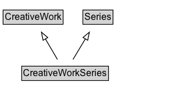

# CreativeWorkSeries

A CreativeWorkSeries in schema.org is a group of related items, typically but not necessarily of the same kind. CreativeWorkSeries are usually organized into some order, often chronological. Unlike [[ItemList]] which is a general purpose data structure for lists of things, the emphasis with CreativeWorkSeries is on published materials (written e.g. books and periodicals, or media such as TV, radio and games).\n\nSpecific subtypes are available for describing [[TVSeries]], [[RadioSeries]], [[MovieSeries]], [[BookSeries]], [[Periodical]] and [[VideoGameSeries]]. In each case, the [[hasPart]] / [[isPartOf]] properties can be used to relate the CreativeWorkSeries to its parts. The general CreativeWorkSeries type serves largely just to organize these more specific and practical subtypes.\n\nIt is common for properties applicable to an item from the series to be usefully applied to the containing group. Schema.org attempts to anticipate some of these cases, but publishers should be free to apply properties of the series parts to the series as a whole wherever they seem appropriate.
    

## Diagram

=== "SVG (interactive)"

    <!-- Generated by graphviz version 14.1.3 (20260303.0454)
     -->
    <!-- Pages: 1 -->
    <svg width="231pt" height="132pt"
     viewBox="0.00 0.00 231.00 132.00" xmlns="http://www.w3.org/2000/svg" xmlns:xlink="http://www.w3.org/1999/xlink">
    <g id="graph0" class="graph" transform="scale(1 1) rotate(0) translate(4 128)">
    <polygon fill="white" stroke="none" points="-4,4 -4,-128 227.38,-128 227.38,4 -4,4"/>
    <g id="clust3" class="cluster">
    <title>cluster_associated</title>
    </g>
    <!-- CreativeWork -->
    <g id="node1" class="node">
    <title>CreativeWork</title>
    <g id="a_node1"><a xlink:href="../CreativeWork" xlink:title="&lt;TABLE&gt;">
    <polygon fill="lightgray" stroke="none" points="1,-97.88 1,-114.12 75.75,-114.12 75.75,-97.88 1,-97.88"/>
    <text xml:space="preserve" text-anchor="start" x="2" y="-101.88" font-family="Arial" font-size="12.00">CreativeWork</text>
    <polygon fill="none" stroke="black" points="0,-96.88 0,-115.12 76.75,-115.12 76.75,-96.88 0,-96.88"/>
    </a>
    </g>
    </g>
    <!-- Series -->
    <g id="node2" class="node">
    <title>Series</title>
    <g id="a_node2"><a xlink:href="../Series" xlink:title="&lt;TABLE&gt;">
    <polygon fill="lightgray" stroke="none" points="103.12,-97.88 103.12,-114.12 139.62,-114.12 139.62,-97.88 103.12,-97.88"/>
    <text xml:space="preserve" text-anchor="start" x="104.12" y="-101.88" font-family="Arial" font-size="12.00">Series</text>
    <polygon fill="none" stroke="black" points="102.12,-96.88 102.12,-115.12 140.62,-115.12 140.62,-96.88 102.12,-96.88"/>
    </a>
    </g>
    </g>
    <!-- CreativeWorkSeries -->
    <g id="node3" class="node">
    <title>CreativeWorkSeries</title>
    <g id="a_node3"><a xlink:href="../CreativeWorkSeries" xlink:title="&lt;TABLE&gt;">
    <polygon fill="lightgray" stroke="none" points="24.75,-25.88 24.75,-42.12 134,-42.12 134,-25.88 24.75,-25.88"/>
    <text xml:space="preserve" text-anchor="start" x="25.75" y="-29.88" font-family="Arial" font-size="12.00">CreativeWorkSeries</text>
    <polygon fill="none" stroke="black" points="23.75,-24.88 23.75,-43.12 135,-43.12 135,-24.88 23.75,-24.88"/>
    </a>
    </g>
    </g>
    <!-- CreativeWorkSeries&#45;&gt;CreativeWork -->
    <g id="edge1" class="edge">
    <title>CreativeWorkSeries&#45;&gt;CreativeWork</title>
    <path fill="none" stroke="black" d="M69.54,-51.79C64.92,-59.68 59.3,-69.28 54.11,-78.14"/>
    <polygon fill="none" stroke="black" points="51.1,-76.35 49.06,-86.75 57.14,-79.89 51.1,-76.35"/>
    </g>
    <!-- CreativeWorkSeries&#45;&gt;Series -->
    <g id="edge2" class="edge">
    <title>CreativeWorkSeries&#45;&gt;Series</title>
    <path fill="none" stroke="black" d="M89.45,-51.79C94.23,-59.76 100.07,-69.48 105.43,-78.43"/>
    <polygon fill="none" stroke="black" points="102.28,-79.98 110.43,-86.76 108.29,-76.38 102.28,-79.98"/>
    </g>
    <!-- Invis -->
    </g>
    </svg>

=== "PNG"

    

## Specializations of CreativeWorkSeries

| Class | Description |
|-------|-------------|
| [Book Series](BookSeries.md) | A series of books. Included books can be indicated with the hasPart property. |
| [Comic Series](ComicSeries.md) | A sequential publication of comic stories under a
    	unifying title, for example "The Amazing Spider-Man" or "Groo the
    	Wanderer". |
| [Movie Series](MovieSeries.md) | A series of movies. Included movies can be indicated with the hasPart property. |
| [Newspaper](Newspaper.md) | A publication containing information about varied topics that are pertinent to general information, a geographic area, or a specific subject matter (i.e. business, culture, education). Often published daily. |
| [Periodical](Periodical.md) | A publication in any medium issued in successive parts bearing numerical or chronological designations and intended to continue indefinitely, such as a magazine, scholarly journal, or newspaper.\n\nSee also [blog post](https://blog.schema.org/2014/09/02/schema-org-support-for-bibliographic-relationships-and-periodicals/). |
| [Podcast Series](PodcastSeries.md) | A podcast is an episodic series of digital audio or video files which a user can download and listen to. |
| [Radio Series](RadioSeries.md) | CreativeWorkSeries dedicated to radio broadcast and associated online delivery. |
| [Tv Series](TVSeries.md) | CreativeWorkSeries dedicated to TV broadcast and associated online delivery. |
| [Video Game Series](VideoGameSeries.md) | A video game series. |

## Formalization for CreativeWorkSeries

| Property | Constraint |
|----------|------------|
| subClassOf | [CreativeWork](CreativeWork.md) |
| subClassOf | [Series](Series.md) |

