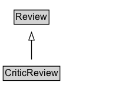

# CriticReview

A [[CriticReview]] is a more specialized form of Review written or published by a source that is recognized for its reviewing activities. These can include online columns, travel and food guides, TV and radio shows, blogs and other independent Web sites. [[CriticReview]]s are typically more in-depth and professionally written. For simpler, casually written user/visitor/viewer/customer reviews, it is more appropriate to use the [[UserReview]] type. Review aggregator sites such as Metacritic already separate out the site's user reviews from selected critic reviews that originate from third-party sources.

## Diagram

=== "SVG (interactive)"

    <!-- Generated by graphviz version 14.1.3 (20260303.0454)
     -->
    <!-- Pages: 1 -->
    <svg width="168pt" height="132pt"
     viewBox="0.00 0.00 168.00 132.00" xmlns="http://www.w3.org/2000/svg" xmlns:xlink="http://www.w3.org/1999/xlink">
    <g id="graph0" class="graph" transform="scale(1 1) rotate(0) translate(4 128)">
    <polygon fill="white" stroke="none" points="-4,4 -4,-128 164.12,-128 164.12,4 -4,4"/>
    <g id="clust3" class="cluster">
    <title>cluster_associated</title>
    </g>
    <!-- Review -->
    <g id="node1" class="node">
    <title>Review</title>
    <g id="a_node1"><a xlink:href="../Review" xlink:title="&lt;TABLE&gt;">
    <polygon fill="lightgray" stroke="none" points="14.88,-97.88 14.88,-114.12 57.38,-114.12 57.38,-97.88 14.88,-97.88"/>
    <text xml:space="preserve" text-anchor="start" x="15.88" y="-101.88" font-family="Arial" font-size="12.00">Review</text>
    <polygon fill="none" stroke="black" points="13.88,-96.88 13.88,-115.12 58.38,-115.12 58.38,-96.88 13.88,-96.88"/>
    </a>
    </g>
    </g>
    <!-- CriticReview -->
    <g id="node2" class="node">
    <title>CriticReview</title>
    <g id="a_node2"><a xlink:href="../CriticReview" xlink:title="&lt;TABLE&gt;">
    <polygon fill="lightgray" stroke="none" points="1,-25.88 1,-42.12 71.25,-42.12 71.25,-25.88 1,-25.88"/>
    <text xml:space="preserve" text-anchor="start" x="2" y="-29.88" font-family="Arial" font-size="12.00">CriticReview</text>
    <polygon fill="none" stroke="black" points="0,-24.88 0,-43.12 72.25,-43.12 72.25,-24.88 0,-24.88"/>
    </a>
    </g>
    </g>
    <!-- CriticReview&#45;&gt;Review -->
    <g id="edge1" class="edge">
    <title>CriticReview&#45;&gt;Review</title>
    <path fill="none" stroke="black" d="M36.12,-51.79C36.12,-59.25 36.12,-68.24 36.12,-76.69"/>
    <polygon fill="none" stroke="black" points="32.63,-76.54 36.13,-86.54 39.63,-76.54 32.63,-76.54"/>
    </g>
    <!-- Invis -->
    </g>
    </svg>

=== "PNG"

    

## Specializations of CriticReview

| Class | Description |
|-------|-------------|
| [Review News Article](ReviewNewsArticle.md) | A [[NewsArticle]] and [[CriticReview]] providing a professional critic's assessment of a service, product, performance, or artistic or literary work. |

## Formalization for CriticReview

| Property | Constraint |
|----------|------------|
| subClassOf | [Review](Review.md) |

