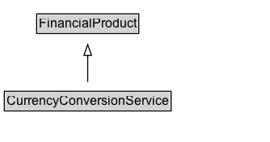

# CurrencyConversionService

A service to convert funds from one currency to another currency.

## Diagram

=== "SVG (interactive)"

    <!-- Generated by graphviz version 14.1.3 (20260303.0454)
     -->
    <!-- Pages: 1 -->
    <svg width="250pt" height="132pt"
     viewBox="0.00 0.00 250.00 132.00" xmlns="http://www.w3.org/2000/svg" xmlns:xlink="http://www.w3.org/1999/xlink">
    <g id="graph0" class="graph" transform="scale(1 1) rotate(0) translate(4 128)">
    <polygon fill="white" stroke="none" points="-4,4 -4,-128 246.38,-128 246.38,4 -4,4"/>
    <g id="clust3" class="cluster">
    <title>cluster_associated</title>
    </g>
    <!-- FinancialProduct -->
    <g id="node1" class="node">
    <title>FinancialProduct</title>
    <g id="a_node1"><a xlink:href="../FinancialProduct" xlink:title="&lt;TABLE&gt;">
    <polygon fill="lightgray" stroke="none" points="31,-97.88 31,-114.12 123.75,-114.12 123.75,-97.88 31,-97.88"/>
    <text xml:space="preserve" text-anchor="start" x="32" y="-101.88" font-family="Arial" font-size="12.00">FinancialProduct</text>
    <polygon fill="none" stroke="black" points="30,-96.88 30,-115.12 124.75,-115.12 124.75,-96.88 30,-96.88"/>
    </a>
    </g>
    </g>
    <!-- CurrencyConversionService -->
    <g id="node2" class="node">
    <title>CurrencyConversionService</title>
    <g id="a_node2"><a xlink:href="../CurrencyConversionService" xlink:title="&lt;TABLE&gt;">
    <polygon fill="lightgray" stroke="none" points="1,-25.88 1,-42.12 153.75,-42.12 153.75,-25.88 1,-25.88"/>
    <text xml:space="preserve" text-anchor="start" x="2" y="-29.88" font-family="Arial" font-size="12.00">CurrencyConversionService</text>
    <polygon fill="none" stroke="black" points="0,-24.88 0,-43.12 154.75,-43.12 154.75,-24.88 0,-24.88"/>
    </a>
    </g>
    </g>
    <!-- CurrencyConversionService&#45;&gt;FinancialProduct -->
    <g id="edge1" class="edge">
    <title>CurrencyConversionService&#45;&gt;FinancialProduct</title>
    <path fill="none" stroke="black" d="M77.38,-51.79C77.38,-59.25 77.38,-68.24 77.38,-76.69"/>
    <polygon fill="none" stroke="black" points="73.88,-76.54 77.38,-86.54 80.88,-76.54 73.88,-76.54"/>
    </g>
    <!-- Invis -->
    </g>
    </svg>

=== "PNG"

    

## Formalization for CurrencyConversionService

| Property | Constraint |
|----------|------------|
| subClassOf | [FinancialProduct](FinancialProduct.md) |

