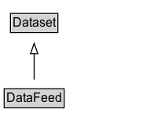

# DataFeed

A single feed providing structured information about one or more entities or topics.

## Diagram

=== "SVG (interactive)"

    <!-- Generated by graphviz version 14.1.3 (20260303.0454)
     -->
    <!-- Pages: 1 -->
    <svg width="154pt" height="132pt"
     viewBox="0.00 0.00 154.00 132.00" xmlns="http://www.w3.org/2000/svg" xmlns:xlink="http://www.w3.org/1999/xlink">
    <g id="graph0" class="graph" transform="scale(1 1) rotate(0) translate(4 128)">
    <polygon fill="white" stroke="none" points="-4,4 -4,-128 149.62,-128 149.62,4 -4,4"/>
    <g id="clust3" class="cluster">
    <title>cluster_associated</title>
    </g>
    <!-- Dataset -->
    <g id="node1" class="node">
    <title>Dataset</title>
    <g id="a_node1"><a xlink:href="../Dataset" xlink:title="&lt;TABLE&gt;">
    <polygon fill="lightgray" stroke="none" points="7,-97.88 7,-114.12 50.25,-114.12 50.25,-97.88 7,-97.88"/>
    <text xml:space="preserve" text-anchor="start" x="8" y="-101.88" font-family="Arial" font-size="12.00">Dataset</text>
    <polygon fill="none" stroke="black" points="6,-96.88 6,-115.12 51.25,-115.12 51.25,-96.88 6,-96.88"/>
    </a>
    </g>
    </g>
    <!-- DataFeed -->
    <g id="node2" class="node">
    <title>DataFeed</title>
    <g id="a_node2"><a xlink:href="../DataFeed" xlink:title="&lt;TABLE&gt;">
    <polygon fill="lightgray" stroke="none" points="1,-25.88 1,-42.12 56.25,-42.12 56.25,-25.88 1,-25.88"/>
    <text xml:space="preserve" text-anchor="start" x="2" y="-29.88" font-family="Arial" font-size="12.00">DataFeed</text>
    <polygon fill="none" stroke="black" points="0,-24.88 0,-43.12 57.25,-43.12 57.25,-24.88 0,-24.88"/>
    </a>
    </g>
    </g>
    <!-- DataFeed&#45;&gt;Dataset -->
    <g id="edge1" class="edge">
    <title>DataFeed&#45;&gt;Dataset</title>
    <path fill="none" stroke="black" d="M28.62,-51.79C28.62,-59.25 28.62,-68.24 28.62,-76.69"/>
    <polygon fill="none" stroke="black" points="25.13,-76.54 28.63,-86.54 32.13,-76.54 25.13,-76.54"/>
    </g>
    <!-- Invis -->
    </g>
    </svg>

=== "PNG"

    

## Specializations of DataFeed

| Class | Description |
|-------|-------------|
| [Complete Data Feed](CompleteDataFeed.md) | A [[CompleteDataFeed]] is a [[DataFeed]] whose standard representation includes content for every item currently in the feed.

This is the equivalent of Atom's element as defined in Feed Paging and Archiving [RFC 5005](https://tools.ietf.org/html/rfc5005), for example (and as defined for Atom), when using data from a feed that represents a collection of items that varies over time (e.g. "Top Twenty Records") there is no need to have newer entries mixed in alongside older, obsolete entries. By marking this feed as a CompleteDataFeed, old entries can be safely discarded when the feed is refreshed, since we can assume the feed has provided descriptions for all current items. |

## Formalization for DataFeed

| Property | Constraint |
|----------|------------|
| subClassOf | [Dataset](Dataset.md) |

