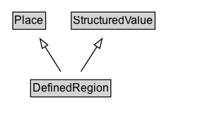

# DefinedRegion

A DefinedRegion is a geographic area defined by potentially arbitrary (rather than political, administrative or natural geographical) criteria. Properties are provided for defining a region by reference to sets of postal codes.

Examples: a delivery destination when shopping. Region where regional pricing is configured.

Requirement 1:
Country: US
States: "NY", "CA"

Requirement 2:
Country: US
PostalCode Set: { [94000-94585], [97000, 97999], [13000, 13599]}
{ [12345, 12345], [78945, 78945], }
Region = state, canton, prefecture, autonomous community...

## Diagram

=== "SVG (interactive)"

    <!-- Generated by graphviz version 14.1.3 (20260303.0454)
     -->
    <!-- Pages: 1 -->
    <svg width="210pt" height="132pt"
     viewBox="0.00 0.00 210.00 132.00" xmlns="http://www.w3.org/2000/svg" xmlns:xlink="http://www.w3.org/1999/xlink">
    <g id="graph0" class="graph" transform="scale(1 1) rotate(0) translate(4 128)">
    <polygon fill="white" stroke="none" points="-4,4 -4,-128 206,-128 206,4 -4,4"/>
    <g id="clust3" class="cluster">
    <title>cluster_associated</title>
    </g>
    <!-- Place -->
    <g id="node1" class="node">
    <title>Place</title>
    <g id="a_node1"><a xlink:href="../Place" xlink:title="&lt;TABLE&gt;">
    <polygon fill="lightgray" stroke="none" points="10.62,-97.88 10.62,-114.12 43.38,-114.12 43.38,-97.88 10.62,-97.88"/>
    <text xml:space="preserve" text-anchor="start" x="11.62" y="-101.88" font-family="Arial" font-size="12.00">Place</text>
    <polygon fill="none" stroke="black" points="9.62,-96.88 9.62,-115.12 44.38,-115.12 44.38,-96.88 9.62,-96.88"/>
    </a>
    </g>
    </g>
    <!-- StructuredValue -->
    <g id="node2" class="node">
    <title>StructuredValue</title>
    <g id="a_node2"><a xlink:href="../StructuredValue" xlink:title="&lt;TABLE&gt;">
    <polygon fill="lightgray" stroke="none" points="72.62,-97.88 72.62,-114.12 159.38,-114.12 159.38,-97.88 72.62,-97.88"/>
    <text xml:space="preserve" text-anchor="start" x="73.62" y="-101.88" font-family="Arial" font-size="12.00">StructuredValue</text>
    <polygon fill="none" stroke="black" points="71.62,-96.88 71.62,-115.12 160.38,-115.12 160.38,-96.88 71.62,-96.88"/>
    </a>
    </g>
    </g>
    <!-- DefinedRegion -->
    <g id="node3" class="node">
    <title>DefinedRegion</title>
    <g id="a_node3"><a xlink:href="../DefinedRegion" xlink:title="&lt;TABLE&gt;">
    <polygon fill="lightgray" stroke="none" points="29.5,-25.88 29.5,-42.12 112.5,-42.12 112.5,-25.88 29.5,-25.88"/>
    <text xml:space="preserve" text-anchor="start" x="30.5" y="-29.88" font-family="Arial" font-size="12.00">DefinedRegion</text>
    <polygon fill="none" stroke="black" points="28.5,-24.88 28.5,-43.12 113.5,-43.12 113.5,-24.88 28.5,-24.88"/>
    </a>
    </g>
    </g>
    <!-- DefinedRegion&#45;&gt;Place -->
    <g id="edge1" class="edge">
    <title>DefinedRegion&#45;&gt;Place</title>
    <path fill="none" stroke="black" d="M60.45,-51.79C55.43,-59.76 49.32,-69.48 43.7,-78.43"/>
    <polygon fill="none" stroke="black" points="40.82,-76.44 38.46,-86.77 46.74,-80.17 40.82,-76.44"/>
    </g>
    <!-- DefinedRegion&#45;&gt;StructuredValue -->
    <g id="edge2" class="edge">
    <title>DefinedRegion&#45;&gt;StructuredValue</title>
    <path fill="none" stroke="black" d="M81.79,-51.79C86.92,-59.76 93.17,-69.48 98.92,-78.43"/>
    <polygon fill="none" stroke="black" points="95.94,-80.26 104.29,-86.78 101.82,-76.48 95.94,-80.26"/>
    </g>
    <!-- Invis -->
    </g>
    </svg>

=== "PNG"

    

## Formalization for DefinedRegion

| Property | Constraint |
|----------|------------|
| subClassOf | [Place](Place.md) |
| subClassOf | [StructuredValue](StructuredValue.md) |

